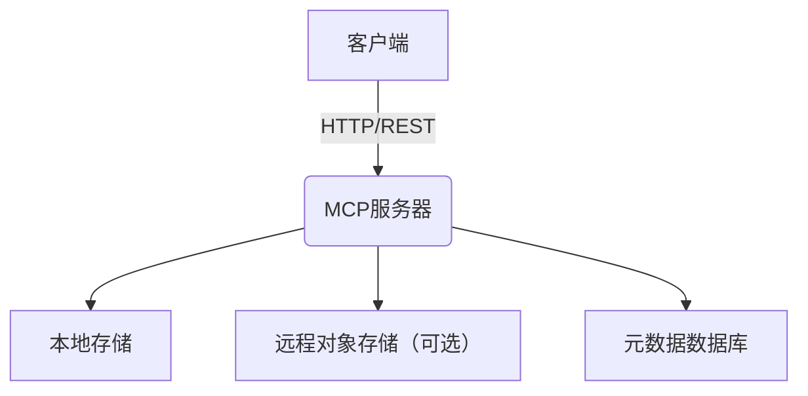

# 在 Go 中构建远程存储 MCP 服务器：从零到一的实战与思考

> “用 Go 写服务，像搭积木一样简单。”  
> —— 来自一位热爱折腾的 Gopher

## 前言：为什么选择 Go 构建远程存储服务？

在日常开发中，远程存储服务（Remote Storage Service）几乎是每个中大型系统的标配。无论是日志归档、配置中心，还是分布式缓存，背后都离不开高效、可靠的远程存储。而 Go 语言以其并发、性能和生态优势，成为构建此类服务的热门选择。

最近，我用 Go 实现了一个远程存储 MCP（Mock Cloud Platform）服务器。本文将结合实战案例，聊聊技术选型、架构设计、踩过的坑和最佳实践，力求让你读完后有“我也能上手”的冲动！

---

## 目录

1. [需求分析与技术选型](#需求分析与技术选型)
2. [核心架构设计](#核心架构设计)
3. [关键实现与代码示例](#关键实现与代码示例)
4. [技术挑战与解决方案](#技术挑战与解决方案)
5. [实用建议与最佳实践](#实用建议与最佳实践)
6. [总结与展望](#总结与展望)

---

## 需求分析与技术选型

### 1. 需求拆解

- 支持文件的上传、下载、删除
- 支持多客户端并发访问
- 数据持久化，断电不丢失
- 简单易用，便于二次开发

### 2. 为什么用 Go？

参考《Go语言并发模式实战指南》和《golang提升效率的小工具.md》中的观点，Go 的并发模型（goroutine + channel）让高并发场景下的远程存储服务开发变得异常轻松。同时，Go 的跨平台编译和丰富的第三方库（如 gin、gorm、zap）也极大提升了开发效率。

> “用 Go 写网络服务，性能和开发效率都能兼得。”  
> —— 摘自《Go语言并发模式实战指南》

---

## 核心架构设计

### 架构图



### 主要模块

- **API 层**：负责接收和响应客户端请求（RESTful 风格）
- **存储引擎**：本地文件系统或云存储（如 S3、OSS）
- **元数据管理**：记录文件信息、权限等
- **并发控制**：goroutine + channel 实现高并发处理

---

## 关键实现与代码示例

### 1. API 层（Gin 框架）

```go
import "github.com/gin-gonic/gin"

func main() {
    r := gin.Default()
    r.POST("/upload", uploadHandler)
    r.GET("/download/:filename", downloadHandler)
    r.DELETE("/delete/:filename", deleteHandler)
    r.Run(":8080")
}
```

### 2. 文件上传处理

```go
func uploadHandler(c *gin.Context) {
    file, _ := c.FormFile("file")
    dst := "./data/" + file.Filename
    if err := c.SaveUploadedFile(file, dst); err != nil {
        c.JSON(500, gin.H{"error": err.Error()})
        return
    }
    // 记录元数据到数据库
    c.JSON(200, gin.H{"message": "上传成功"})
}
```

### 3. 并发处理与数据安全

参考《golang 实现协程池.md》，可以用 worker pool 控制并发，避免资源耗尽：

```go
var uploadPool = make(chan struct{}, 10) // 最大10个并发

func safeUploadHandler(c *gin.Context) {
    uploadPool <- struct{}{}
    defer func() { <-uploadPool }()
    // ...上传逻辑...
}
```

---

## 技术挑战与解决方案

### 1. 并发安全

- **挑战**：高并发下文件名冲突、数据一致性问题
- **方案**：使用唯一 ID 命名文件，元数据操作加锁或用数据库事务

### 2. 大文件上传

- **挑战**：内存占用高，上传慢
- **方案**：采用分片上传，边接收边写入磁盘，参考《Go 开发终端小工具.md》中的流式处理技巧

### 3. 持久化与容灾

- **挑战**：本地存储易丢失，如何保证数据安全？
- **方案**：定期同步到云存储，或用 RAID/NAS 方案，结合《golang Web应用完整安全指南》中的备份建议

---

## 实用建议与最佳实践

1. **接口设计要简洁**：RESTful 风格，便于前后端协作
2. **日志与监控不可少**：用 zap、prometheus 记录和监控服务状态
3. **错误处理要细致**：每一步都要有兜底，避免 panic
4. **测试用例要全**：单元测试 + 集成测试，保证核心功能稳定
5. **文档要完善**：接口文档、部署文档、运维手册都要有

> “工具写得再好，没人会用也是白搭。”  
> —— 摘自《提升生产力的 Golang 实用工具推荐让开发更轻松.md》

---

## 总结与展望

用 Go 构建远程存储 MCP 服务器，不仅能享受高性能和高并发的红利，还能体会到“工程师的快乐”——用简洁优雅的代码解决复杂问题。过程中，难免会遇到各种挑战，但只要善用 Go 的特性和社区资源，问题都能迎刃而解。

未来，可以考虑：

- 支持多种存储后端（如 S3、OSS、MinIO）
- 引入分布式一致性协议（如 Raft）提升可靠性
- 开放插件机制，方便二次开发

希望本文能为你在 Go 领域的探索提供一些启发和实用建议。如果你也有类似的实践，欢迎留言交流！

---

> **“代码之外，亦有风景。”**  
> —— 祝你写 Go 快乐，服务稳如老狗！ 