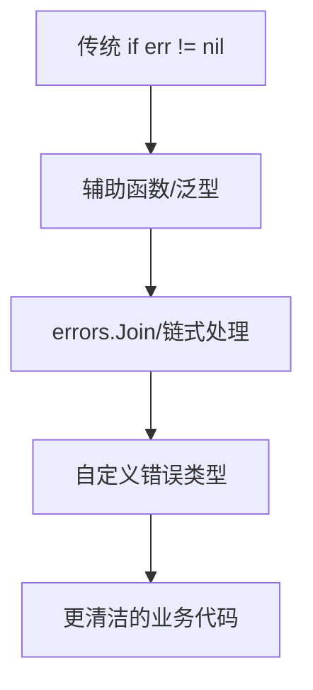

# 2025 年更清洁的 Go 代码：紧凑的错误管理

## 引言：告别“if err != nil”地狱

还记得刚学 Go 时，满屏的 `if err != nil` 吗？每次写完一段逻辑，紧接着就是机械地检查错误。虽然 Go 的显式错误处理让 bug 无处遁形，但也让代码变得冗长、重复。

2025 年，Go 社区在错误管理上有了新突破。**紧凑、优雅的错误处理方式**，让代码既安全又清爽。今天，我就结合实际项目和个人踩坑经验，聊聊如何用更现代的姿势管理 Go 错误。

---

## 错误处理的“前世今生”

### 传统写法：安全但啰嗦

```go
result, err := doSomething()
if err != nil {
    return fmt.Errorf("doSomething failed: %w", err)
}
```

这种写法虽然直观，但在业务流程复杂时，代码会被错误检查“切割”得支离破碎。

### 2025 新趋势：紧凑与表达力并存

随着 Go 1.22+ 及社区库的发展，错误处理变得更“声明式”。比如：

- 使用辅助函数/泛型简化重复逻辑
- 错误分组与链式处理
- 结合上下文（context）和自定义类型，提升可读性

---

## 实战案例：让错误管理更优雅

### 1. 错误分组与链式处理

假设你有一连串操作，每一步都可能出错。传统写法：

```go
if err := step1(); err != nil {
    return err
}
if err := step2(); err != nil {
    return err
}
if err := step3(); err != nil {
    return err
}
```

2025 年的做法：

```go
errs := errors.Join(
    step1(),
    step2(),
    step3(),
)
if errs != nil {
    return errs
}
```

> **经验分享**：`errors.Join`（Go 1.20+）让多个错误合并，便于批量处理和日志追踪。

#### 细节补充：errors.Join 的高级用法

- `errors.Join(nil, nil)` 返回 `nil`，无需额外判断。
- 可递归展开嵌套 error 列表，便于批量校验和集中处理。
- 可结合 `errors.Is`/`errors.As` 精确定位具体错误类型。

**示例：**

```go
func ValidateUser(u User) error {
    var errs []error
    if u.Name == "" {
        errs = append(errs, errors.New("用户名不能为空"))
    }
    if u.Age < 0 {
        errs = append(errs, errors.New("年龄不能为负数"))
    }
    if !strings.Contains(u.Email, "@") {
        errs = append(errs, errors.New("邮箱格式不正确"))
    }
    return errors.Join(errs...)
}
```

---

### 2. 泛型辅助函数，消灭重复

利用泛型和高阶函数，封装常见的错误处理模式：

```go
func Must[T any](v T, err error) T {
    if err != nil {
        panic(err)
    }
    return v
}

// 使用
data := Must(os.ReadFile("config.yaml"))
```

> **小贴士**：在工具脚本、初始化流程中大胆用 `Must`，主业务流程仍建议显式处理错误。

#### 细节补充：Must 的安全边界

- 仅在初始化、脚本、测试代码中使用。
- 生产环境建议替换为日志+os.Exit(1) 或返回自定义错误。
- 业务主流程建议保留显式错误处理，便于追踪和恢复。

---

### 3. 错误上下文与分层

结合 `context.Context` 和自定义错误类型，提升错误定位效率：

```go
type NotFoundError struct {
    Resource string
}

func (e NotFoundError) Error() string {
    return fmt.Sprintf("%s not found", e.Resource)
}

func getUser(ctx context.Context, id int) (User, error) {
    // ...
    return User{}, NotFoundError{"User"}
}
```

> **最佳实践**：为关键业务错误定义专属类型，便于上层捕获和处理。

#### 细节补充：自定义错误类型的最佳实践

- 推荐实现 `Is(target error) bool` 方法，支持 `errors.Is` 判断。
- 可为每类业务错误定义专属类型，提升可维护性。
- 结合领域驱动设计，将错误分为“用户可见错误”和“系统内部错误”。

**示例：**

```go
type PermissionDeniedError struct {
    UserID int
    Action string
}

func (e PermissionDeniedError) Error() string {
    return fmt.Sprintf("用户 %d 无权执行操作: %s", e.UserID, e.Action)
}

if errors.As(err, &PermissionDeniedError{}) {
    // 返回 403
}
```

---

### 4. 更完整的业务流程实战代码

假设有一个用户注册流程，涉及参数校验、数据库写入、邮件通知等多个环节，每一步都可能出错：

```go
package main

import (
    "context"
    "database/sql"
    "errors"
    "fmt"
    "log"
    "net/mail"
    "os"
    "time"
)

// 自定义错误类型
// ...（可复用上文 ValidationError、DBError 等定义）

type ValidationError struct {
    Field string
    Msg   string
}

func (e ValidationError) Error() string {
    return fmt.Sprintf("字段[%s]校验失败: %s", e.Field, e.Msg)
}

type DBError struct {
    Op  string
    Err error
}

func (e DBError) Error() string {
    return fmt.Sprintf("数据库操作[%s]失败: %v", e.Op, e.Err)
}

func (e DBError) Unwrap() error { return e.Err }

// 参数校验
func validateUser(email string, age int) error {
    var errs []error
    if _, err := mail.ParseAddress(email); err != nil {
        errs = append(errs, ValidationError{"email", "邮箱格式不正确"})
    }
    if age < 0 {
        errs = append(errs, ValidationError{"age", "年龄不能为负数"})
    }
    return errors.Join(errs...)
}

// 数据库写入
func saveUserToDB(ctx context.Context, email string, age int) error {
    var db *sql.DB
    select {
    case <-ctx.Done():
        return ctx.Err()
    case <-time.After(100 * time.Millisecond):
        return DBError{"insert", sql.ErrConnDone}
    }
}

// 邮件通知
func sendWelcomeEmail(email string) error {
    return errors.New("邮件服务不可用")
}

// 注册主流程
func registerUser(ctx context.Context, email string, age int) error {
    if err := validateUser(email, age); err != nil {
        return fmt.Errorf("参数校验未通过: %w", err)
    }
    if err := saveUserToDB(ctx, email, age); err != nil {
        return fmt.Errorf("保存用户失败: %w", err)
    }
    if err := sendWelcomeEmail(email); err != nil {
        log.Printf("欢迎邮件发送失败: %v", err)
    }
    return nil
}

func main() {
    ctx, cancel := context.WithTimeout(context.Background(), 200*time.Millisecond)
    defer cancel()

    err := registerUser(ctx, "bad-email", -1)
    if err != nil {
        var vErr ValidationError
        if errors.As(err, &vErr) {
            fmt.Println("用户输入有误：", vErr)
        } else if errors.Is(err, context.DeadlineExceeded) {
            fmt.Println("操作超时，请重试")
        } else {
            fmt.Println("注册失败：", err)
        }
        os.Exit(1)
    }
    fmt.Println("注册成功")
}
```

---

### 5. 错误链日志集成与溯源

结合 logrus/zap 等日志库，输出完整错误链和堆栈信息：

```go
import (
    "github.com/sirupsen/logrus"
    "errors"
    "fmt"
)

func doSomething() error {
    return fmt.Errorf("业务处理失败: %w", errors.New("底层IO错误"))
}

func main() {
    err := doSomething()
    if err != nil {
        logrus.WithField("err", err).Error("操作失败")
        // 输出完整错误链
        var targetErr error = err
        for targetErr != nil {
            fmt.Println("链路：", targetErr)
            targetErr = errors.Unwrap(targetErr)
        }
    }
}
```

---

### 6. context 错误与业务错误分离

```go
func fetchData(ctx context.Context) error {
    select {
    case <-ctx.Done():
        return ctx.Err() // context.Canceled or context.DeadlineExceeded
    case <-time.After(2 * time.Second):
        return errors.New("远程服务无响应")
    }
}

func main() {
    ctx, cancel := context.WithTimeout(context.Background(), 1*time.Second)
    defer cancel()
    err := fetchData(ctx)
    if errors.Is(err, context.DeadlineExceeded) {
        fmt.Println("请求超时，请稍后重试")
    } else if err != nil {
        fmt.Println("数据获取失败：", err)
    }
}
```

---

### 7. 领域驱动的错误分层与前端友好提示

```go
type UserVisibleError struct {
    Code string
    Msg  string
}

func (e UserVisibleError) Error() string { return e.Msg }

func doBiz() error {
    return UserVisibleError{"E1001", "余额不足"}
}

func main() {
    err := doBiz()
    var uErr UserVisibleError
    if errors.As(err, &uErr) {
        fmt.Printf("前端提示：%s（错误码：%s）\n", uErr.Msg, uErr.Code)
    } else if err != nil {
        fmt.Println("系统错误，请联系管理员")
    }
}
```

---

## 图表：错误处理演进路线



---

## 技术挑战与解决方案

### 1. 错误信息丢失

**挑战**：多层包装后，原始错误信息难以追踪。

**解决方案**：  
- 使用 `%w` 格式化符号，保留错误链。
- 利用 `errors.Unwrap` 和 `errors.Is/As` 进行错误溯源。
- 结合日志库（如 zap、logrus），完整记录错误链路。

**示例：**

```go
err := fmt.Errorf("数据库操作失败: %w", dbErr)
log.WithError(err).Error("用户注册失败")
```

### 2. 过度抽象导致调试困难

**挑战**：辅助函数用多了，反而不知哪里出错。

**解决方案**：  
- 关键路径保留显式错误处理。
- 日志中输出完整错误链和调用栈。

### 3. 团队风格不统一

**挑战**：不同成员对错误处理理解不一，代码风格混乱。

**解决方案**：  
- 制定团队错误处理规范。
- 代码评审时重点关注错误管理方式。
- 统一错误码和错误消息，便于国际化和维护。

### 4. 错误链过长

**挑战**：多层包装后难以定位根因。

**解决方案**：
- 结合日志堆栈、分层 unwrap。
- 统一日志格式，便于后期检索和报警。

### 5. 误用 panic

**挑战**：误将 panic 用于业务错误，导致服务崩溃。

**解决方案**：
- 仅在不可恢复场景使用 panic。
- 业务错误应返回 error，由上层处理。

### 6. 错误码混乱

**挑战**：前后端错误码不一致，难以追踪。

**解决方案**：
- 统一错误码定义，文档化。
- 前端只展示用户可见错误，其余错误记录日志。

### 7. 忽略 context 错误

**挑战**：误判 context 错误为业务错误。

**解决方案**：
- 业务错误与 context 错误分开处理，避免误判。
- 传递 context 时，优先用 `WithTimeout`/`WithCancel` 控制生命周期。

---

## 常见误区与反例

### 误区1：所有错误都 panic

```go
// 反例
if err != nil {
    panic(err) // 生产环境极易导致服务崩溃
}
```

### 误区2：错误信息不带上下文

```go
// 反例
return err // 无法定位是哪个环节出错
```

**改进**：

```go
return fmt.Errorf("读取配置文件失败: %w", err)
```

### 误区3：忽略 context 错误

```go
// 反例
if err := fetchData(ctx); err != nil && err != context.Canceled {
    // 误判 context 错误为业务错误
}
```

---

## 总结：让错误管理成为 Go 代码的加分项

2025 年，Go 的错误管理正从“机械式”走向“表达式”。**紧凑的错误处理不仅让代码更美观，更让系统更健壮**。我的建议是：

- 善用新特性和社区工具，别被“if err != nil”束缚
- 结合实际场景，灵活选择错误处理方式
- 团队协作时，统一风格，持续优化
- 细节决定健壮性，规范决定可维护性

最后，愿你的 Go 代码因为更清洁的错误管理，变得更可靠、更优雅！

> “优雅的错误处理，是高级 Go 工程师的标志。”——PFinal南丞

---

如需更多实战案例和工具推荐，欢迎关注 PFinalClub，和我一起探索 Go 世界的新范式！ 