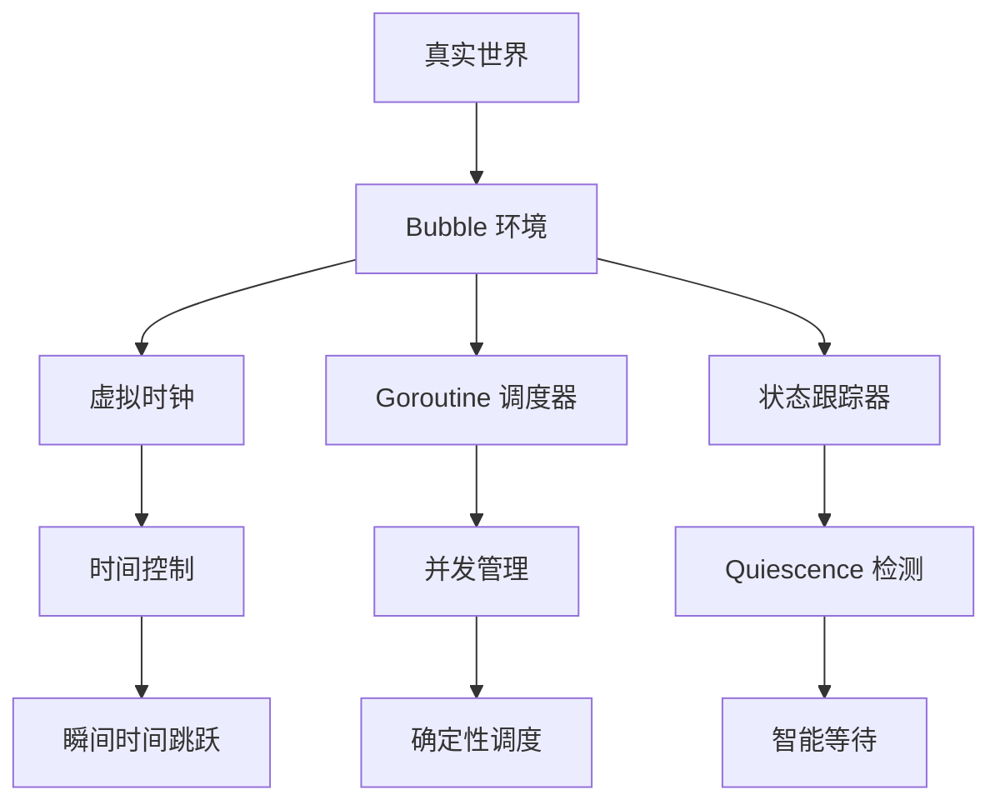

# Go 1.25 testing/synctest 深度解析与实战指南

## 前言

在 Go 语言的发展历程中，并发编程一直是其核心优势之一。然而，测试并发和异步代码却始终是开发者面临的一大挑战。传统的测试方法要么运行缓慢，要么结果不稳定，让开发者在"快速"与"可靠"之间艰难选择。

Go 1.25 正式引入的 `testing/synctest` 包彻底改变了这一现状。它通过创建一个可控的"泡泡"（bubble）环境，让异步测试变得既快速又可靠。本文将深入解析其核心原理、使用技巧和最佳实践。


## 异步测试的挑战

### 传统异步测试的困境

在 `testing/synctest` 出现之前，测试异步代码面临着诸多挑战：

```go
// 传统的异步测试方式
func TestTraditionalAsync(t *testing.T) {
    deadline := time.Now().Add(1 * time.Second)
    ctx, cancel := context.WithDeadline(context.Background(), deadline)
    defer cancel()

    // 问题1：需要真实等待时间
    time.Sleep(time.Until(deadline) + 100*time.Millisecond)

    // 问题2：时间 buffer 难以确定
    if err := ctx.Err(); err != context.DeadlineExceeded {
        t.Fatalf("context not canceled after deadline")
    }
}
```

**主要问题：**

1. **时间等待**：测试需要真实等待时间流逝，导致测试套件运行缓慢
2. **不确定性**：系统负载、调度延迟等因素导致测试结果不稳定
3. **时间 buffer**：为了避免竞态条件，需要添加额外的等待时间，但很难确定合适的值
4. **复杂同步**：需要使用 `sync.WaitGroup`、channel 等复杂的同步机制

### 异步与同步的本质区别

```go
// 同步函数：简单直接
func (c *Cache) Cleanup() {
    os.RemoveAll(c.cacheDir)
}

// 异步函数：复杂难测
func (c *Cache) CleanupInBackground() {
    go os.RemoveAll(c.cacheDir)
}
```

同步函数的测试模式很简单：**设置 → 调用 → 验证**。但异步函数打破了这个模式：**调用 → 立即返回 → 后台执行 → 何时验证？**

## synctest 核心原理分析

### Bubble 机制：虚拟执行环境

`testing/synctest` 的核心创新是"Bubble"机制——创建一个与外界隔离的虚拟执行环境：



### 核心组件深度解析

#### 1. 虚拟时钟系统（FakeClock）

```go
// 虚拟时钟的核心数据结构
type FakeClock struct {
    mu          sync.Mutex
    currentTime time.Time        // 当前虚拟时间
    timers      []*FakeTimer     // 所有定时器
    scheduler   *Scheduler       // 关联的调度器
}

// 虚拟时间推进
func (fc *FakeClock) AdvanceTo(target time.Time) {
    fc.mu.Lock()
    defer fc.mu.Unlock()
    
    // 推进时间到目标时间
    fc.currentTime = target
    
    // 触发所有到期的定时器
    for _, timer := range fc.timers {
        if !timer.deadline.After(target) {
            timer.Fire()
        }
    }
}

// 虚拟睡眠：不真实等待
func (fc *FakeClock) Sleep(d time.Duration) {
    timer := fc.NewTimer(d)
    <-timer.C  // 会被调度器立即唤醒
}
```

**关键特性：**
- 虚拟时钟由 synctest 控制，起始点与推进策略由实现决定（不依赖真实墙钟）
- `time.Sleep()` 不会真实等待，而是注册定时器
- 时间推进是瞬间的，由调度器控制

#### 2. Goroutine 调度器（Scheduler）

```go
type Scheduler struct {
    mu          sync.Mutex
    goroutines  map[int]*Goroutine    // 所有 goroutine
    runQueue    []*Goroutine          // 可运行队列
    clock       *FakeClock            // 虚拟时钟
    waiting     map[int]WaitReason    // 等待原因
}

type Goroutine struct {
    id       int
    state    GoroutineState
    function func()
    channel  chan struct{}
}

// Goroutine 状态
type GoroutineState int
const (
    StateRunnable GoroutineState = iota  // 可运行
    StateBlocked                         // 阻塞
    StateDead                           // 已结束
)

// 等待原因
type WaitReason int
const (
    WaitChannel WaitReason = iota  // 等待 channel
    WaitTimer                      // 等待定时器
    WaitMutex                      // 等待互斥锁
    WaitIO                         // 等待 I/O
    WaitSyscall                    // 等待系统调用
)
```

#### 3. Quiescence 检测算法

Quiescence（静止状态）检测是 `synctest` 的核心算法，用于判断何时所有异步操作都已完成：

```go
func (s *Scheduler) AllGoroutinesQuiescent() bool {
    s.mu.Lock()
    defer s.mu.Unlock()
    
    runnableCount := 0
    durableBlockedCount := 0
    
    for _, g := range s.goroutines {
        switch g.state {
        case StateRunnable:
            runnableCount++
        case StateBlocked:
            if s.isDurablyBlocked(g) {
                durableBlockedCount++
            } else {
                return false // 有非持久阻塞的 goroutine
            }
        }
    }
    
    // 如果没有可运行的 goroutine
    if runnableCount == 0 {
        if durableBlockedCount > 0 {
            // 尝试推进时间解除阻塞
            s.advanceTimeToNextEvent()
            return false
        }
        return true // 所有 goroutine 都完成
    }
    
    return false
}

// 判断是否为持久阻塞
func (s *Scheduler) isDurablyBlocked(g *Goroutine) bool {
    reason := s.waiting[g.id]
    switch reason {
    case WaitChannel:
        return s.isChannelPermanentlyBlocked(g)
    case WaitTimer:
        return true  // 定时器等待是持久的
    case WaitMutex:
        return false // 互斥锁可能很快释放
    case WaitIO, WaitSyscall:
        return false // 真实 I/O 无法控制
    }
    return false
}
```

#### 4. 受控执行与虚拟时钟机制

> 说明：在 synctest 的受控环境（bubble）中，时间相关操作不会真实等待，而由内部调度器与虚拟时钟确定性推进；Go 标准库函数并不支持对其进行动态替换。

在受控环境中实现对时间与调度的确定性推进（无需对运行时做任何动态替换）：

> 提示：为避免误解，已移除示意性的“替换/拦截”代码片段。synctest 的确定性来自受控 bubble 环境与虚拟时钟/调度推进，并非对标准库进行运行时替换。

## API 详解与基础用法

### 核心 API

`testing/synctest` 提供了极简的 API 设计：

```go
// 在虚拟环境中执行测试
func Test(t *testing.T, f func(*testing.T))

// 等待所有 goroutine 达到稳定状态
func Wait()
```

### 基础使用模式

#### 1. 标准测试结构

```go
func TestBasicAsync(t *testing.T) {
    synctest.Test(t, func(t *testing.T) {
        // 在这个函数内部，时间是虚拟的
        
        result := make(chan int)
        
        // 启动异步操作
        go func() {
            time.Sleep(1 * time.Second)  // 瞬间完成
            result <- 42
        }()
        
        // 等待所有 goroutine 稳定
        synctest.Wait()
        
        // 验证结果
        select {
        case val := <-result:
            if val != 42 {
                t.Errorf("Expected 42, got %d", val)
            }
        default:
            t.Error("Result not available")
        }
    })
}
```

#### 2. 时间控制示例

```go
func TestTimeControl(t *testing.T) {
    synctest.Test(t, func(t *testing.T) {
        start := time.Now()
        
        // 这些操作会瞬间完成
        time.Sleep(10 * time.Second)
        time.Sleep(5 * time.Minute)
        time.Sleep(2 * time.Hour)
        
        elapsed := time.Since(start)
        expected := 10*time.Second + 5*time.Minute + 2*time.Hour
        
        if elapsed != expected {
            t.Errorf("Expected %v, got %v", expected, elapsed)
        }
        
        t.Logf("虚拟时间流逝: %v", elapsed)
        // 实际运行时间: 几毫秒
    })
}
```

#### 3. Context 超时测试

```go
func TestContextTimeout(t *testing.T) {
    synctest.Test(t, func(t *testing.T) {
        // 创建 2 秒超时的 context
        ctx, cancel := context.WithTimeout(context.Background(), 2*time.Second)
        defer cancel()
        
        done := make(chan bool)
        
        go func() {
            select {
            case <-time.After(3 * time.Second):
                // 3 秒后才完成，应该超时
                done <- false
            case <-ctx.Done():
                // context 在 2 秒后超时
                done <- true
            }
        }()
        
        synctest.Wait()
        
        select {
        case timedOut := <-done:
            if !timedOut {
                t.Error("Expected context to timeout")
            }
        default:
            t.Error("Test should have completed")
        }
        
        if ctx.Err() != context.DeadlineExceeded {
            t.Errorf("Expected DeadlineExceeded, got %v", ctx.Err())
        }
    })
}
```

## 高级使用技巧

### 1. 复杂并发场景测试

#### 生产者-消费者模式

```go
func TestProducerConsumer(t *testing.T) {
    synctest.Test(t, func(t *testing.T) {
        buffer := make(chan int, 5)
        results := make(chan []int)
        
        // 生产者
        go func() {
            for i := 0; i < 10; i++ {
                buffer <- i
                time.Sleep(100 * time.Millisecond)
            }
            close(buffer)
        }()
        
        // 消费者
        go func() {
            var consumed []int
            for value := range buffer {
                consumed = append(consumed, value)
                time.Sleep(50 * time.Millisecond)
            }
            results <- consumed
        }()
        
        synctest.Wait()
        
        select {
        case consumed := <-results:
            expected := []int{0, 1, 2, 3, 4, 5, 6, 7, 8, 9}
            if !reflect.DeepEqual(consumed, expected) {
                t.Errorf("Expected %v, got %v", expected, consumed)
            }
        default:
            t.Error("Consumer should have completed")
        }
    })
}
```

#### 工作池模式

```go
func TestWorkerPool(t *testing.T) {
    synctest.Test(t, func(t *testing.T) {
        const numWorkers = 3
        const numJobs = 10
        
        jobs := make(chan int, numJobs)
        results := make(chan int, numJobs)
        
        // 启动工作者
        for w := 0; w < numWorkers; w++ {
            go func(id int) {
                for job := range jobs {
                    // 模拟工作时间
                    time.Sleep(time.Duration(job) * 100 * time.Millisecond)
                    results <- job * job
                }
            }(w)
        }
        
        // 发送任务
        go func() {
            for j := 1; j <= numJobs; j++ {
                jobs <- j
            }
            close(jobs)
        }()
        
        synctest.Wait()
        
        // 收集结果
        var allResults []int
        for i := 0; i < numJobs; i++ {
            select {
            case result := <-results:
                allResults = append(allResults, result)
            default:
                t.Errorf("Missing result %d", i)
            }
        }
        
        if len(allResults) != numJobs {
            t.Errorf("Expected %d results, got %d", numJobs, len(allResults))
        }
    })
}
```

### 2. 定时器和 Ticker 测试

#### 复杂定时器逻辑

```go
func TestComplexTimer(t *testing.T) {
    synctest.Test(t, func(t *testing.T) {
        events := make(chan string, 10)
        
        // 多个定时器
        go func() {
            timer1 := time.NewTimer(1 * time.Second)
            timer2 := time.NewTimer(2 * time.Second)
            timer3 := time.NewTimer(3 * time.Second)
            
            for {
                select {
                case <-timer1.C:
                    events <- "timer1"
                    timer1.Reset(1 * time.Second)
                case <-timer2.C:
                    events <- "timer2"
                    timer2.Reset(2 * time.Second)
                case <-timer3.C:
                    events <- "timer3"
                    return
                }
            }
        }()
        
        synctest.Wait()
        
        // 验证事件顺序
        expectedEvents := []string{"timer1", "timer2", "timer1", "timer3"}
        var actualEvents []string
        
        for len(actualEvents) < len(expectedEvents) {
            select {
            case event := <-events:
                actualEvents = append(actualEvents, event)
            default:
                break
            }
        }
        
        if !reflect.DeepEqual(actualEvents, expectedEvents) {
            t.Errorf("Expected %v, got %v", expectedEvents, actualEvents)
        }
    })
}
```

#### Ticker 测试

```go
func TestTicker(t *testing.T) {
    synctest.Test(t, func(t *testing.T) {
        ticker := time.NewTicker(500 * time.Millisecond)
        defer ticker.Stop()
        
        count := 0
        done := make(chan bool)
        
        go func() {
            for {
                select {
                case <-ticker.C:
                    count++
                    if count >= 5 {
                        done <- true
                        return
                    }
                case <-time.After(3 * time.Second):
                    done <- false
                    return
                }
            }
        }()
        
        synctest.Wait()
        
        select {
        case success := <-done:
            if !success {
                t.Error("Ticker should have fired 5 times")
            }
            if count != 5 {
                t.Errorf("Expected 5 ticks, got %d", count)
            }
        default:
            t.Error("Test should have completed")
        }
    })
}
```

### 3. 错误处理和恢复

#### 异步错误处理

```go
func TestAsyncErrorHandling(t *testing.T) {
    synctest.Test(t, func(t *testing.T) {
        errCh := make(chan error, 1)
        recoveryCh := make(chan bool, 1)
        
        // 模拟可能出错的异步操作
        go func() {
            defer func() {
                if r := recover(); r != nil {
                    errCh <- fmt.Errorf("panic: %v", r)
                }
            }()
            
            time.Sleep(1 * time.Second)
            
            // 模拟错误条件
            if time.Now().Second()%2 == 0 {
                panic("simulated error")
            }
            
            errCh <- nil
        }()
        
        // 错误恢复逻辑
        go func() {
            err := <-errCh
            if err != nil {
                t.Logf("Handling error: %v", err)
                // 执行恢复逻辑
                time.Sleep(500 * time.Millisecond)
                recoveryCh <- true
            } else {
                recoveryCh <- false
            }
        }()
        
        synctest.Wait()
        
        select {
        case recovered := <-recoveryCh:
            t.Logf("Recovery executed: %v", recovered)
        default:
            t.Error("Error handling should have completed")
        }
    })
}
```

## 典型应用场景

### 1. HTTP 客户端测试
> 注意：synctest 不控制真实网络 I/O；使用 httptest 服务器仍运行在真实运行时。建议通过可注入 http.RoundTripper 来模拟延迟/错误，使等待由虚拟时钟推进，更可控。

#### 超时和重试机制

```go
func TestHTTPClientWithRetry(t *testing.T) {
    synctest.Test(t, func(t *testing.T) {
        // 创建测试服务器
        attempts := 0
        server := httptest.NewServer(http.HandlerFunc(func(w http.ResponseWriter, r *http.Request) {
            attempts++
            if attempts < 3 {
                // 前两次请求失败
                time.Sleep(2 * time.Second)
                w.WriteHeader(http.StatusInternalServerError)
                return
            }
            // 第三次请求成功
            w.WriteHeader(http.StatusOK)
            w.Write([]byte("success"))
        }))
        defer server.Close()
        
        client := &http.Client{
            Timeout: 1 * time.Second, // 1秒超时
        }
        
        var finalResponse *http.Response
        var finalError error
        
        // 重试逻辑
        go func() {
            for i := 0; i < 3; i++ {
                resp, err := client.Get(server.URL)
                if err == nil && resp.StatusCode == http.StatusOK {
                    finalResponse = resp
                    return
                }
                
                if resp != nil {
                    resp.Body.Close()
                }
                
                finalError = err
                
                // 重试间隔
                if i < 2 {
                    time.Sleep(1 * time.Second)
                }
            }
        }()
        
        synctest.Wait()
        
        if finalResponse == nil {
            t.Errorf("Expected successful response after retries, got error: %v", finalError)
        }
        
        if attempts != 3 {
            t.Errorf("Expected 3 attempts, got %d", attempts)
        }
    })
}
```

#### 可取消重试模板（基于可注入 RoundTripper）
```go
// 可注入 RoundTripper：延迟由 synctest 虚拟时钟推进
type fakeRT struct {
    delay  time.Duration
    status int
    body   string
    failN  int
    calls  int
}
func (f *fakeRT) RoundTrip(req *http.Request) (*http.Response, error) {
    f.calls++
    time.Sleep(f.delay) // 在 synctest 中瞬时推进
    if f.calls <= f.failN {
        return nil, fmt.Errorf("temporary error")
    }
    return &http.Response{
        StatusCode: f.status,
        Body:       io.NopCloser(strings.NewReader(f.body)),
        Header:     make(http.Header),
        Request:    req,
    }, nil
}
func retryWithBackoff(ctx context.Context, do func(context.Context) (*http.Response, error)) (*http.Response, error) {
    backoff := 200 * time.Millisecond
    for i := 0; i < 5; i++ {
        resp, err := do(ctx)
        if err == nil && resp.StatusCode >= 200 && resp.StatusCode < 300 {
            return resp, nil
        }
        select {
        case <-ctx.Done():
            return nil, ctx.Err()
        case <-time.After(backoff):
        }
        backoff *= 2
    }
    return nil, fmt.Errorf("exhausted retries")
}
func TestCancelableRetry(t *testing.T) {
    synctest.Test(t, func(t *testing.T) {
        rt := &fakeRT{delay: 300 * time.Millisecond, status: 200, body: "ok", failN: 2}
        client := &http.Client{Transport: rt}
        ctx, cancel := context.WithTimeout(context.Background(), 2*time.Second)
        defer cancel()
        resp, err := retryWithBackoff(ctx, func(c context.Context) (*http.Response, error) {
            req, _ := http.NewRequestWithContext(c, http.MethodGet, "http://example", nil)
            return client.Do(req)
        })
        synctest.Wait()
        if err != nil || resp == nil || resp.StatusCode != 200 {
            t.Fatalf("expected success, got err=%v, resp=%v", err, resp)
        }
    })
}
```

### 2. 缓存系统测试

#### 过期和清理机制

```go
type Cache struct {
    mu    sync.RWMutex
    items map[string]cacheItem
}

type cacheItem struct {
    value  interface{}
    expiry time.Time
}

func (c *Cache) Set(key string, value interface{}, ttl time.Duration) {
    c.mu.Lock()
    defer c.mu.Unlock()
    
    c.items[key] = cacheItem{
        value:  value,
        expiry: time.Now().Add(ttl),
    }
}

func (c *Cache) Get(key string) (interface{}, bool) {
    c.mu.RLock()
    defer c.mu.RUnlock()
    
    item, exists := c.items[key]
    if !exists || time.Now().After(item.expiry) {
        return nil, false
    }
    
    return item.value, true
}

func (c *Cache) StartCleanup(interval time.Duration) {
    ticker := time.NewTicker(interval)
    go func() {
        for range ticker.C {
            c.cleanup()
        }
    }()
}

func (c *Cache) cleanup() {
    c.mu.Lock()
    defer c.mu.Unlock()
    
    now := time.Now()
    for key, item := range c.items {
        if now.After(item.expiry) {
            delete(c.items, key)
        }
    }
}

func TestCacheExpiry(t *testing.T) {
    synctest.Test(t, func(t *testing.T) {
        cache := &Cache{
            items: make(map[string]cacheItem),
        }
        
        // 启动清理 goroutine
        cache.StartCleanup(1 * time.Second)
        
        // 设置不同过期时间的缓存项
        cache.Set("short", "value1", 2*time.Second)
        cache.Set("medium", "value2", 5*time.Second)
        cache.Set("long", "value3", 10*time.Second)
        
        // 验证初始状态
        if _, ok := cache.Get("short"); !ok {
            t.Error("short should be available initially")
        }
        
        // 推进时间到 3 秒
        time.Sleep(3 * time.Second)
        synctest.Wait()
        
        // short 应该过期，medium 和 long 仍然存在
        if _, ok := cache.Get("short"); ok {
            t.Error("short should have expired")
        }
        if _, ok := cache.Get("medium"); !ok {
            t.Error("medium should still be available")
        }
        if _, ok := cache.Get("long"); !ok {
            t.Error("long should still be available")
        }
        
        // 推进时间到 6 秒
        time.Sleep(3 * time.Second)
        synctest.Wait()
        
        // medium 也应该过期
        if _, ok := cache.Get("medium"); ok {
            t.Error("medium should have expired")
        }
        if _, ok := cache.Get("long"); !ok {
            t.Error("long should still be available")
        }
    })
}
```

### 3. 消息队列测试

#### 批处理和背压控制

```go
type MessageQueue struct {
    buffer   chan Message
    batchSize int
    flushInterval time.Duration
    processor func([]Message) error
}

type Message struct {
    ID   string
    Data []byte
}

func (mq *MessageQueue) Start() {
    go mq.batchProcessor()
}

func (mq *MessageQueue) Send(msg Message) error {
    select {
    case mq.buffer <- msg:
        return nil
    case <-time.After(1 * time.Second):
        return errors.New("queue full")
    }
}

func (mq *MessageQueue) batchProcessor() {
    ticker := time.NewTicker(mq.flushInterval)
    defer ticker.Stop()
    
    var batch []Message
    
    for {
        select {
        case msg := <-mq.buffer:
            batch = append(batch, msg)
            if len(batch) >= mq.batchSize {
                mq.processBatch(batch)
                batch = nil
            }
            
        case <-ticker.C:
            if len(batch) > 0 {
                mq.processBatch(batch)
                batch = nil
            }
        }
    }
}

func (mq *MessageQueue) processBatch(batch []Message) {
    if mq.processor != nil {
        mq.processor(batch)
    }
}

func TestMessageQueueBatching(t *testing.T) {
    synctest.Test(t, func(t *testing.T) {
        var processedBatches [][]Message
        var mu sync.Mutex
        
        mq := &MessageQueue{
            buffer:        make(chan Message, 100),
            batchSize:     5,
            flushInterval: 2 * time.Second,
            processor: func(batch []Message) error {
                mu.Lock()
                defer mu.Unlock()
                
                // 复制 batch 以避免竞态条件
                batchCopy := make([]Message, len(batch))
                copy(batchCopy, batch)
                processedBatches = append(processedBatches, batchCopy)
                return nil
            },
        }
        
        mq.Start()
        
        // 发送消息
        go func() {
            for i := 0; i < 12; i++ {
                msg := Message{
                    ID:   fmt.Sprintf("msg-%d", i),
                    Data: []byte(fmt.Sprintf("data-%d", i)),
                }
                
                if err := mq.Send(msg); err != nil {
                    t.Errorf("Failed to send message %d: %v", i, err)
                }
                
                time.Sleep(100 * time.Millisecond)
            }
        }()
        
        // 等待处理完成
        time.Sleep(5 * time.Second)
        synctest.Wait()
        
        mu.Lock()
        defer mu.Unlock()
        
        // 验证批处理结果
        // 应该有 3 个批次：5+5+2
        if len(processedBatches) != 3 {
            t.Errorf("Expected 3 batches, got %d", len(processedBatches))
        }
        
        // 验证批次大小
        expectedSizes := []int{5, 5, 2}
        for i, batch := range processedBatches {
            if len(batch) != expectedSizes[i] {
                t.Errorf("Batch %d: expected size %d, got %d", 
                    i, expectedSizes[i], len(batch))
            }
        }
    })
}
```

### 4. 分布式系统组件测试

#### 领导者选举
> 并发同步注意：示例使用带缓冲的心跳/选举 channel 降低阻塞风险；真实实现需明确 goroutine 生命周期（退出条件）、对共享状态加锁或使用原子操作，并避免在未受控 I/O 上阻塞（这些不受 synctest 控制）。

```go
type Node struct {
    id       string
    isLeader bool
    peers    []*Node
    heartbeat chan struct{}
    election  chan struct{}
}

func (n *Node) StartElection() {
    go func() {
        for {
            select {
            case <-n.election:
                n.runElection()
            case <-time.After(5 * time.Second):
                if n.isLeader {
                    n.sendHeartbeat()
                } else {
                    // 如果长时间没有收到心跳，开始选举
                    n.election <- struct{}{}
                }
            }
        }
    }()
}

func (n *Node) runElection() {
    // 简化的选举逻辑：ID 最小的成为领导者
    minID := n.id
    for _, peer := range n.peers {
        if peer.id < minID {
            minID = peer.id
        }
    }
    
    n.isLeader = (n.id == minID)
    
    if n.isLeader {
        n.sendHeartbeat()
    }
}

func (n *Node) sendHeartbeat() {
    for _, peer := range n.peers {
        select {
        case peer.heartbeat <- struct{}{}:
        default:
        }
    }
}

func TestLeaderElection(t *testing.T) {
    synctest.Test(t, func(t *testing.T) {
        // 创建 3 个节点
        nodes := []*Node{
            {id: "node-1", heartbeat: make(chan struct{}, 10), election: make(chan struct{}, 1)},
            {id: "node-2", heartbeat: make(chan struct{}, 10), election: make(chan struct{}, 1)},
            {id: "node-3", heartbeat: make(chan struct{}, 10), election: make(chan struct{}, 1)},
        }
        
        // 设置节点间的连接
        for i, node := range nodes {
            for j, peer := range nodes {
                if i != j {
                    node.peers = append(node.peers, peer)
                }
            }
        }
        
        // 启动所有节点
        for _, node := range nodes {
            node.StartElection()
        }
        
        // 触发选举
        nodes[0].election <- struct{}{}
        
        // 等待选举完成
        time.Sleep(1 * time.Second)
        synctest.Wait()
        
        // 验证只有一个领导者
        leaderCount := 0
        var leader *Node
        for _, node := range nodes {
            if node.isLeader {
                leaderCount++
                leader = node
            }
        }
        
        if leaderCount != 1 {
            t.Errorf("Expected 1 leader, got %d", leaderCount)
        }
        
        if leader.id != "node-1" {
            t.Errorf("Expected node-1 to be leader, got %s", leader.id)
        }
        
        // 模拟领导者故障
        leader.isLeader = false
        
        // 触发重新选举
        nodes[1].election <- struct{}{}
        
        time.Sleep(1 * time.Second)
        synctest.Wait()
        
        // 验证新的领导者
        leaderCount = 0
        for _, node := range nodes {
            if node.isLeader {
                leaderCount++
                leader = node
            }
        }
        
        if leaderCount != 1 {
            t.Errorf("Expected 1 leader after re-election, got %d", leaderCount)
        }
    })
}
```

## 性能优化与调试

### 1. 性能优化建议

#### 减少不必要的 goroutine

```go
// 不推荐：创建过多 goroutine
func TestTooManyGoroutines(t *testing.T) {
    synctest.Test(t, func(t *testing.T) {
        results := make(chan int, 1000)
        
        // 创建 1000 个 goroutine
        for i := 0; i < 1000; i++ {
            go func(id int) {
                time.Sleep(1 * time.Millisecond)
                results <- id
            }(i)
        }
        
        synctest.Wait() // 需要跟踪 1000 个 goroutine
        
        // 验证结果...
    })
}

// 推荐：使用工作池模式
func TestOptimizedGoroutines(t *testing.T) {
    synctest.Test(t, func(t *testing.T) {
        const numWorkers = 10
        const numJobs = 1000
        
        jobs := make(chan int, numJobs)
        results := make(chan int, numJobs)
        
        // 只创建 10 个工作者
        for w := 0; w < numWorkers; w++ {
            go func() {
                for job := range jobs {
                    time.Sleep(1 * time.Millisecond)
                    results <- job
                }
            }()
        }
        
        // 发送任务
        go func() {
            for i := 0; i < numJobs; i++ {
                jobs <- i
            }
            close(jobs)
        }()
        
        synctest.Wait() // 只需跟踪 11 个 goroutine
        
        // 验证结果...
    })
}
```

#### 合理使用 Wait()

```go
// 不推荐：频繁调用 Wait()
func TestFrequentWait(t *testing.T) {
    synctest.Test(t, func(t *testing.T) {
        for i := 0; i < 10; i++ {
            go func(id int) {
                time.Sleep(time.Duration(id) * time.Millisecond)
            }(i)
            
            synctest.Wait() // 每次都等待，效率低
        }
    })
}

// 推荐：批量处理后统一等待
func TestBatchWait(t *testing.T) {
    synctest.Test(t, func(t *testing.T) {
        // 启动所有 goroutine
        for i := 0; i < 10; i++ {
            go func(id int) {
                time.Sleep(time.Duration(id) * time.Millisecond)
            }(i)
        }
        
        // 统一等待
        synctest.Wait()
    })
}
```

### 2. 调试技巧

#### 添加调试日志

```go
func TestWithDebugLogging(t *testing.T) {
    synctest.Test(t, func(t *testing.T) {
        t.Log("Test started at virtual time:", time.Now())
        
        done := make(chan string, 3)
        
        for i := 0; i < 3; i++ {
            go func(id int) {
                t.Logf("Goroutine %d started at %v", id, time.Now())
                
                sleepDuration := time.Duration(id+1) * time.Second
                time.Sleep(sleepDuration)
                
                t.Logf("Goroutine %d completed at %v after sleeping %v", 
                    id, time.Now(), sleepDuration)
                
                done <- fmt.Sprintf("goroutine-%d", id)
            }(i)
        }
        
        t.Log("All goroutines started, waiting...")
        synctest.Wait()
        t.Log("All goroutines completed at:", time.Now())
        
        // 验证结果
        for i := 0; i < 3; i++ {
            select {
            case result := <-done:
                t.Logf("Received result: %s", result)
            default:
                t.Errorf("Missing result %d", i)
            }
        }
    })
}
```

#### 状态检查和断言

```go
func TestWithStateChecking(t *testing.T) {
    synctest.Test(t, func(t *testing.T) {
        var state int32
        phases := make(chan string, 10)
        
        go func() {
            phases <- "phase-1-start"
            atomic.StoreInt32(&state, 1)
            time.Sleep(1 * time.Second)
            
            phases <- "phase-2-start"
            atomic.StoreInt32(&state, 2)
            time.Sleep(2 * time.Second)
            
            phases <- "phase-3-start"
            atomic.StoreInt32(&state, 3)
            phases <- "completed"
        }()
        
        // 检查中间状态
        time.Sleep(500 * time.Millisecond)
        if currentState := atomic.LoadInt32(&state); currentState != 1 {
            t.Errorf("Expected state 1 at 500ms, got %d", currentState)
        }
        
        time.Sleep(1 * time.Second) // 总共 1.5 秒
        if currentState := atomic.LoadInt32(&state); currentState != 2 {
            t.Errorf("Expected state 2 at 1.5s, got %d", currentState)
        }
        
        synctest.Wait()
        
        if finalState := atomic.LoadInt32(&state); finalState != 3 {
            t.Errorf("Expected final state 3, got %d", finalState)
        }
        
        // 验证阶段顺序
        expectedPhases := []string{"phase-1-start", "phase-2-start", "phase-3-start", "completed"}
        for i, expected := range expectedPhases {
            select {
            case actual := <-phases:
                if actual != expected {
                    t.Errorf("Phase %d: expected %s, got %s", i, expected, actual)
                }
            default:
                t.Errorf("Missing phase %d: %s", i, expected)
            }
        }
    })
}
```

#### 超时检测

```go
func TestTimeoutDetection(t *testing.T) {
    synctest.Test(t, func(t *testing.T) {
        // 设置测试超时
        testTimeout := 10 * time.Second
        testStart := time.Now()
        
        result := make(chan bool)
        
        go func() {
            // 模拟可能超时的操作
            select {
            case <-time.After(5 * time.Second):
                result <- true
            case <-time.After(15 * time.Second):
                result <- false
            }
        }()
        
        synctest.Wait()
        
        elapsed := time.Since(testStart)
        if elapsed > testTimeout {
            t.Errorf("Test took too long: %v > %v", elapsed, testTimeout)
        }
        
        select {
        case success := <-result:
            if !success {
                t.Error("Operation should have completed successfully")
            }
        default:
            t.Error("No result received")
        }
        
        t.Logf("Test completed in virtual time: %v", elapsed)
    })
}
```

## 最佳实践指南

### 1. 测试设计原则

#### 单一职责原则

```go
// 好的做法：每个测试专注一个场景
func TestChannelSend(t *testing.T) {
    synctest.Test(t, func(t *testing.T) {
        ch := make(chan int, 1)
        
        go func() {
            ch <- 42
        }()
        
        synctest.Wait()
        
        select {
        case val := <-ch:
            if val != 42 {
                t.Errorf("Expected 42, got %d", val)
            }
        default:
            t.Error("Channel should contain value")
        }
    })
}

func TestChannelReceive(t *testing.T) {
    synctest.Test(t, func(t *testing.T) {
        ch := make(chan int, 1)
        ch <- 42
        
        var received int
        go func() {
            received = <-ch
        }()
        
        synctest.Wait()
        
        if received != 42 {
            t.Errorf("Expected 42, got %d", received)
        }
    })
}

// 避免：一个测试包含多个不相关的场景
func TestChannelOperations(t *testing.T) {
    synctest.Test(t, func(t *testing.T) {
        // 测试发送
        // 测试接收
        // 测试关闭
        // 测试缓冲
        // ... 太多职责
    })
}
```

#### 可预测性原则

```go
// 好的做法：结果可预测
func TestPredictableOrder(t *testing.T) {
    synctest.Test(t, func(t *testing.T) {
        events := make(chan string, 10)
        
        // 确定的执行顺序
        go func() {
            time.Sleep(1 * time.Second)
            events <- "first"
        }()
        
        go func() {
            time.Sleep(2 * time.Second)
            events <- "second"
        }()
        
        go func() {
            time.Sleep(3 * time.Second)
            events <- "third"
        }()
        
        synctest.Wait()
        
        expected := []string{"first", "second", "third"}
        for i, exp := range expected {
            select {
            case actual := <-events:
                if actual != exp {
                    t.Errorf("Event %d: expected %s, got %s", i, exp, actual)
                }
            default:
                t.Errorf("Missing event %d: %s", i, exp)
            }
        }
    })
}
```

### 2. 代码组织建议

#### 测试辅助函数

```go
// 创建测试辅助函数
func runAsyncTest(t *testing.T, name string, test func(*testing.T)) {
    t.Run(name, func(t *testing.T) {
        synctest.Test(t, test)
    })
}

// 使用辅助函数
func TestAsyncOperations(t *testing.T) {
    runAsyncTest(t, "basic_channel", func(t *testing.T) {
        ch := make(chan int)
        go func() { ch <- 42 }()
        synctest.Wait()
        
        if val := <-ch; val != 42 {
            t.Errorf("Expected 42, got %d", val)
        }
    })
    
    runAsyncTest(t, "timeout_context", func(t *testing.T) {
        ctx, cancel := context.WithTimeout(context.Background(), 1*time.Second)
        defer cancel()
        
        go func() {
            <-ctx.Done()
        }()
        
        synctest.Wait()
        
        if ctx.Err() != context.DeadlineExceeded {
            t.Errorf("Expected DeadlineExceeded, got %v", ctx.Err())
        }
    })
}
```

#### 测试数据管理

```go
// 定义测试数据结构
type AsyncTestCase struct {
    name     string
    setup    func() (interface{}, func())
    action   func(interface{})
    verify   func(*testing.T, interface{})
}

func TestAsyncScenarios(t *testing.T) {
    testCases := []AsyncTestCase{
        {
            name: "producer_consumer",
            setup: func() (interface{}, func()) {
                ch := make(chan int, 5)
                return ch, func() { close(ch) }
            },
            action: func(data interface{}) {
                ch := data.(chan int)
                go func() {
                    for i := 0; i < 3; i++ {
                        ch <- i
                        time.Sleep(100 * time.Millisecond)
                    }
                }()
            },
            verify: func(t *testing.T, data interface{}) {
                ch := data.(chan int)
                expected := []int{0, 1, 2}
                for i, exp := range expected {
                    select {
                    case actual := <-ch:
                        if actual != exp {
                            t.Errorf("Expected %d, got %d", exp, actual)
                        }
                    default:
                        t.Errorf("Missing value at index %d", i)
                    }
                }
            },
        },
    }
    
    for _, tc := range testCases {
        t.Run(tc.name, func(t *testing.T) {
            synctest.Test(t, func(t *testing.T) {
                data, cleanup := tc.setup()
                defer cleanup()
                
                tc.action(data)
                synctest.Wait()
                tc.verify(t, data)
            })
        })
    }
}
```

### 3. 团队协作规范

#### 命名约定

```go
// 测试函数命名：Test + 功能 + 场景
func TestCacheExpiry_WhenTTLExpired_ShouldReturnNotFound(t *testing.T) {}
func TestHTTPClient_WhenTimeout_ShouldReturnError(t *testing.T) {}
func TestMessageQueue_WhenBatchSizeReached_ShouldProcessBatch(t *testing.T) {}

// 辅助函数命名
func setupTestCache() *Cache {}
func createTestMessage(id string) Message {}
func assertChannelReceives(t *testing.T, ch <-chan int, expected int) {}
```

#### 文档和注释

```go
// TestComplexAsyncFlow 测试复杂的异步工作流
// 
// 场景：
// 1. 启动多个阶段的异步处理
// 2. 每个阶段依赖前一个阶段的结果
// 3. 验证整个流程的正确性和时序
//
// 预期行为：
// - 阶段按顺序执行
// - 每个阶段的输出成为下一阶段的输入
// - 总执行时间等于各阶段时间之和
func TestComplexAsyncFlow(t *testing.T) {
    synctest.Test(t, func(t *testing.T) {
        // 实现...
    })
}
```

## 与 t.Parallel 的关系与建议
- 建议在测试用例外层使用 t.Parallel 并行不同用例；每个用例内部用 synctest.Test 构建独立的 bubble。
- 不要在 synctest.Test 包裹的函数内部再调用 t.Parallel，以免混淆调度语义。
- 对共享全局资源的并行用例，要么隔离资源，要么在外层串行运行。

## 受控事件边界清单

- 受 synctest 控制（在 bubble 中确定性推进）
  - 与时间相关：time.Sleep、time.After、time.NewTimer/Reset、time.NewTicker/Stop
  - 基于 time 的 context 超时/截止时间（context.WithTimeout/Deadline）
  - goroutine 调度与基于 channel 的协调（在受控环境内）
  - quiescence 检测：在没有可运行 goroutine 时推进到下一事件点
- 不受控制或有限支持
  - 真实 I/O：文件/网络/数据库 等外部资源
  - 系统调用、os/exec、cgo、阻塞性 syscalls
  - 真实 net/http 服务器的时序（建议用可注入 RoundTripper 模拟）
  - 互斥锁争用、公平性等底层调度细节的绝对检测保证
- 建议
  - 优先用可注入依赖与模拟替代外部 I/O
  - 将等待与重试基于虚拟时间构造（如 time.After/backoff）
  - 在用例外层使用 t.Parallel 并行不同测试；用例内部以 synctest.Test 构建独立 bubble

## 常见陷阱与解决方案

### 1. 不支持的操作

#### 真实 I/O 操作

```go
// 错误做法：使用真实文件 I/O
func TestFileOperationWrong(t *testing.T) {
    synctest.Test(t, func(t *testing.T) {
        go func() {
            // 这不会被 synctest 控制
            data, err := os.ReadFile("test.txt")
            if err != nil {
                t.Error(err)
            }
            t.Log(string(data))
        }()
        
        synctest.Wait() // 可能永远等不到
    })
}

// 正确做法：使用模拟 I/O
func TestFileOperationCorrect(t *testing.T) {
    synctest.Test(t, func(t *testing.T) {
        // 使用内存中的模拟文件系统
        mockFS := make(map[string][]byte)
        mockFS["test.txt"] = []byte("test content")
        
        result := make(chan string)
        
        go func() {
            // 模拟文件读取延迟
            time.Sleep(100 * time.Millisecond)
            
            if data, exists := mockFS["test.txt"]; exists {
                result <- string(data)
            } else {
                result <- ""
            }
        }()
        
        synctest.Wait()
        
        select {
        case content := <-result:
            if content != "test content" {
                t.Errorf("Expected 'test content', got '%s'", content)
            }
        default:
            t.Error("No result received")
        }
    })
}
```

#### 系统调用和 CGO

```go
// 错误做法：依赖系统调用
func TestSystemCallWrong(t *testing.T) {
    synctest.Test(t, func(t *testing.T) {
        go func() {
            // 系统调用不受 synctest 控制
            cmd := exec.Command("sleep", "1")
            cmd.Run()
        }()
        
        synctest.Wait() // 可能不会等待系统调用
    })
}

// 正确做法：模拟系统调用
func TestSystemCallCorrect(t *testing.T) {
    synctest.Test(t, func(t *testing.T) {
        result := make(chan error)
        
        go func() {
            // 模拟系统调用的延迟
            time.Sleep(1 * time.Second)
            result <- nil // 模拟成功
        }()
        
        synctest.Wait()
        
        select {
        case err := <-result:
            if err != nil {
                t.Errorf("Command failed: %v", err)
            }
        default:
            t.Error("Command should have completed")
        }
    })
}
```

### 2. 竞态条件

#### 共享状态访问

```go
// 错误做法：未同步的共享状态
func TestRaceConditionWrong(t *testing.T) {
    synctest.Test(t, func(t *testing.T) {
        counter := 0
        
        for i := 0; i < 10; i++ {
            go func() {
                counter++ // 竞态条件
            }()
        }
        
        synctest.Wait()
        
        if counter != 10 {
            t.Errorf("Expected 10, got %d", counter)
        }
    })
}

// 正确做法：使用原子操作或互斥锁
func TestRaceConditionCorrect(t *testing.T) {
    synctest.Test(t, func(t *testing.T) {
        var counter int64
        
        for i := 0; i < 10; i++ {
            go func() {
                atomic.AddInt64(&counter, 1)
            }()
        }
        
        synctest.Wait()
        
        if atomic.LoadInt64(&counter) != 10 {
            t.Errorf("Expected 10, got %d", counter)
        }
    })
}
```

### 3. 死锁检测

#### 循环等待

```go
// 可能导致死锁的代码
func TestPotentialDeadlock(t *testing.T) {
    synctest.Test(t, func(t *testing.T) {
        ch1 := make(chan int)
        ch2 := make(chan int)
        
        go func() {
            ch1 <- 1
            <-ch2 // 等待 ch2
        }()
        
        go func() {
            ch2 <- 2
            <-ch1 // 等待 ch1
        }()
        
         // 注意：synctest 仅能对受控事件导致的永久阻塞提供帮助；对于互斥锁争用、真实 I/O、syscall、cgo 等情况不做保证，可能无法检测或报告。
        synctest.Wait()
    })
}

// 正确的解决方案
func TestAvoidDeadlock(t *testing.T) {
    synctest.Test(t, func(t *testing.T) {
        ch1 := make(chan int, 1) // 使用缓冲 channel
        ch2 := make(chan int, 1)
        
        go func() {
            ch1 <- 1
            <-ch2
        }()
        
        go func() {
            ch2 <- 2
            <-ch1
        }()
        
        synctest.Wait()
        
        // 验证两个 channel 都为空
        select {
        case <-ch1:
            t.Error("ch1 should be empty")
        default:
        }
        
        select {
        case <-ch2:
            t.Error("ch2 should be empty")
        default:
        }
    })
}
```

### 4. 内存泄漏预防

#### Goroutine 泄漏

```go
// 可能导致 goroutine 泄漏
func TestGoroutineLeakPrevention(t *testing.T) {
    synctest.Test(t, func(t *testing.T) {
        done := make(chan struct{})
        
        go func() {
            ticker := time.NewTicker(1 * time.Second)
            defer ticker.Stop() // 重要：确保资源清理
            
            for {
                select {
                case <-ticker.C:
                    // 处理定时任务
                case <-done:
                    return // 正确退出
                }
            }
        }()
        
        // 模拟一些工作
        time.Sleep(3 * time.Second)
        
        // 通知 goroutine 退出
        close(done)
        
        synctest.Wait()
    })
}
```

## 总结与展望

### 核心价值

`testing/synctest` 包的引入标志着 Go 语言在测试工具方面的重大进步：

1. **性能提升**：异步测试从秒级降低到毫秒级
2. **可靠性增强**：消除时间相关的不确定性
3. **开发效率**：简化复杂并发逻辑的测试编写
4. **代码质量**：鼓励编写更好的异步代码

### 技术创新

- **Bubble 机制**：创造性地解决了异步测试的根本问题
- **虚拟时钟**：精确控制时间流逝，实现确定性测试
- **智能调度**：通过 Quiescence 检测算法实现自动同步
- **受控执行模型**：通过受控 bubble 与虚拟时钟/调度实现确定性

### 最佳实践总结

1. **设计原则**
   - 单一职责：每个测试专注一个场景
   - 可预测性：确保测试结果的一致性
   - 隔离性：避免测试间的相互影响

2. **使用技巧**
   - 合理使用 `synctest.Wait()`
   - 避免真实 I/O 和系统调用
   - 使用模拟对象替代外部依赖
   - 注意资源清理和 goroutine 生命周期

3. **性能优化**
   - 减少不必要的 goroutine 创建
   - 使用工作池模式处理大量任务
   - 批量操作后统一等待

4. **调试方法**
   - 添加详细的日志记录
   - 使用状态检查验证中间结果
   - 设置合理的超时检测

### 未来展望

随着 `testing/synctest` 的普及，我们可以期待：

1. **生态系统发展**：更多第三方库将提供 synctest 兼容的测试工具
2. **工具链集成**：IDE 和 CI/CD 系统将更好地支持异步测试
3. **最佳实践演进**：社区将总结出更多高效的测试模式
4. **性能持续优化**：Go 团队将继续改进 synctest 的性能和功能

### 结语

`testing/synctest` 不仅仅是一个测试工具，它代表了 Go 语言对开发者体验的持续关注和改进。通过提供快速、可靠的异步测试能力，它让开发者能够更自信地编写和维护复杂的并发系统。

掌握 `testing/synctest` 的使用，不仅能提高测试效率，更能帮助我们编写出更高质量的 Go 代码。在并发编程日益重要的今天，这项技能将成为每个 Go 开发者的必备武器。

