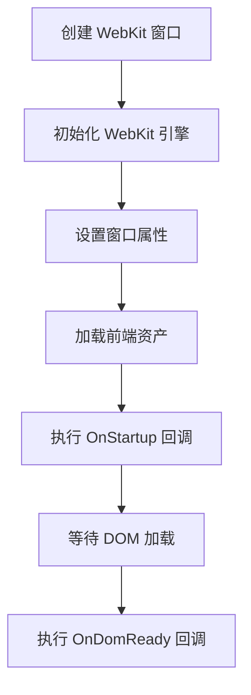
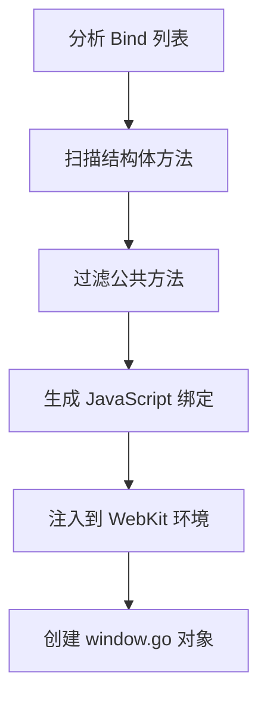

# Wails 教程系列 - WebKit 与生命周期深度解析

在开始 Wails 开发之前，我们需要深入理解两个核心概念：WebKit 技术原理和 Wails 应用的生命周期。这些知识将帮助你更好地理解 Wails 的工作机制，写出更优雅的应用。

## 为什么需要理解这些底层原理？

很多开发者直接开始写代码，但理解底层原理能让你：
- 遇到问题时快速定位原因
- 写出更高效的应用
- 避免常见的陷阱
- 更好地利用框架特性

## WebKit 技术深度解析

### 什么是 WebKit？

WebKit 是一个开源的浏览器引擎，最初由苹果公司开发，现在被广泛用于 Safari、Chrome（早期版本）等浏览器。在 Wails 中，WebKit 扮演着前端渲染引擎的角色。

简单来说，WebKit 就是负责把 HTML、CSS、JavaScript 转换成你看到的网页界面的引擎。它包含了：
- **HTML 解析器**：把 HTML 代码解析成 DOM 树
- **CSS 引擎**：处理样式和布局
- **JavaScript 引擎**：执行 JavaScript 代码
- **渲染引擎**：把解析结果绘制到屏幕上

### WebKit 在 Wails 中的作用

```go
// Wails 应用的基本结构
┌─────────────────────────────────────┐
│           Wails 应用                │
├─────────────────┬───────────────────┤
│   Go 后端       │   WebKit 前端     │
│                 │                   │
│  - 业务逻辑     │  - HTML/CSS/JS    │
│  - 系统调用     │  - 用户界面       │
│  - 数据处理     │  - 交互逻辑       │
└─────────────────┴───────────────────┘
```

**WebKit 的核心优势：**

1. **原生集成**：直接使用系统自带的 WebKit 组件，无需额外安装
2. **性能优化**：比打包 Chromium 引擎更轻量，启动更快
3. **标准兼容**：支持现代 Web 标准，兼容性好
4. **系统一致性**：与系统默认浏览器行为一致

**为什么不用 Chromium？**
- Chromium 太大了，动辄几百 MB
- WebKit 是系统自带的，启动快，占用少
- 系统原生集成，性能更好

### 各平台的 WebKit 实现

#### macOS
- **WebKit2 Framework**：苹果官方 WebKit 实现
- **优势**：性能优秀，与系统深度集成
- **特性**：支持 Safari 的所有现代功能

#### Windows
- **WebView2**：基于 Chromium 的现代 WebView 实现
- **优势**：功能丰富，兼容性好
- **特性**：支持最新的 Web 标准

#### Linux
- **WebKitGTK**：基于 GTK 的 WebKit 实现
- **优势**：与 Linux 桌面环境完美融合
- **特性**：支持各种 Linux 发行版

**技术细节：**
- macOS 使用 WebKit2 Framework，这是苹果官方维护的版本
- Windows 用 WebView2，基于 Chromium 但更轻量
- Linux 用 WebKitGTK，与 GTK 桌面环境集成

### WebKit 与前端技术栈

WebKit 支持所有现代 Web 技术：

```html
<!-- 支持现代 HTML5 -->
<!DOCTYPE html>
<html>
<head>
    <title>Wails App</title>
    <meta charset="utf-8">
</head>
<body>
    <!-- 支持现代 CSS -->
    <style>
        .container {
            display: flex;
            justify-content: center;
            align-items: center;
            height: 100vh;
        }
    </style>
    
    <!-- 支持现代 JavaScript -->
    <script>
        // ES6+ 语法
        const app = {
            async init() {
                const response = await fetch('/api/data');
                const data = await response.json();
                console.log(data);
            }
        };
        
        // 支持模块化
        import { Greet } from '../wailsjs/go/main/App';
    </script>
</body>
</html>
```

## wails.Run() 运行路线深度解析

### 启动流程概览

当你调用 `wails.Run()` 时，Wails 内部做了很多事情。理解这个过程能帮你更好地调试和优化应用。

```go
func main() {
    app := &App{}
    
    err := wails.Run(&options.App{
        Title:  "My App",
        Width:  1024,
        Height: 768,
        AssetServer: &assetserver.Options{
            Assets: assets,
        },
        OnStartup:  app.startup,
        OnDomReady: app.domReady,
        OnShutdown: app.shutdown,
        Bind: []interface{}{
            app,
        },
    })
    if err != nil {
        log.Fatal(err)
    }
}
```

### 详细运行路线

#### 1. 应用初始化阶段
```mermaid
graph TD
    A[main() 函数开始] --> B[创建 App 实例]
    B --> C[配置 options.App]
    C --> D[调用 wails.Run()]
    D --> E[初始化 Wails 运行时]
    E --> F[设置窗口属性]
    F --> G[配置资产服务器]
    G --> H[准备方法绑定]
```

**关键步骤：**
- **运行时初始化**：Wails 创建内部运行时环境，包括消息队列、事件系统等
- **窗口配置**：设置窗口大小、标题、样式等，创建原生窗口
- **资产准备**：加载前端资源文件，开发模式从磁盘，生产模式从嵌入文件
- **绑定准备**：分析 Go 结构体，准备方法绑定，生成 JavaScript 代码

#### 2. WebKit 窗口创建


**WebKit 初始化过程：**
```go
// 伪代码展示 WebKit 初始化
func initializeWebKit() {
    // 1. 创建 WebKit 上下文
    webkitContext := createWebKitContext()
    
    // 2. 设置安全策略
    webkitContext.setSecurityPolicy(securityPolicy)
    
    // 3. 配置开发者工具
    if isDevelopment {
        webkitContext.enableDeveloperTools()
    }
    
    // 4. 设置消息处理器
    webkitContext.setMessageHandler(handleMessage)
    
    // 5. 创建 WebView
    webView := webkitContext.createWebView()
    
    // 6. 加载前端资源
    webView.loadAssets(assets)
}
```

**实际过程更复杂：**
- 每个平台的 WebKit 实现都不一样
- 需要处理权限、安全策略、网络设置等
- 还要配置 JavaScript 引擎、CSS 引擎等

#### 3. 方法绑定机制


**绑定过程详解：**
```go
// 原始 Go 方法
type App struct {
    ctx context.Context
}

func (a *App) Greet(name string) string {
    return fmt.Sprintf("Hello %s!", name)
}

func (a *App) ProcessData(data []string) ([]string, error) {
    // 处理逻辑
    return processedData, nil
}

// 生成的 JavaScript 绑定
// wailsjs/go/main/App.js
export function Greet(arg1) {
    return window["go"]["main"]["App"]["Greet"](arg1);
}

export function ProcessData(arg1) {
    return window["go"]["main"]["App"]["ProcessData"](arg1);
}
```

**绑定原理：**
1. Wails 扫描 `Bind` 列表中的结构体
2. 找到所有首字母大写的公共方法
3. 生成对应的 JavaScript 函数
4. 通过 `window.go` 对象暴露给前端
5. 前端调用时，通过 IPC 机制传递给 Go 后端

#### 4. 资产加载机制
```go
// 开发模式：从磁盘加载
func loadAssetsDev() {
    // 监听文件变化
    watcher := fsnotify.NewWatcher()
    watcher.Add("frontend/dist")
    
    // 热重载逻辑
    for event := range watcher.Events {
        if event.Op&fsnotify.Write == fsnotify.Write {
            reloadFrontend()
        }
    }
}

// 生产模式：从嵌入文件加载
//go:embed all:frontend/dist
var assets embed.FS

func loadAssetsProd() {
    // 从 embed.FS 加载
    indexHTML, _ := assets.ReadFile("frontend/dist/index.html")
    webView.loadHTML(string(indexHTML))
}
```

**资产加载策略：**
- **开发模式**：从磁盘加载，支持热重载，方便调试
- **生产模式**：从 `embed.FS` 加载，打包到二进制文件，零外部依赖
- **自动检测**：Wails 自动找到包含 `index.html` 的目录
```

## 应用生命周期管理

### 生命周期阶段

Wails 应用有明确的生命周期，理解这些阶段能帮你更好地管理资源和状态。


### 详细生命周期回调

#### 1. OnStartup - 应用启动时
```go
func (a *App) startup(ctx context.Context) {
    a.ctx = ctx
    
    // 初始化资源
    a.initDatabase()
    a.initLogger()
    a.initConfig()
    
    // 启动后台服务
    go a.startBackgroundServices()
    
    // 发送启动事件
    runtime.EventsEmit(ctx, "appStarted", map[string]interface{}{
        "version": "1.0.0",
        "timestamp": time.Now(),
    })
}
```

**OnStartup 特点：**
- 在 WebKit 窗口创建后，前端加载前调用
- 适合初始化数据库连接、配置文件、后台服务等
- 可以发送事件通知前端应用已启动
- 这是初始化资源的最佳时机，因为前端还没加载，不会阻塞 UI

#### 2. OnDomReady - DOM 加载完成时
```go
func (a *App) domReady(ctx context.Context) {
    // 前端 DOM 已准备好
    log.Println("Frontend DOM is ready")
    
    // 可以安全地调用前端方法
    runtime.WindowSetTitle(ctx, "My App - Ready")
    
    // 发送数据到前端
    runtime.EventsEmit(ctx, "initialData", a.getInitialData())
}
```

**OnDomReady 特点：**
- 前端 DOM 完全加载后调用
- 可以安全地进行 DOM 操作
- 适合发送初始数据到前端
- 这时前端已经准备好，可以开始与用户交互

#### 3. OnBeforeClose - 窗口关闭前
```go
func (a *App) beforeClose(ctx context.Context) bool {
    // 检查是否有未保存的数据
    if a.hasUnsavedData() {
        // 显示确认对话框
        result := runtime.MessageDialog(ctx, runtime.MessageDialogOptions{
            Type:    runtime.QuestionDialog,
            Title:   "确认关闭",
            Message: "有未保存的数据，确定要关闭吗？",
            Buttons: []string{"保存并关闭", "直接关闭", "取消"},
        })
        
        switch result {
        case "保存并关闭":
            a.saveData()
            return true
        case "直接关闭":
            return true
        case "取消":
            return false
        }
    }
    
    return true
}
```

**OnBeforeClose 特点：**
- 在窗口关闭前调用
- 返回 `true` 允许关闭，`false` 阻止关闭
- 适合保存数据、显示确认对话框等
- 这是最后的机会来保存用户数据或阻止意外关闭

#### 4. OnShutdown - 应用关闭时
```go
func (a *App) shutdown(ctx context.Context) {
    // 清理资源
    a.closeDatabase()
    a.stopBackgroundServices()
    a.saveConfig()
    
    // 记录日志
    log.Println("Application shutting down gracefully")
}
```

**OnShutdown 特点：**
- 应用即将退出时调用
- 适合清理资源、关闭连接、保存配置等
- 确保应用优雅退出
- 这时窗口已经关闭，但应用进程还在，可以做一些清理工作

### 生命周期最佳实践

#### 1. 资源管理
```go
type App struct {
    ctx    context.Context
    db     *sql.DB
    logger *log.Logger
    config *Config
}

func (a *App) startup(ctx context.Context) {
    a.ctx = ctx
    
    // 按依赖顺序初始化
    a.initLogger()
    a.initConfig()
    a.initDatabase()
    
    // 启动后台服务
    go a.startBackgroundServices()
}

func (a *App) shutdown(ctx context.Context) {
    // 按相反顺序清理
    a.stopBackgroundServices()
    a.closeDatabase()
    a.saveConfig()
}
```

#### 2. 错误处理
```go
func (a *App) startup(ctx context.Context) {
    a.ctx = ctx
    
    // 使用 defer 确保清理
    defer func() {
        if r := recover(); r != nil {
            log.Printf("Startup panic: %v", r)
            runtime.Quit(ctx)
        }
    }()
    
    // 初始化逻辑
    if err := a.initComponents(); err != nil {
        log.Printf("Failed to initialize: %v", err)
        runtime.Quit(ctx)
    }
}
```

#### 3. 事件通信
```go
func (a *App) startup(ctx context.Context) {
    a.ctx = ctx
    
    // 发送启动事件
    runtime.EventsEmit(ctx, "appStarted", map[string]interface{}{
        "version": "1.0.0",
        "config":  a.config,
    })
}

func (a *App) domReady(ctx context.Context) {
    // 发送初始数据
    runtime.EventsEmit(ctx, "initialData", a.getInitialData())
    
    // 设置窗口标题
    runtime.WindowSetTitle(ctx, fmt.Sprintf("My App v%s", a.config.Version))
}
```

## 调试与监控

### 开发模式调试

开发时用好这些工具，能大大提高调试效率。
```go
err := wails.Run(&options.App{
    Title:  "My App",
    Width:  1024,
    Height: 768,
    AssetServer: &assetserver.Options{
        Assets: assets,
    },
    // 开发模式配置
    Logger:  nil, // 使用默认日志
    LogLevel: logger.DEBUG,
    // 启用开发者工具
    Debug: true,
    OnStartup:  app.startup,
    OnDomReady: app.domReady,
    OnShutdown: app.shutdown,
    Bind: []interface{}{
        app,
    },
})
```

### 生命周期监控
```go
func (a *App) startup(ctx context.Context) {
    startTime := time.Now()
    log.Printf("Application starting at %s", startTime.Format(time.RFC3339))
    
    // 初始化逻辑...
    
    log.Printf("Application started in %v", time.Since(startTime))
}

func (a *App) shutdown(ctx context.Context) {
    log.Printf("Application shutting down at %s", time.Now().Format(time.RFC3339))
    
    // 清理逻辑...
    
    log.Println("Application shutdown complete")
}
```

## 总结

理解 WebKit 技术和 Wails 生命周期对于开发高质量的桌面应用至关重要：

1. **WebKit 提供了强大的前端渲染能力**，支持现代 Web 技术
2. **wails.Run() 的启动流程**确保了应用的正确初始化
3. **生命周期回调**让你能够精确控制应用的各个阶段
4. **合理的资源管理**确保应用的稳定性和性能

**关键要点：**
- WebKit 是系统原生的，比 Chromium 轻量很多
- 理解启动流程能帮你快速定位问题
- 生命周期回调是管理资源的好工具
- 开发模式和生产模式的资产加载策略不同

在接下来的教程中，我们将基于这些基础知识，深入探讨 Wails 开发的各个方面。
