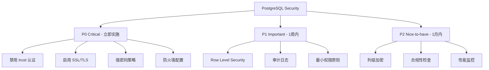

# PostgreSQL Security Best Practices 2025 - 生产环境安全加固完整指南

## 前言：一次数据泄露事件的反思

2024 年 3 月，某知名 SaaS 公司发生了一起严重的数据泄露事件。黑客通过一个配置不当的 PostgreSQL 数据库，窃取了超过 50 万用户的敏感信息。事后调查发现，问题的根源竟然是：

- ✗ `pg_hba.conf` 使用了不安全的 `trust` 认证
- ✗ 数据库端口直接暴露在公网
- ✗ 超级用户密码使用了弱密码 `admin123`
- ✗ 没有启用 SSL 加密传输
- ✗ 敏感数据未加密存储

最讽刺的是，**这些问题只需要 30 分钟就能完全修复**。

作为一个管理过数十个 PostgreSQL 生产环境的老兵，我深知数据库安全不是"选配"，而是"标配"。今天，我将分享一套经过生产环境验证的 PostgreSQL 安全加固方案，帮助你避免成为下一个安全事件的主角。

## 1. 认证安全：第一道防线

### 1.1 理解 pg_hba.conf：PostgreSQL 的"门卫"

`pg_hba.conf`（Host-Based Authentication）是 PostgreSQL 认证的核心配置文件。它决定了**谁可以连接、从哪里连接、使用什么认证方式**。

#### 危险配置示例（❌ 绝对不要这样做）

```conf
# ❌ 致命错误：允许任何人从任何地方无密码连接
host    all    all    0.0.0.0/0    trust

# ❌ 危险：使用已被破解的 md5 认证
host    all    all    192.168.1.0/24    md5
```

#### 安全配置最佳实践（✅ 推荐）

```conf
# PostgreSQL 15+ 推荐配置
# 格式：TYPE  DATABASE  USER  ADDRESS  METHOD  [OPTIONS]

# 1. 本地连接使用 peer 认证（Unix socket）
local   all       postgres                  peer

# 2. 本地 TCP 连接使用 scram-sha-256
host    all       all       127.0.0.1/32    scram-sha-256
host    all       all       ::1/128         scram-sha-256

# 3. 内网应用服务器使用 scram-sha-256 + SSL
hostssl mydb      app_user  10.0.1.0/24     scram-sha-256 clientcert=verify-ca

# 4. 只读副本连接（需要 SSL 证书）
hostssl replication repl_user 10.0.2.5/32   cert

# 5. DBA 远程管理（限制 IP + 双因素认证）
hostssl all       dba_user   203.0.113.5/32 scram-sha-256

# 6. 拒绝所有其他连接
host    all       all        0.0.0.0/0      reject
host    all       all        ::/0           reject
```

#### 关键配置解析

| 认证方法 | 安全等级 | 使用场景 | 说明 |
|---------|---------|---------|------|
| `trust` | ❌ 极低 | **绝不使用** | 无密码直接登录 |
| `md5` | ⚠️ 低 | 淘汰中 | 已被破解，不安全 |
| `scram-sha-256` | ✅ 高 | **生产推荐** | PostgreSQL 10+ 默认 |
| `cert` | ✅ 极高 | 关键连接 | SSL 客户端证书认证 |
| `ldap` | ✅ 高 | 企业环境 | 集成 AD/LDAP |
| `gss` | ✅ 高 | 企业环境 | Kerberos 认证 |

### 1.2 强密码策略：不只是"复杂度"

#### 安装密码强度检查扩展

```sql
-- 安装 passwordcheck 扩展
CREATE EXTENSION IF NOT EXISTS passwordcheck;

-- PostgreSQL 14+ 还可以使用 pg_qualstats
CREATE EXTENSION IF NOT EXISTS pg_qualstats;
```

#### 设置强密码策略

```sql
-- 1. 创建角色时要求强密码
CREATE ROLE app_user WITH 
  LOGIN 
  PASSWORD 'Secure@Pass2025!#$' 
  VALID UNTIL '2025-12-31'
  CONNECTION LIMIT 10;

-- 2. 修改现有用户密码并设置过期
ALTER ROLE legacy_user PASSWORD 'NewStrong@Pass2025!' VALID UNTIL '2025-06-30';

-- 3. 强制用户首次登录时修改密码
ALTER ROLE new_user PASSWORD 'Temp@Pass123!' VALID UNTIL 'now';

-- 4. 查看密码即将过期的用户
SELECT 
  rolname,
  rolvaliduntil,
  CURRENT_TIMESTAMP - rolvaliduntil AS days_expired
FROM pg_authid 
WHERE rolvaliduntil IS NOT NULL
  AND rolvaliduntil < CURRENT_TIMESTAMP + INTERVAL '30 days'
ORDER BY rolvaliduntil;
```

#### 密码管理最佳实践

```bash
# 使用环境变量而非明文密码
export PGPASSWORD='your_secure_password'
psql -U app_user -d mydb

# 或使用 .pgpass 文件（推荐）
# 格式：hostname:port:database:username:password
echo "localhost:5432:mydb:app_user:Secure@Pass2025" > ~/.pgpass
chmod 0600 ~/.pgpass
```

### 1.3 SSL/TLS 加密连接配置

#### 服务器端 SSL 配置

```bash
# 1. 生成自签名证书（测试用）
cd /var/lib/postgresql/15/main
openssl req -new -x509 -days 365 -nodes -text \
  -out server.crt \
  -keyout server.key \
  -subj "/CN=db.example.com"

# 设置证书权限
chown postgres:postgres server.crt server.key
chmod 600 server.key
chmod 644 server.crt
```

#### postgresql.conf SSL 配置

```conf
# 启用 SSL
ssl = on
ssl_cert_file = '/var/lib/postgresql/15/main/server.crt'
ssl_key_file = '/var/lib/postgresql/15/main/server.key'
ssl_ca_file = '/var/lib/postgresql/15/main/root.crt'  # 可选：CA 证书

# SSL 加密套件（推荐高强度加密）
ssl_ciphers = 'HIGH:MEDIUM:+3DES:!aNULL'  # OpenSSL 默认
ssl_prefer_server_ciphers = on
ssl_min_protocol_version = 'TLSv1.2'  # 禁用 TLSv1.0/1.1

# 强制 SSL 连接（生产环境推荐）
ssl_require = on
```

#### 客户端 SSL 连接

```bash
# Go 连接示例
connStr := "host=db.example.com port=5432 user=app_user password=xxx dbname=mydb sslmode=verify-full sslrootcert=/path/to/root.crt"

# Python psycopg2
conn = psycopg2.connect(
    host="db.example.com",
    database="mydb",
    user="app_user",
    password="xxx",
    sslmode="verify-full",
    sslrootcert="/path/to/root.crt"
)

# psql 命令行
psql "sslmode=require host=db.example.com dbname=mydb user=app_user"
```

#### SSL 模式安全等级

| sslmode | 加密 | 证书验证 | 安全性 | 使用场景 |
|---------|-----|---------|-------|---------|
| `disable` | ❌ | ❌ | 极低 | 仅本地测试 |
| `allow` | 可选 | ❌ | 低 | 不推荐 |
| `prefer` | 优先 | ❌ | 中 | 内网环境 |
| `require` | ✅ | ❌ | 中高 | 基本生产 |
| `verify-ca` | ✅ | ✅ CA | 高 | 生产推荐 |
| `verify-full` | ✅ | ✅ CA+主机名 | **极高** | **生产必备** |

### 1.4 企业级认证：LDAP 集成

```conf
# pg_hba.conf LDAP 配置
host    all    all    10.0.0.0/8    ldap ldapserver=ldap.company.com ldapport=389 ldapprefix="uid=" ldapsuffix=",ou=people,dc=company,dc=com"

# 或使用 LDAPS（加密）
host    all    all    10.0.0.0/8    ldap ldapserver=ldap.company.com ldapport=636 ldapscheme=ldaps ldapprefix="uid=" ldapsuffix=",ou=people,dc=company,dc=com"
```

---

## 2. 权限管理：最小权限原则

### 2.1 角色与权限模型

PostgreSQL 的权限系统非常强大，但也很容易配置错误。

#### 常见错误：给应用用户过多权限

```sql
-- ❌ 危险：直接使用超级用户
psql -U postgres mydb  -- 不要这样做！

-- ❌ 危险：授予不必要的权限
GRANT ALL PRIVILEGES ON DATABASE mydb TO app_user;
```

#### 最佳实践：分层权限设计

```sql
-- 1. 创建角色组（Role Groups）
CREATE ROLE readonly_group NOLOGIN;
CREATE ROLE readwrite_group NOLOGIN;
CREATE ROLE admin_group NOLOGIN;

-- 2. 为角色组授予权限
-- 只读权限
GRANT CONNECT ON DATABASE mydb TO readonly_group;
GRANT USAGE ON SCHEMA public TO readonly_group;
GRANT SELECT ON ALL TABLES IN SCHEMA public TO readonly_group;
ALTER DEFAULT PRIVILEGES IN SCHEMA public 
  GRANT SELECT ON TABLES TO readonly_group;

-- 读写权限
GRANT CONNECT ON DATABASE mydb TO readwrite_group;
GRANT USAGE, CREATE ON SCHEMA public TO readwrite_group;
GRANT SELECT, INSERT, UPDATE, DELETE ON ALL TABLES IN SCHEMA public TO readwrite_group;
GRANT USAGE, SELECT ON ALL SEQUENCES IN SCHEMA public TO readwrite_group;
ALTER DEFAULT PRIVILEGES IN SCHEMA public 
  GRANT SELECT, INSERT, UPDATE, DELETE ON TABLES TO readwrite_group;
ALTER DEFAULT PRIVILEGES IN SCHEMA public 
  GRANT USAGE, SELECT ON SEQUENCES TO readwrite_group;

-- 管理员权限
GRANT ALL PRIVILEGES ON DATABASE mydb TO admin_group;
GRANT ALL PRIVILEGES ON SCHEMA public TO admin_group;
GRANT ALL PRIVILEGES ON ALL TABLES IN SCHEMA public TO admin_group;

-- 3. 创建实际用户并分配到组
CREATE ROLE report_user LOGIN PASSWORD 'xxx' IN ROLE readonly_group;
CREATE ROLE app_user LOGIN PASSWORD 'xxx' IN ROLE readwrite_group CONNECTION LIMIT 20;
CREATE ROLE dba_user LOGIN PASSWORD 'xxx' IN ROLE admin_group;

-- 4. 移除 public 的默认权限（重要！）
REVOKE ALL ON DATABASE mydb FROM PUBLIC;
REVOKE ALL ON SCHEMA public FROM PUBLIC;
```

### 2.2 Row Level Security (RLS)：行级安全

RLS 是 PostgreSQL 9.5+ 引入的强大功能，可以实现**多租户数据隔离**。

#### 实战案例：SaaS 多租户应用

```sql
-- 场景：每个租户只能访问自己的数据

-- 1. 创建租户表
CREATE TABLE tenants (
  tenant_id SERIAL PRIMARY KEY,
  tenant_name VARCHAR(100) NOT NULL,
  created_at TIMESTAMP DEFAULT NOW()
);

-- 2. 创建业务表（包含 tenant_id）
CREATE TABLE orders (
  order_id SERIAL PRIMARY KEY,
  tenant_id INTEGER NOT NULL REFERENCES tenants(tenant_id),
  order_number VARCHAR(50) NOT NULL,
  customer_name VARCHAR(100),
  total_amount DECIMAL(10,2),
  created_at TIMESTAMP DEFAULT NOW()
);

-- 3. 启用 RLS
ALTER TABLE orders ENABLE ROW LEVEL SECURITY;

-- 4. 创建 RLS 策略
-- 租户只能查看自己的订单
CREATE POLICY tenant_isolation ON orders
  FOR ALL
  TO PUBLIC
  USING (tenant_id = current_setting('app.current_tenant_id')::INTEGER);

-- 5. 强制 RLS（即使表所有者也受限）
ALTER TABLE orders FORCE ROW LEVEL SECURITY;

-- 6. 应用层使用
-- 在每个请求开始时设置租户 ID
BEGIN;
SET LOCAL app.current_tenant_id = '123';  -- 从 JWT token 中提取
SELECT * FROM orders;  -- 自动过滤，只返回 tenant_id=123 的数据
COMMIT;
```

#### RLS 性能优化技巧

```sql
-- 1. 为 RLS 过滤字段创建索引
CREATE INDEX idx_orders_tenant_id ON orders(tenant_id);

-- 2. 使用 LEAKPROOF 函数避免信息泄露
CREATE FUNCTION get_current_tenant() RETURNS INTEGER AS $$
  SELECT current_setting('app.current_tenant_id')::INTEGER;
$$ LANGUAGE SQL STABLE LEAKPROOF;

CREATE POLICY tenant_isolation_optimized ON orders
  FOR ALL
  TO PUBLIC
  USING (tenant_id = get_current_tenant());

-- 3. 为不同操作创建不同策略
CREATE POLICY tenant_select ON orders
  FOR SELECT
  TO PUBLIC
  USING (tenant_id = current_setting('app.current_tenant_id')::INTEGER);

CREATE POLICY tenant_insert ON orders
  FOR INSERT
  TO PUBLIC
  WITH CHECK (tenant_id = current_setting('app.current_tenant_id')::INTEGER);

CREATE POLICY tenant_update ON orders
  FOR UPDATE
  TO PUBLIC
  USING (tenant_id = current_setting('app.current_tenant_id')::INTEGER)
  WITH CHECK (tenant_id = current_setting('app.current_tenant_id')::INTEGER);
```

### 2.3 Schema 隔离策略

```sql
-- 为不同租户/模块创建独立 Schema
CREATE SCHEMA tenant_001;
CREATE SCHEMA tenant_002;
CREATE SCHEMA analytics;

-- 设置 Schema 权限
GRANT USAGE ON SCHEMA tenant_001 TO tenant_001_user;
GRANT ALL ON ALL TABLES IN SCHEMA tenant_001 TO tenant_001_user;

-- 设置默认 Schema 搜索路径
ALTER ROLE tenant_001_user SET search_path = tenant_001, public;

-- 切换到指定 Schema
SET search_path TO tenant_001;
```

### 2.4 权限审计：谁有什么权限？

```sql
-- 查看数据库权限
SELECT 
  datname,
  datacl
FROM pg_database
WHERE datname = 'mydb';

-- 查看表权限
SELECT 
  schemaname,
  tablename,
  tableowner,
  has_table_privilege('app_user', schemaname||'.'||tablename, 'SELECT') AS can_select,
  has_table_privilege('app_user', schemaname||'.'||tablename, 'INSERT') AS can_insert,
  has_table_privilege('app_user', schemaname||'.'||tablename, 'UPDATE') AS can_update,
  has_table_privilege('app_user', schemaname||'.'||tablename, 'DELETE') AS can_delete
FROM pg_tables
WHERE schemaname = 'public'
ORDER BY tablename;

-- 查看角色成员关系
SELECT 
  r.rolname AS role,
  m.rolname AS member,
  g.rolname AS grantor
FROM pg_auth_members am
JOIN pg_roles r ON r.oid = am.roleid
JOIN pg_roles m ON m.oid = am.member
LEFT JOIN pg_roles g ON g.oid = am.grantor
ORDER BY r.rolname;

-- 查看超级用户（危险！）
SELECT rolname, rolsuper, rolcreatedb, rolcreaterole 
FROM pg_roles 
WHERE rolsuper = true;
```

---

## 3. 数据加密：保护静态数据

### 3.1 传输层加密（已在 SSL 部分介绍）

### 3.2 列级加密：pgcrypto 扩展

```sql
-- 1. 安装 pgcrypto
CREATE EXTENSION IF NOT EXISTS pgcrypto;

-- 2. 创建包含敏感字段的表
CREATE TABLE users (
  user_id SERIAL PRIMARY KEY,
  username VARCHAR(50) NOT NULL,
  email VARCHAR(100),
  ssn BYTEA,  -- 加密存储的社会安全号
  credit_card BYTEA,  -- 加密存储的信用卡号
  created_at TIMESTAMP DEFAULT NOW()
);

-- 3. 插入加密数据
INSERT INTO users (username, email, ssn, credit_card)
VALUES (
  'john_doe',
  'john@example.com',
  pgp_sym_encrypt('123-45-6789', 'encryption_key_2025'),
  pgp_sym_encrypt('4532-1234-5678-9012', 'encryption_key_2025')
);

-- 4. 查询解密数据
SELECT 
  user_id,
  username,
  email,
  pgp_sym_decrypt(ssn, 'encryption_key_2025') AS ssn_decrypted,
  pgp_sym_decrypt(credit_card, 'encryption_key_2025') AS card_decrypted
FROM users
WHERE user_id = 1;

-- 5. 使用公钥加密（更安全）
-- 生成密钥对（在应用层完成）
-- 公钥加密，只有私钥能解密
INSERT INTO users (username, ssn)
VALUES (
  'jane_doe',
  pgp_pub_encrypt('987-65-4321', dearmor('-----BEGIN PGP PUBLIC KEY BLOCK-----
...
-----END PGP PUBLIC KEY BLOCK-----'))
);
```

### 3.3 密钥管理最佳实践

```sql
-- ❌ 错误：硬编码密钥
SELECT pgp_sym_decrypt(ssn, 'my_secret_key') FROM users;

-- ✅ 正确：从环境变量/密钥管理服务获取
-- 方案 1：使用 PostgreSQL GUC 变量（应用层设置）
SET app.encryption_key = 'xxx';  -- 从 Vault/AWS KMS 获取
SELECT pgp_sym_decrypt(ssn, current_setting('app.encryption_key')) FROM users;

-- 方案 2：使用应用层加解密（推荐）
-- 在 Go/Python/Java 中处理加解密，数据库只存储密文
```

#### 与密钥管理系统集成

```go
// Go 示例：与 AWS KMS 集成
package main

import (
    "database/sql"
    "github.com/aws/aws-sdk-go/aws/session"
    "github.com/aws/aws-sdk-go/service/kms"
)

func encryptSensitiveData(plaintext string) ([]byte, error) {
    sess := session.Must(session.NewSession())
    kmsSvc := kms.New(sess)
    
    result, err := kmsSvc.Encrypt(&kms.EncryptInput{
        KeyId:     aws.String("arn:aws:kms:us-east-1:123456789:key/xxx"),
        Plaintext: []byte(plaintext),
    })
    
    return result.CiphertextBlob, err
}

func saveUser(db *sql.DB, username, ssn string) error {
    encryptedSSN, err := encryptSensitiveData(ssn)
    if err != nil {
        return err
    }
    
    _, err = db.Exec(
        "INSERT INTO users (username, ssn) VALUES ($1, $2)",
        username, encryptedSSN,
    )
    return err
}
```

### 3.4 透明数据加密（TDE）

PostgreSQL 本身不支持 TDE，但可以通过以下方式实现：

```bash
# 方案 1：使用文件系统加密（推荐）
# Linux LUKS 加密
cryptsetup luksFormat /dev/sdb1
cryptsetup luksOpen /dev/sdb1 pgdata_encrypted
mkfs.ext4 /dev/mapper/pgdata_encrypted
mount /dev/mapper/pgdata_encrypted /var/lib/postgresql

# 方案 2：使用 Citus 企业版（商业方案）
# 支持表空间级别的 TDE

# 方案 3：使用 pg_tde 扩展（实验性）
# https://github.com/Percona-Lab/pg_tde
```

---

## 4. 审计与监控：知道发生了什么

### 4.1 安装 pgAudit 扩展

```sql
-- 1. 安装扩展
CREATE EXTENSION IF NOT EXISTS pgaudit;

-- 2. 配置审计范围（postgresql.conf）
```

```conf
# 启用 pgAudit
shared_preload_libraries = 'pgaudit'

# 审计所有操作
pgaudit.log = 'all'  # 或 'read, write, ddl, role, misc'

# 审计所有用户
pgaudit.log_catalog = on
pgaudit.log_client = off
pgaudit.log_level = 'log'
pgaudit.log_parameter = on
pgaudit.log_relation = on
pgaudit.log_statement_once = off

# 日志格式
log_destination = 'csvlog'
logging_collector = on
log_directory = '/var/log/postgresql'
log_filename = 'postgresql-%Y-%m-%d_%H%M%S.log'
log_rotation_age = 1d
log_rotation_size = 100MB
```

### 4.2 审计关键操作

```sql
-- 审计特定用户的所有操作
ALTER ROLE app_user SET pgaudit.log = 'all';

-- 仅审计 DDL 和权限变更
ALTER ROLE dba_user SET pgaudit.log = 'ddl, role';

-- 审计特定表的访问
CREATE SCHEMA audit;
ALTER TABLE sensitive_table SET (pgaudit.log = 'read, write');

-- 查看审计日志
SELECT 
  log_time,
  user_name,
  database_name,
  command_tag,
  message
FROM pg_log
WHERE user_name = 'app_user'
  AND log_time > NOW() - INTERVAL '1 hour'
ORDER BY log_time DESC;
```

### 4.3 监控异常行为

```sql
-- 1. 监控失败的登录尝试
CREATE TABLE login_failures (
  attempt_time TIMESTAMP,
  username VARCHAR(100),
  ip_address INET,
  reason TEXT
);

-- 使用 pg_stat_statements 监控慢查询
CREATE EXTENSION IF NOT EXISTS pg_stat_statements;

-- 查找最慢的查询
SELECT 
  userid::regrole,
  dbid,
  query,
  calls,
  total_exec_time / 1000 AS total_time_seconds,
  mean_exec_time / 1000 AS mean_time_seconds,
  max_exec_time / 1000 AS max_time_seconds
FROM pg_stat_statements
ORDER BY total_exec_time DESC
LIMIT 20;

-- 2. 监控权限变更
CREATE TABLE audit_grants (
  change_time TIMESTAMP DEFAULT NOW(),
  grantor NAME,
  grantee NAME,
  privilege TEXT,
  object_type TEXT,
  object_name TEXT
);

-- 使用触发器记录权限变更（需要事件触发器）
CREATE OR REPLACE FUNCTION audit_grant_revoke()
RETURNS event_trigger AS $$
BEGIN
  INSERT INTO audit_grants (grantor, grantee, privilege)
  SELECT 
    session_user,
    'xxx',  -- 从 pg_event_trigger_ddl_commands() 提取
    tg_tag;
END;
$$ LANGUAGE plpgsql;

CREATE EVENT TRIGGER audit_grants_trigger
  ON ddl_command_end
  WHEN TAG IN ('GRANT', 'REVOKE')
  EXECUTE FUNCTION audit_grant_revoke();
```

### 4.4 实时告警配置

```python
# Python 监控脚本示例
import psycopg2
import smtplib
from email.mime.text import MIMEText

def check_suspicious_activity():
    conn = psycopg2.connect("dbname=mydb user=monitor")
    cur = conn.cursor()
    
    # 检查失败登录次数
    cur.execute("""
        SELECT username, COUNT(*) 
        FROM login_failures 
        WHERE attempt_time > NOW() - INTERVAL '5 minutes'
        GROUP BY username
        HAVING COUNT(*) > 5
    """)
    
    for row in cur.fetchall():
        send_alert(f"Brute force detected: {row[0]} - {row[1]} attempts")
    
    # 检查异常大量删除
    cur.execute("""
        SELECT query, calls
        FROM pg_stat_statements
        WHERE query LIKE '%DELETE%'
          AND calls > 1000
          AND last_exec > NOW() - INTERVAL '10 minutes'
    """)
    
    for row in cur.fetchall():
        send_alert(f"Mass deletion detected: {row[1]} DELETE operations")

def send_alert(message):
    msg = MIMEText(message)
    msg['Subject'] = 'PostgreSQL Security Alert'
    msg['From'] = 'monitor@example.com'
    msg['To'] = 'dba@example.com'
    
    s = smtplib.SMTP('localhost')
    s.send_message(msg)
    s.quit()
```

---

## 5. 网络安全：防御外部攻击

### 5.1 防火墙规则配置

```bash
# Ubuntu/Debian UFW 配置
# 只允许特定 IP 访问 PostgreSQL 端口
ufw allow from 10.0.1.0/24 to any port 5432 proto tcp
ufw deny 5432/tcp

# CentOS/RHEL firewalld 配置
firewall-cmd --permanent --zone=internal --add-source=10.0.1.0/24
firewall-cmd --permanent --zone=internal --add-port=5432/tcp
firewall-cmd --reload

# iptables 配置
iptables -A INPUT -p tcp -s 10.0.1.0/24 --dport 5432 -j ACCEPT
iptables -A INPUT -p tcp --dport 5432 -j DROP
```

### 5.2 连接限制与速率限制

```sql
-- 1. 限制每个用户的最大连接数
ALTER ROLE app_user CONNECTION LIMIT 20;

-- 2. 限制数据库总连接数（postgresql.conf）
```

```conf
max_connections = 100
superuser_reserved_connections = 3

# 连接池推荐配置
shared_buffers = '256MB'
work_mem = '4MB'
maintenance_work_mem = '64MB'
```

```sql
-- 3. 监控当前连接
SELECT 
  datname,
  usename,
  application_name,
  client_addr,
  state,
  state_change,
  query
FROM pg_stat_activity
WHERE state = 'active'
ORDER BY state_change;

-- 4. 强制断开空闲连接
SELECT pg_terminate_backend(pid)
FROM pg_stat_activity
WHERE state = 'idle'
  AND state_change < NOW() - INTERVAL '30 minutes'
  AND usename != 'postgres';
```

### 5.3 防止暴力破解

```conf
# postgresql.conf 配置
# 使用连接限制 + fail2ban

# 记录失败的连接尝试
log_connections = on
log_disconnections = on
log_duration = off
log_hostname = off  # 性能考虑
```

```bash
# fail2ban 配置（/etc/fail2ban/jail.d/postgresql.conf）
[postgresql]
enabled = true
port = 5432
filter = postgresql
logpath = /var/log/postgresql/postgresql-*.log
maxretry = 5
findtime = 600
bantime = 3600
action = iptables[name=PostgreSQL, port=5432, protocol=tcp]
```

```bash
# fail2ban filter（/etc/fail2ban/filter.d/postgresql.conf）
[Definition]
failregex = FATAL:  password authentication failed for user ".*" \[<HOST>\]
            FATAL:  no pg_hba.conf entry for host "<HOST>"
ignoreregex =
```

### 5.4 使用堡垒机/跳板机

```bash
# 通过 SSH 隧道连接 PostgreSQL
ssh -L 5432:localhost:5432 user@bastion-host.example.com

# 然后连接本地端口
psql -h localhost -p 5432 -U app_user mydb

# 使用 PgBouncer 连接池 + 堡垒机
# PgBouncer 配置 (pgbouncer.ini)
[databases]
mydb = host=10.0.1.5 port=5432 dbname=mydb

[pgbouncer]
listen_addr = 0.0.0.0
listen_port = 6432
auth_type = scram-sha-256
auth_file = /etc/pgbouncer/userlist.txt
pool_mode = transaction
max_client_conn = 1000
default_pool_size = 25
```

---

## 6. 安全检查清单

### 6.1 部署前必做的 10 项检查

| 检查项 | 配置文件 | 命令/脚本 | 优先级 |
|--------|---------|-----------|--------|
| 1. 禁用 trust 认证 | `pg_hba.conf` | `grep trust pg_hba.conf` | 🔴 P0 |
| 2. 启用 SSL/TLS | `postgresql.conf` | `SHOW ssl;` | 🔴 P0 |
| 3. 使用强密码策略 | SQL | `SELECT rolvaliduntil FROM pg_roles WHERE rolvaliduntil IS NULL;` | 🔴 P0 |
| 4. 限制超级用户 | SQL | `SELECT COUNT(*) FROM pg_roles WHERE rolsuper = true;` | 🔴 P0 |
| 5. 配置防火墙 | OS | `ufw status` | 🔴 P0 |
| 6. 启用审计日志 | `postgresql.conf` | `SHOW logging_collector;` | 🟡 P1 |
| 7. 配置 RLS | SQL | `SELECT COUNT(*) FROM pg_tables WHERE rowsecurity = false;` | 🟡 P1 |
| 8. 加密敏感字段 | SQL | 手动审查 | 🟡 P1 |
| 9. 设置连接限制 | `postgresql.conf` | `SHOW max_connections;` | 🟢 P2 |
| 10. 备份加密 | 备份脚本 | `pg_dump --encrypt` | 🟢 P2 |

### 6.2 一键安全检查脚本

```bash
#!/bin/bash
# PostgreSQL Security Audit Script

echo "=== PostgreSQL Security Audit ==="
echo "Date: $(date)"
echo ""

# 1. 检查 trust 认证
echo "[1] Checking for trust authentication..."
if grep -q "trust" /etc/postgresql/*/main/pg_hba.conf; then
  echo "❌ CRITICAL: trust authentication found!"
  grep "trust" /etc/postgresql/*/main/pg_hba.conf
else
  echo "✅ PASS"
fi
echo ""

# 2. 检查 SSL 配置
echo "[2] Checking SSL configuration..."
SSL_STATUS=$(sudo -u postgres psql -t -c "SHOW ssl;")
if [[ "$SSL_STATUS" == *"on"* ]]; then
  echo "✅ PASS: SSL is enabled"
else
  echo "❌ CRITICAL: SSL is disabled!"
fi
echo ""

# 3. 检查超级用户数量
echo "[3] Checking superuser count..."
SUPERUSER_COUNT=$(sudo -u postgres psql -t -c "SELECT COUNT(*) FROM pg_roles WHERE rolsuper = true;")
if [ "$SUPERUSER_COUNT" -le 2 ]; then
  echo "✅ PASS: $SUPERUSER_COUNT superusers found"
else
  echo "⚠️  WARNING: $SUPERUSER_COUNT superusers found (recommended: ≤2)"
fi
echo ""

# 4. 检查密码过期
echo "[4] Checking password expiration..."
EXPIRED=$(sudo -u postgres psql -t -c "SELECT COUNT(*) FROM pg_authid WHERE rolvaliduntil IS NULL AND rolcanlogin = true;")
if [ "$EXPIRED" -eq 0 ]; then
  echo "✅ PASS: All passwords have expiration dates"
else
  echo "⚠️  WARNING: $EXPIRED users without password expiration"
fi
echo ""

# 5. 检查公网暴露
echo "[5] Checking public exposure..."
LISTEN_ADDR=$(sudo -u postgres psql -t -c "SHOW listen_addresses;")
if [[ "$LISTEN_ADDR" == *"*"* ]] || [[ "$LISTEN_ADDR" == *"0.0.0.0"* ]]; then
  echo "⚠️  WARNING: Database listening on all interfaces"
else
  echo "✅ PASS: Database listening on: $LISTEN_ADDR"
fi
echo ""

# 6. 检查日志配置
echo "[6] Checking logging configuration..."
LOG_COLLECTOR=$(sudo -u postgres psql -t -c "SHOW logging_collector;")
if [[ "$LOG_COLLECTOR" == *"on"* ]]; then
  echo "✅ PASS: Logging collector is enabled"
else
  echo "❌ CRITICAL: Logging collector is disabled!"
fi
echo ""

# 7. 检查连接限制
echo "[7] Checking connection limits..."
sudo -u postgres psql -c "SELECT rolname, rolconnlimit FROM pg_roles WHERE rolconnlimit >= 0;"
echo ""

# 8. 检查 pgAudit 扩展
echo "[8] Checking pgAudit extension..."
PGAUDIT=$(sudo -u postgres psql -t -c "SELECT COUNT(*) FROM pg_extension WHERE extname = 'pgaudit';")
if [ "$PGAUDIT" -gt 0 ]; then
  echo "✅ PASS: pgAudit is installed"
else
  echo "⚠️  WARNING: pgAudit is not installed"
fi
echo ""

# 9. 检查防火墙
echo "[9] Checking firewall status..."
if command -v ufw &> /dev/null; then
  ufw status | grep 5432
elif command -v firewall-cmd &> /dev/null; then
  firewall-cmd --list-ports | grep 5432
else
  echo "⚠️  WARNING: Firewall tool not found"
fi
echo ""

# 10. 生成报告
echo "=== Audit Summary ==="
echo "Review the findings above and address critical issues immediately."
echo "For detailed security hardening, refer to: https://friday-go.icu"
```

### 6.3 合规性清单（GDPR/SOC2）

```sql
-- GDPR 合规检查

-- 1. 数据保留策略
CREATE TABLE data_retention_policy (
  table_name VARCHAR(100),
  retention_days INTEGER,
  last_cleanup TIMESTAMP
);

-- 2. 数据删除审计
CREATE TABLE data_deletion_log (
  deletion_time TIMESTAMP DEFAULT NOW(),
  table_name VARCHAR(100),
  user_id INTEGER,
  reason TEXT,
  performed_by NAME DEFAULT SESSION_USER
);

-- 3. 数据访问日志（使用 pgAudit）
SELECT 
  log_time,
  user_name,
  command_tag,
  object_name
FROM pg_audit_log
WHERE object_name = 'sensitive_table'
  AND log_time > NOW() - INTERVAL '90 days'
ORDER BY log_time DESC;

-- 4. 数据匿名化（用于测试环境）
UPDATE users_test 
SET 
  email = 'user' || user_id || '@example.com',
  phone = '555-' || LPAD(user_id::TEXT, 7, '0'),
  ssn = NULL,
  credit_card = NULL;
```

---

## 7. 实战案例：防御 SQL 注入

虽然 SQL 注入主要是应用层问题，但 PostgreSQL 也可以提供额外防护。

### 7.1 使用参数化查询（应用层）

```go
// ❌ 危险：SQL 注入漏洞
func GetUser(username string) {
    query := fmt.Sprintf("SELECT * FROM users WHERE username = '%s'", username)
    rows, _ := db.Query(query)
    // 攻击者输入: admin' OR '1'='1
}

// ✅ 安全：参数化查询
func GetUserSafe(username string) {
    query := "SELECT * FROM users WHERE username = $1"
    rows, _ := db.Query(query, username)
}
```

### 7.2 数据库层面的防护

```sql
-- 1. 使用 CHECK 约束限制输入
CREATE TABLE users (
  user_id SERIAL PRIMARY KEY,
  username VARCHAR(50) CHECK (username ~ '^[a-zA-Z0-9_]{3,50}$'),
  email VARCHAR(100) CHECK (email ~ '^[^@]+@[^@]+\.[^@]+$')
);

-- 2. 创建只读视图
CREATE VIEW users_readonly AS
SELECT user_id, username, email, created_at
FROM users;

GRANT SELECT ON users_readonly TO app_user;
REVOKE ALL ON users FROM app_user;

-- 3. 使用 SECURITY DEFINER 函数封装操作
CREATE OR REPLACE FUNCTION get_user_by_username(p_username VARCHAR)
RETURNS TABLE (user_id INT, username VARCHAR, email VARCHAR)
SECURITY DEFINER
AS $$
BEGIN
  RETURN QUERY
  SELECT u.user_id, u.username, u.email
  FROM users u
  WHERE u.username = p_username;
END;
$$ LANGUAGE plpgsql;

REVOKE EXECUTE ON FUNCTION get_user_by_username(VARCHAR) FROM PUBLIC;
GRANT EXECUTE ON FUNCTION get_user_by_username(VARCHAR) TO app_user;
```

---

## 8. 总结与资源

### 8.1 安全优先级矩阵



### 8.2 安全配置模板下载

```bash
# 克隆安全配置模板仓库
git clone https://github.com/pfinal-nc/postgresql-security-templates.git

# 包含：
# - pg_hba.conf.template
# - postgresql.conf.secure
# - ssl-setup.sh
# - audit-script.sh
# - backup-encrypted.sh
```

### 8.3 推荐学习资源

1. **官方文档**
   - [PostgreSQL Security](https://www.postgresql.org/docs/current/security.html)
   - [Row Level Security](https://www.postgresql.org/docs/current/ddl-rowsecurity.html)

2. **工具**
   - [pgAudit](https://github.com/pgaudit/pgaudit) - 审计扩展
   - [pgBadger](https://github.com/darold/pgbadger) - 日志分析
   - [PgBouncer](https://www.pgbouncer.org/) - 连接池

3. **书籍**
   - *PostgreSQL 14 Administration Cookbook*
   - *Mastering PostgreSQL Security*

4. **社区**
   - [PostgreSQL Slack](https://postgres-slack.herokuapp.com/)
   - [Stack Overflow - PostgreSQL](https://stackoverflow.com/questions/tagged/postgresql)

---

## 9. 常见问题解答

**Q1: SSL 会影响性能吗？**

A: 现代 CPU 的 AES-NI 指令使 SSL 开销降到 5% 以下，生产环境必须启用。

**Q2: RLS 对性能有多大影响？**

A: 如果为过滤字段建立索引，影响通常 < 10%。务必使用 `EXPLAIN ANALYZE` 测试。

**Q3: 如何在不停机的情况下启用 SSL？**

A: 先配置 `ssl = on`，但 `pg_hba.conf` 保留 `host`（非 `hostssl`），然后逐步迁移客户端。

**Q4: pgAudit 会产生大量日志吗？**

A: 是的。生产环境建议只审计 `ddl, role`，避免 `read, write`，并配置日志轮转。

**Q5: 多租户应用必须用 RLS 吗？**

A: 不是必须，但 RLS 是最可靠的数据隔离方案，避免应用层逻辑漏洞。

---

## 结语

数据库安全不是一次性工作，而是持续的过程。本文介绍的方案已在多个生产环境验证，但安全形势在不断变化，建议：

1. **每季度运行一次安全审计脚本**
2. **订阅 PostgreSQL 安全公告**
3. **定期审查权限和日志**
4. **保持 PostgreSQL 版本更新**

记住：**80% 的数据库安全问题源于配置错误，而非软件漏洞**。花 30 分钟配置，避免百万损失。

如果本文对你有帮助，欢迎分享给更多开发者。安全是所有人的责任！

---

**关于作者**

PFinal南丞 - 10+ 年数据库架构经验，管理过 PB 级 PostgreSQL 集群。更多技术文章请访问 [PFinalClub](https://friday-go.icu)。

**相关阅读**

- [PostgreSQL 性能优化实战](./PostgreSQL-Performance-Optimization-Guide.md)
- [PostgreSQL 10个鲜为人知的强大功能](./PostgreSQL-10个鲜为人知的强大功能.md)
- [Golang Web 应用完整安全指南](../../security/engineering/golang%20Web应用完整安全指南.md)
