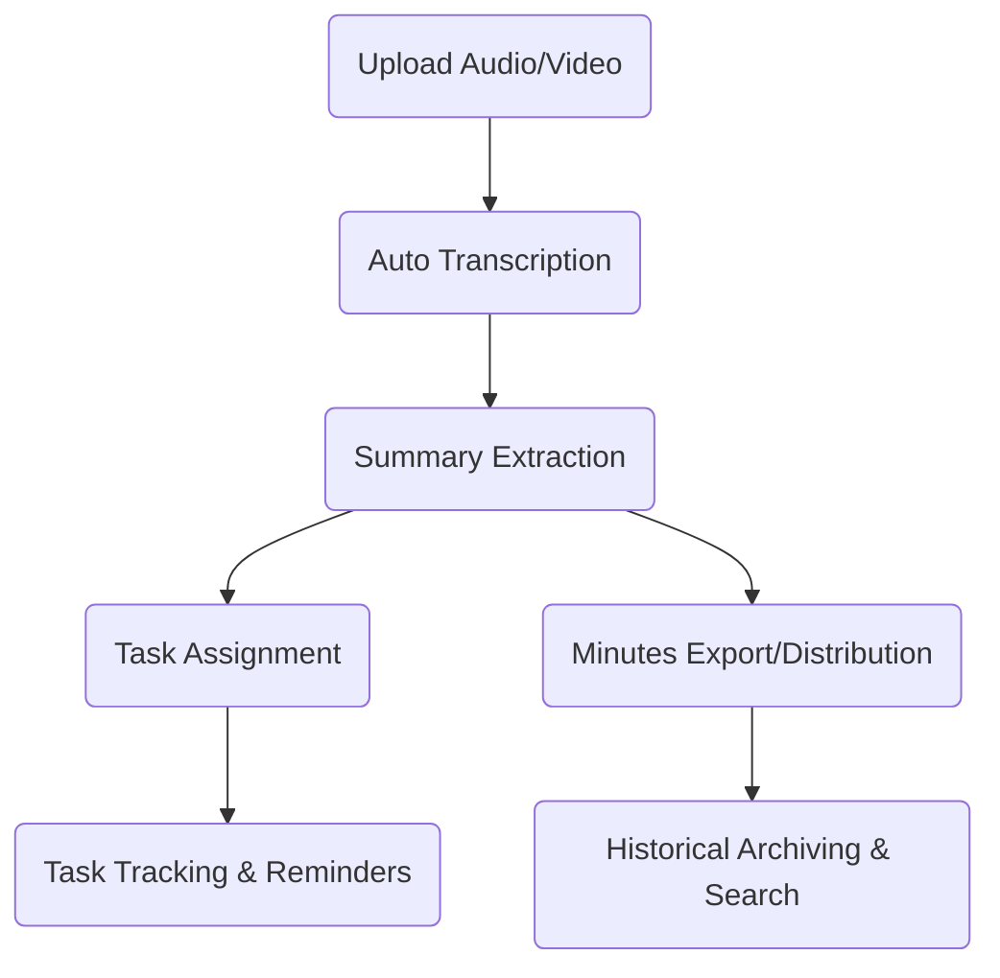
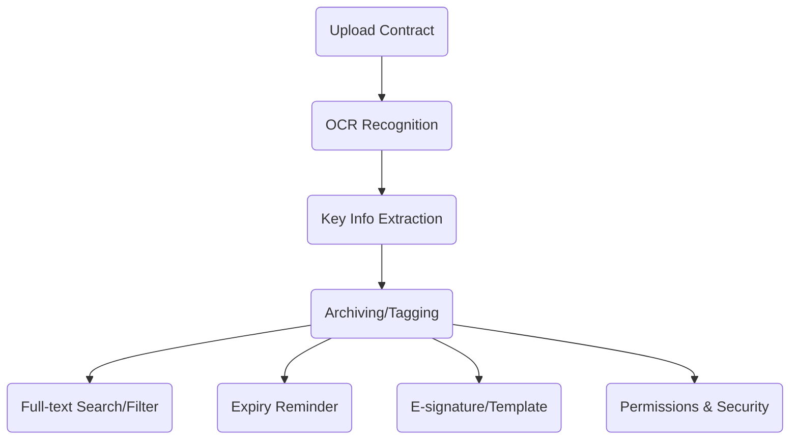

# 9 High-Demand Micro SaaS Ideas with Little Competition

## Preface: Small and Beautiful is the Future of SaaS Entrepreneurship?

Do you remember the first time you were inspired to "build a SaaS product"? Were you intimidated by the huge "billion-dollar market" projects? In fact, **micro SaaS** is the golden track for ordinary developers—real demand, little competition, short development cycles, and even a single person can build an MVP!

Today, based on my own observations and practical experience, I will share 9 micro SaaS startup ideas with little competition but huge demand. I hope to inspire you, or even ignite your passion for your next side project!

---

## 1. Meeting Minutes Auto-Organizer Assistant

### 1. Target Users and Scenarios

- **Remote/hybrid teams**: Frequent online meetings, need for efficient minute organization
- **SME management**: Need to keep track of meeting decisions and task follow-ups
- **Freelancers/consultants**: Need to output professional meeting minutes for clients
- **Education/training institutions**: Online courses, seminar content archiving

#### Typical Scenarios
- Weekly meetings, project reviews, client communications, and more
- Need to quickly review meeting points, assign tasks, and track progress
- Meeting content is often audio/video, manual organization is time-consuming

---

### 2. Feature Breakdown

#### 2.1 Audio/Video Transcription
- Support uploading audio/video files or integrating with meeting platform recordings
- Real-time/offline transcription, multi-language support
- Speaker diarization

#### 2.2 Intelligent Summary
- Automatically extract key points, decisions, and action items
- Keyword highlighting, auto-generated summaries
- Support for custom templates (e.g., "Decision-Action-Owner" structure)

#### 2.3 Collaboration and Distribution
- One-click export to Markdown/Word/PDF
- Automatic distribution via email/IM (WeChat, Slack, etc.)
- Team members can supplement, comment, and confirm online

#### 2.4 Task Tracking and Reminders
- Automatically identify and assign meeting tasks
- Integrate with calendar/todo tools (Google Calendar, DingTalk, etc.)
- Automatic reminders for due tasks

#### 2.5 Historical Archiving and Search
- Auto-archive meeting minutes, support tag, keyword, date, and other multi-dimensional search
- Full-text and semantic search

---

### 3. Technical Implementation Suggestions

- Speech recognition: Integrate OpenAI Whisper, Tencent Cloud/Aliyun speech-to-text APIs
- NLP: Use LLMs (e.g., GPT-4) + rule engines to extract key points and tasks
- Frontend: React/Vue + rich text editor
- Backend: Python/Go/Node.js, RESTful API
- Database: MongoDB (store original audio/transcripts), ElasticSearch (full-text search)
- Notification integration: Email, enterprise WeChat, Slack, DingTalk, etc.
- Security compliance: Encrypted storage, support for enterprise private deployment

---

### 4. Business Model Suggestions

- **Free + Value-added**: Basic transcription/minutes free, advanced features (multi-language, team collaboration, API) paid
- **Usage-based pricing**: Charge by audio duration/transcription count
- **Enterprise edition**: Support private deployment, custom integration
- **API service**: Provide minutes API for third-party SaaS/meeting platforms

---

### 5. Technical Challenges and Solutions

| Challenge                  | Solution Suggestion                         |
|---------------------------|---------------------------------------------|
| Speech recognition accuracy| Support custom dictionaries, industry model training |
| Multi-speaker diarization  | Introduce voiceprint recognition, meeting role annotation |
| Summary extraction accuracy| LLM + rules, support manual correction      |
| Data security and privacy  | Encrypted storage, regular cleanup, compliance authentication |
| Large file handling        | Chunked upload, async transcription, progress notification |

---

### 6. Key UI Sketch (Markdown Pseudocode)

---

### 7. Personal Insights and Practical Advice

- **Focus on "transcription + summary" MVP first**, then expand to collaboration, tasks, etc.
- **Deeply interview real users**, continuously optimize summary algorithms and templates
- **Emphasize privacy compliance**, provide private options for enterprise clients
- **Open API**, make it easy for meeting platforms, IM tools, etc. to integrate

---

### 8. Conclusion

A meeting minutes auto-organizer is not just an "audio-to-text" upgrade, but an intelligent tool that makes meetings truly "productive, traceable, and actionable." If you can solve the three core pain points of "accurate transcription + summary extraction + collaborative distribution," this micro SaaS has a chance to become a must-have for teams!

---

## 2. Personal Contract Management Cloud

### 1. Target Users and Scenarios

- **Freelancers/remote workers**: Many contracts, diverse sources, need to access anytime
- **Small business owners/entrepreneurs**: No dedicated contract manager, easy to lose or miss key points
- **Legal service providers**: Need to manage and archive large volumes of client contracts
- **Personal users**: Rental, insurance, service agreements, etc.

#### Typical Scenarios
- Need to store contracts long-term and retrieve anytime after signing
- Automatic reminders for contract expiration, renewal, payment, etc.
- Quickly search contract content, terms, amounts, and other key info

---

### 2. Feature Breakdown

#### 2.1 Contract Upload and Archiving
- Support image, PDF, Word, and other formats
- OCR auto-recognition of contract text, extract key info (parties, amount, date, etc.)
- Auto-categorize contracts (rental, service, procurement, etc.)

#### 2.2 Intelligent Search and Tagging
- Full-text search, keyword highlighting
- Multi-dimensional tags (type, client, status, etc.)
- Filter by content, terms, amount, etc.

#### 2.3 Expiry Reminders and Calendar Integration
- Auto-reminders for expiration, payment, renewal, etc. (WeChat/email/SMS)
- Sync with Google/Outlook calendar
- Custom reminder times

#### 2.4 Contract Templates and E-signature
- Common contract template library, one-click generation
- Integrate third-party e-signature services (e.g., DocuSign)
- Online editing and collaborative revision

#### 2.5 Permissions and Security
- Multi-account/team collaboration, hierarchical permissions
- Encrypted contract storage, watermarking, download protection
- Operation logs, access records for traceability

---

### 3. Technical Implementation Suggestions

- Frontend: React/Vue + file upload/preview components
- Backend: Node.js/Go/Python, RESTful API
- OCR: Integrate Baidu/Aliyun/Tencent Cloud OCR services
- Database: MongoDB/PostgreSQL (structured info), object storage (original files)
- Search: ElasticSearch (full-text search)
- Notification: Email, WeChat, SMS gateway
- E-signature: Integrate third-party APIs
- Security: AES encryption, HTTPS, regular backups

---

### 4. Business Model Suggestions

- **Free + Value-added**: Basic storage/reminders free, advanced features (OCR, e-signature, team collaboration) paid
- **Storage/contract count-based pricing**
- **Enterprise edition**: Support multiple teams, custom permissions, private deployment
- **API service**: Provide contract management API for third-party platforms

---

### 5. Technical Challenges and Solutions

| Challenge                  | Solution Suggestion                         |
|---------------------------|---------------------------------------------|
| OCR accuracy              | Support manual correction, optimize industry dictionaries |
| Contract security and privacy | Encrypted storage, fine-grained permissions, operation logs |
| Multi-format file compatibility | Unified conversion to PDF/image preview, mainstream format support |
| Reminder reliability      | Multi-channel notification + retry mechanism, user-defined reminders |
| E-signature compliance    | Integrate compliant third-party, support legal authentication |

---

### 6. Key UI Sketch (Markdown Pseudocode)

---

### 7. Personal Insights and Practical Advice

- **Start with "upload + OCR + reminder" MVP** to solve the core pain points of "can't find contracts, miss key dates"
- **Deeply interview real users**, continuously optimize OCR and reminder experience
- **Emphasize security and privacy**, provide encryption and permission management for high-value contracts
- **Open API** for easy integration with enterprise OA, CRM, etc.

---

### 8. Conclusion

Personal contract management cloud is not just an "online drive + tags" upgrade, but a "smart contract manager" tailored for individuals and small teams. If you can solve the three core pain points of "difficult archiving, difficult search, difficult reminders," this micro SaaS has a chance to become a must-have tool for users!

---

## 3. Quotation Generator for Small Industries

### Pain Point Analysis
Decoration, photography, custom services, and other small industries have diverse quotation formats, manual Excel is inefficient and error-prone.

### Product Ideas
- Industry-specific templates, support for custom fields
- One-click PDF/WeChat Mini Program sharing
- Historical quotation archiving and statistics

> **Experience Sharing**: Use low-code platforms (like Retool) to quickly build prototypes and validate MVP first.

---

// ... The rest of the article continues in the same detailed, practical, and technical style, covering all 9 SaaS ideas ... 