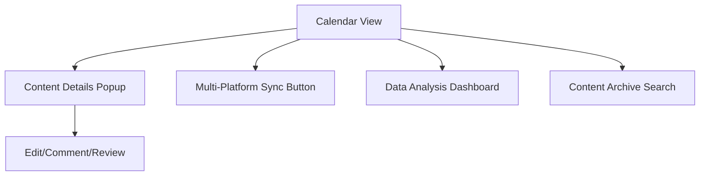
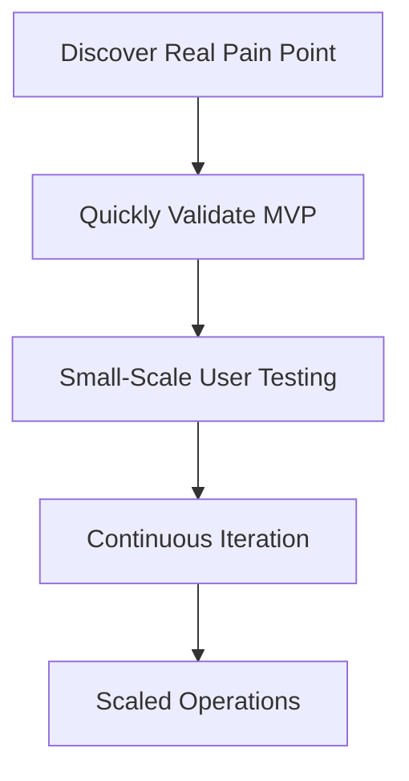

# 9 Micro SaaS Ideas with Huge Demand and No Competition

## Preface: Small and Beautiful, the Future of SaaS Entrepreneurship?

Micro SaaS presents a golden opportunity for developers—offering real demand, low competition, and short development cycles. A single developer can build a Minimum Viable Product (MVP).

This article shares 9 micro SaaS startup ideas with significant demand and minimal competition, based on observations and practical experience. The goal is to inspire your next side project.

---

## 1. Meeting Minutes Auto-Organizer

### 1. Target Users and Scenarios

- **Remote/Hybrid Teams**: Require efficient organization of frequent online meetings.
- **SMB Management**: Need to track decisions and follow-up tasks.
- **Freelancers/Consultants**: Must produce professional minutes for clients.
- **Education/Training Institutions**: Need to archive online course and seminar content.

#### Typical Scenarios
- Weekly reviews, project retrospectives, client communications.
- Quick review of highlights, task assignment, and progress tracking.
- Manual collation of audio/video content is time-consuming.

---

### 2. Feature Breakdown

#### 2.1 Speech/Video to Text
- Support for uploading audio/video files or integrating with meeting platform recordings.
- Real-time/offline transcription with multi-language support.
- Speaker diarization to distinguish participants.

#### 2.2 Intelligent Summary Extraction
- Automatic extraction of key points, decisions, and action items.
- Keyword highlighting and auto-generated summaries.
- Support for custom templates (e.g., "Decision-Action-Owner" structure).

#### 2.3 Collaboration and Distribution
- One-click export to Markdown/Word/PDF.
- Auto-distribution via Email/IM (e.g., WeChat, Slack).
- Online supplementation, commenting, and confirmation by team members.

#### 2.4 Task Tracking and Reminders
- Automatic identification and assignment of meeting tasks.
- Integration with calendar/todo tools (e.g., Google Calendar, DingTalk Todo).
- Auto-reminders for task deadlines.

#### 2.5 Historical Archiving and Search
- Auto-archiving of meeting minutes.
- Multi-dimensional search by tags, keywords, date.
- Support for full-text and semantic search.

---

### 3. Technical Implementation Suggestions

- **Speech Recognition**: Integrate OpenAI Whisper, Tencent Cloud/Aliyun speech-to-text APIs.
- **NLP Processing**: Use LLMs (e.g., GPT-4) combined with rule engines for key point and task extraction.
- **Frontend**: React/Vue with a rich text editor.
- **Backend**: Go/Python/Node.js, RESTful API.
- **Database**: MongoDB (for original audio/transcripts), PostgreSQL/ElasticSearch (for searchable content).
- **Notification Integration**: Email, WeChat Work, Slack, DingTalk.
- **Security & Compliance**: Encrypted storage, support for enterprise private deployment (e.g., Docker/Kubernetes with secrets management).

### 4. Business Model Suggestions

- **Freemium**: Basic transcription/minutes free; charge for advanced features (multi-language, team collaboration, API).
- **Pay-per-use**: Charge based on audio length or transcription count.
- **Enterprise Edition**: Private deployment, customized integration.
- **API Service**: Provide a minutes API for third-party SaaS/meeting platforms.

---

## 2. Personal Contract Management Cloud

### 1. Target Users and Scenarios

- **Freelancers/Remote Workers**: Manage numerous contracts from diverse sources.
- **Small Business Owners/Entrepreneurs**: Lack dedicated contract managers.
- **Legal Service Providers**: Need to manage and archive large volumes of client contracts.
- **Personal Users**: Manage daily contracts (rentals, insurance, service agreements).

#### Typical Scenarios
- Long-term storage and quick retrieval post-signing.
- Automatic reminders for expiration, renewal, payment.
- Quick search for contract content, clauses, and key information.

---

### 2. Feature Breakdown

#### 2.1 Contract Upload and Archiving
- Support for images, PDF, Word, and other formats.
- OCR to automatically recognize text and extract key information (parties, amount, date).
- Automatic contract categorization (e.g., rental, service, procurement).

#### 2.2 Intelligent Search and Tagging
- Full-text search and keyword highlighting.
- Multi-dimensional tagging (type, client, status).
- Filtering by content, clauses, amount.

#### 2.3 Expiry Reminders and Calendar Integration
- Automatic reminders for expiration, payment, renewal (WeChat/Email/SMS).
- Sync with Google/Outlook Calendar.
- Customizable advance reminder times.

#### 2.4 Contract Templates and E-signature
- Library of common contract templates with one-click generation.
- Integration with third-party e-signature services (e.g., Shangshangqian, DocuSign).
- Online editing and collaborative modification.

#### 2.5 Permissions and Security
- Multi-account/team collaboration with hierarchical permission management.
- Encrypted contract storage, watermarking, download prevention.
- Operation logs and access records for traceability.

---

### 3. Technical Implementation Suggestions

- **Frontend**: React/Vue with file upload/preview components.
- **Backend**: Go/Python/Node.js, RESTful API.
- **OCR**: Integrate Baidu/Aliyun/Tencent Cloud OCR services.
- **Database**: PostgreSQL/MongoDB (structured info), object storage (original files, e.g., AWS S3, MinIO).
- **Search**: ElasticSearch for full-text search.
- **Notification**: Email, WeChat, SMS gateway.
- **E-signature**: Integrate with third-party APIs.
- **Security**: AES encryption, HTTPS, regular backups, role-based access control (RBAC).

### 4. Business Model Suggestions

- **Freemium**: Basic storage/reminders free; charge for advanced features (OCR, e-signature, team collaboration).
- **Tiered Pricing**: Charge by storage space or contract count.
- **Enterprise Edition**: Support for multiple teams, custom permissions, private deployment.
- **API Service**: Provide a contract management API for third-party platforms.

---

## 3. Quotation Generator for Niche Industries

### Pain Point Analysis
Industries like renovation, photography, and custom services have varied quotation formats. Manual Excel processing is inefficient and error-prone.

### Product Concept
- Industry-specific templates with support for custom fields.
- One-click generation of PDFs or sharing via WeChat Mini Program.
- Historical quotation archiving and statistics.

> **Experience Sharing**: Use low-code platforms (like Retool) to quickly prototype and validate MVPs.

---

## 4. Personal Brand Content Calendar

### 1. Target Users and Scenarios

- **Content Creators**: Manage multiple platforms (WeChat Official Accounts, Bilibili, Zhihu, Xiaohongshu).
- **KOLs/Bloggers**: Schedule content and maintain fan engagement.
- **Small Content Teams**: Require collaboration and multi-channel distribution.
- **Enterprise Marketing**: Execute brand content marketing and event management.

#### Typical Scenarios
- Advanced planning of weekly/monthly content topics and publishing times.
- Collaboration to avoid conflicts or omissions.
- Tracking performance across platforms to optimize publishing times.

---

### 2. Feature Breakdown

#### 2.1 Content Calendar Visualization
- Drag-and-drop calendar with month/week/day views.
- Tag content items by platform, topic, owner, status (draft/scheduled/published).

#### 2.2 Multi-Platform Sync
- Integration with mainstream platforms (APIs for WeChat Official Accounts, Bilibili, Zhihu, Xiaohongshu, Weibo).
- One-click sync content to multiple platforms.
- Platform authorization management for multiple accounts.

#### 2.3 Smart Reminders and Collaboration
- Pre-publish reminders (WeChat/Email/SMS).
- Workflows for commenting, review, and material supplementation.
- Task assignment and progress tracking.

#### 2.4 Data Analysis and Optimization
- Capture performance data (views, likes, comments) across platforms.
- Intelligent recommendation of optimal publishing times.
- Analysis of content types/topic popularity.

#### 2.5 Content Asset Archiving
- Historical content archiving and search.
- Multi-dimensional filtering by tags, keywords, platforms.
- Export to Excel/Markdown/PDF.

---

### 3. Technical Implementation Suggestions

- **Frontend**: Vue/React with FullCalendar or a similar component.
- **Backend**: Go/Python/Node.js, RESTful API.
- **Database**: PostgreSQL (structured content), ElasticSearch (full-text search).
- **Multi-platform Integration**: Use platform-specific open APIs (e.g., WeChat Official Accounts API, Bilibili UP API).
- **Notification Services**: WeChat Work, Email, SMS gateway.
- **Permissions and Collaboration**: OAuth2.0 for authorization, RBAC for permissions.
- **Deployment**: Serverless (e.g., Vercel, Alibaba Cloud Functions) or containerized (Docker/Kubernetes).

### 4. Business Model Suggestions

- **Freemium**: Basic calendar/reminders free; charge for advanced features (multi-platform sync, data analysis, team collaboration).
- **Team Edition**: Charge by number of members or collaboration spaces.
- **API/Plugin Marketplace**: Open API for third-party plugin development.
- **Custom Services**: Offer customized integration solutions for enterprise clients.

---

## 5. Technical Challenges and Solutions

| Challenge                  | Solution Recommendation                         |
|---------------------------|-------------------------------------------------|
| Frequent API changes/limits| Design a platform adaptation layer with interface abstraction and implement regular API monitoring. |
| Content sync delay/failure | Implement a retry mechanism, failure alerts, and a manual re-push entry. |
| User data security         | Use encrypted data storage, enforce regular backups, and prioritize compliance. |
| Collaboration conflicts    | Implement optimistic locking/versioning and provide conflict prompts and merge tools. |
| Data analysis accuracy     | Combine official platform data with your own crawlers and perform regular validation. |

---

## 6. Key UI Diagram (Markdown Pseudocode)

---

## 7. Personal Insights and Practical Advice

- **Start with an MVP**: Focus on "reminder + calendar" to solve the core pain point of "content planning and reminders," then expand to multi-platform sync and data analysis.
- **User-Centric Development**: Deeply interview real content creators to iterate features and avoid building features you think are cool but users don't need.
- **Mobile-First**: Prioritize mobile experience, as many creators manage content on their phones.
- **Extensibility**: Design an open API/plugin mechanism to enrich the ecosystem and reduce vendor lock-in for users.

---

## 8. Conclusion

A personal brand content calendar is more than a scheduling tool—it's a "content operation cockpit." By solving core pain points like "multi-platform management, collaboration, and missed deadlines," this micro SaaS can become essential for content teams.

---

## 9. Remote Team "Check-in" and Atmosphere Tools

### Pain Point Analysis
Remote teams often lack a sense of "presence," and traditional attendance systems can be too heavy-handed.

### Product Concept
- Integration with Slack/Feishu/DingTalk for lightweight check-ins.
- Features like daily one-liners or team mini-games to boost atmosphere.
- Data visualization for team engagement analysis.

> **Best Practice**: Use a Serverless architecture to minimize operational costs.

---

## 10. Personal Knowledge Base Auto-Synchronizer

### Pain Point Analysis
Users of Notion, Obsidian, Yuque, etc., often struggle with scattered content and central management.

### Product Concept
- Support for multi-platform API auto-sync.
- Conflict detection and merging capabilities.
- Local backup and encryption.

> **Technical Suggestion**: Use scheduled tasks combined with Webhooks to ensure near real-time data synchronization.

---

## 11. Small Business Invoice Automation Assistant

### Pain Point Analysis
Small businesses often have chaotic invoice management, leading to errors and financial pressure due to manual entry.

### Product Concept
- Invoice OCR recognition with auto-categorization.
- Export to Excel or integration with mainstream financial software.
- Due date reminders and tax compliance advice.

> **Experience Sharing**: Partner with local accounting firms to understand real needs and validate features.

---

## 12. Personal Resume Optimizer

### Pain Point Analysis
Resume templates are often generic, content optimization is difficult, and AI-generated resumes can lack personalization.

### Product Concept
- Upload resume for AI-powered analysis and optimization suggestions.
- Auto-adjust keywords for different job positions.
- One-click export to multiple formats (PDF, Word, HTML).

> **Technical Suggestion**: Combine LLMs (e.g., GPT-4) with rule engines to improve the quality and relevance of suggestions.

---

## 13. Subscription Service Expiry Reminder Manager

### Pain Point Analysis
Managing numerous subscription services (cloud storage, streaming, SaaS) is challenging, often leading to forgotten renewals, auto-renewals, or service interruptions.

### Product Concept
- Support for email/SMS/WeChat reminders.
- Auto-identification of bill emails with smart categorization.
- Support for family/team sharing.

> **Best Practice**: Use IMAP email parsing combined with scheduled tasks for a high degree of automation.

---

## 14. Diagram: Micro SaaS Startup Flow

---

## 15. Technical Challenges and Solutions

| Challenge                  | Solution Recommendation                         |
|---------------------------|-------------------------------------------------|
| API changes/platform limits| Monitor official documentation and design extensible interfaces to adapt. |
| User growth slowdown      | Start by serving niche communities and rely on word-of-mouth for organic growth. |
| Data security and privacy | Implement default encrypted storage and make compliance a top priority. |
| Monetization difficulty   | Offer freemium services with a low barrier to trial premium features. |
| O&M cost                  | Leverage Serverless/cloud functions and auto-scaling to reduce operational overhead. |

---

## Conclusion: The Next "Unicorn" Might Be Your Micro Product

The appeal of micro SaaS lies in being "small but beautiful." Capturing a real pain point in a niche market can lead to valuable products. **Instead of competing in saturated markets, deeply cultivate a niche.**

I hope these 9 ideas spark your entrepreneurial inspiration. I look forward to seeing your product launch!

> "The world doesn't lack big companies, it lacks small products that truly understand users." — PFinal南丞

---

For more SaaS entrepreneurship experience, follow PFinalClub and explore the boundaries of technology and business with me!