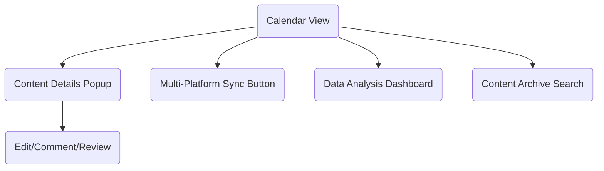
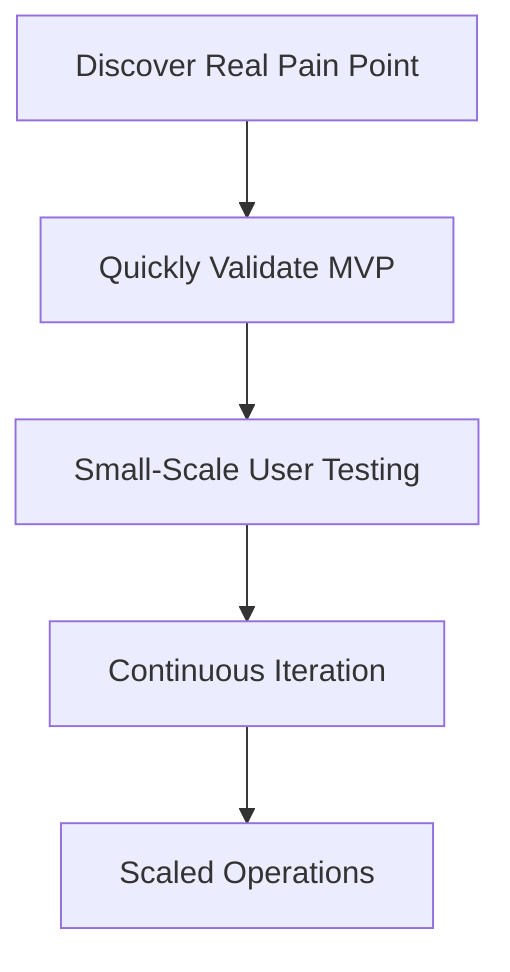

# 9 Micro SaaS Ideas with Huge Demand and No Competition

## Preface: Small and Beautiful, the Future of SaaS Entrepreneurship?

Do you remember the first time you were inspired to “build a SaaS product”? Were you intimidated by the “trillion-dollar market” hype? In fact, **micro SaaS** is the golden track for ordinary developers—real demand, low competition, short development cycles, and even a single person can build an MVP!

Today, based on my own observations and practical experience, I’ll share 9 micro SaaS startup ideas with almost no competition but huge demand. I hope to inspire you and even ignite your passion for your next side project!

---

## 1. Meeting Minutes Auto-Organizer

### 1. Target Users and Scenarios

- **Remote/Hybrid Teams**: Frequent online meetings, need for efficient minute organization
- **SMB Management**: Need to track meeting decisions and task follow-up
- **Freelancers/Consultants**: Need to output professional meeting minutes for clients
- **Education/Training Institutions**: Online courses, seminar content archiving

#### Typical Scenarios
- Weekly reviews, project retrospectives, client communications, and more
- Need to quickly review meeting highlights, assign tasks, and track progress
- Meeting content often in audio/video, manual collation is time-consuming and laborious

---

### 2. Feature Breakdown

#### 2.1 Speech/Video to Text
- Support uploading audio/video files or integrating with meeting platform recordings
- Real-time/offline transcription, multi-language support
- Speaker diarization

#### 2.2 Intelligent Summary Extraction
- Automatically extract meeting key points, decisions, and action items
- Keyword highlighting, auto-generated summaries
- Support custom templates (e.g., “Decision-Action-Owner” structure)

#### 2.3 Collaboration and Distribution
- One-click export of minutes to Markdown/Word/PDF
- Email/IM (e.g., WeChat, Slack) auto-distribution
- Support for team members to supplement, comment, and confirm online

#### 2.4 Task Tracking and Reminders
- Automatically identify and assign meeting tasks
- Integrate with calendar/todo tools (e.g., Google Calendar, DingTalk Todo)
- Auto-reminders for task deadlines

#### 2.5 Historical Archiving and Search
- Auto-archive meeting minutes, support multi-dimensional search by tags, keywords, date
- Support full-text and semantic search

---

### 3. Technical Implementation Suggestions

- Speech recognition: Integrate OpenAI Whisper, Tencent Cloud/Aliyun speech-to-text APIs
- NLP processing: Use LLMs (e.g., GPT-4) + rule engines to extract key points and tasks
- Frontend: React/Vue + rich text editor
- Backend: Python/Go/Node.js, RESTful API
- Database: MongoDB (store original audio/transcripts), ElasticSearch (full-text search)
- Notification integration: Email, WeChat Work, Slack, DingTalk, etc.
- Security compliance: Encrypted storage, support for enterprise private deployment

---

### 4. Business Model Suggestions

- **Free + Value-added**: Basic transcription/minutes free, advanced features (multi-language, team collaboration, API calls) paid
- **Pay-per-use**: Charge by audio length/transcription count
- **Enterprise Edition**: Support private deployment, customized integration
- **API Service**: Provide minutes API for third-party SaaS/meeting platforms 

## 2. Personal Contract Management Cloud

### 1. Target Users and Scenarios

- **Freelancers/Remote Workers**: Many contracts, diverse sources, need to access anytime
- **Small Business Owners/Entrepreneurs**: No dedicated contract manager, easy to lose or miss key milestones
- **Legal Service Providers**: Need to manage and archive large volumes of client contracts
- **Personal Users**: Daily contract management for rentals, insurance, service agreements, etc.

#### Typical Scenarios
- Long-term storage and quick retrieval after contract signing
- Automatic reminders for contract expiration, renewal, payment, etc.
- Need to quickly search contract content, clauses, amounts, and other key information

---

### 2. Feature Breakdown

#### 2.1 Contract Upload and Archiving
- Support for images, PDF, Word, and other formats
- OCR to automatically recognize contract text and extract key information (parties, amount, date, etc.)
- Automatic contract categorization (e.g., rental, service, procurement, etc.)

#### 2.2 Intelligent Search and Tagging
- Support full-text search and keyword highlighting
- Multi-dimensional tagging (type, client, status, etc.) management
- Filter contracts by content, clauses, amount, etc.

#### 2.3 Expiry Reminders and Calendar Integration
- Automatic reminders for contract expiration, payment, renewal, etc. (WeChat/Email/SMS)
- Sync with Google/Outlook Calendar
- Customizable advance reminder times

#### 2.4 Contract Templates and E-signature
- Provide a library of common contract templates, support one-click generation
- Integrate with third-party e-signature services (e.g., Shangshangqian, DocuSign)
- Support online editing and collaborative modification

#### 2.5 Permissions and Security
- Support multi-account/team collaboration, hierarchical permission management
- Encrypted contract storage, support for watermarking, download prevention, and other security measures
- Operation logs and access records for traceability

---

### 3. Technical Implementation Suggestions

- Frontend: React/Vue + file upload/preview components
- Backend: Node.js/Go/Python, RESTful API
- OCR: Integrate Baidu/Aliyun/Tencent Cloud OCR services
- Database: MongoDB/PostgreSQL (structured contract info), object storage (original files)
- Search: ElasticSearch (full-text search)
- Notification: Email, WeChat, SMS gateway
- E-signature: Integrate with third-party APIs
- Security: AES encryption, HTTPS, regular backups

---

### 4. Business Model Suggestions

- **Free + Value-added**: Basic storage/reminders free, advanced features (OCR, e-signature, team collaboration) paid
- **Charge by storage space/contract count**
- **Enterprise Edition**: Support multiple teams, custom permissions, private deployment
- **API Service**: Provide contract management API for third-party platforms 

## 3. Quotation Generator for Niche Industries

### Pain Point Analysis
Industries like renovation, photography, and custom services often have a wide variety of quotation formats, and manual Excel processing is inefficient and error-prone.

### Product Concept
- Industry-specific templates, support for custom fields
- One-click generation of PDF/WeChat Mini Program sharing
- Historical quotation archiving and statistics

> **Experience Sharing**: Use low-code platforms (like Retool) to quickly build prototypes and validate MVPs first.

---

## 4. Personal Brand Content Calendar

### 1. Target Users and Scenarios

- **Content Creators**: WeChat Official Accounts, Bilibili, Zhihu, Xiaohongshu, etc.
- **KOLs/Bloggers**: Need to regularly publish content and maintain fan engagement
- **Small Content Teams**: Need collaboration and multi-channel distribution
- **Enterprise Marketing**: Brand content marketing, event management

#### Typical Scenarios
- Plan weekly/monthly content topics and publishing times in advance
- Collaborate to avoid content conflicts or omissions
- Track content performance across platforms and optimize publishing times

---

### 2. Feature Breakdown

#### 2.1 Content Calendar Visualization
- Drag-and-drop calendar, support for month/week/day views
- Each content item can be tagged by platform, topic, owner, status (draft/scheduled/published)

#### 2.2 Multi-Platform Sync
- Support for mainstream platforms (WeChat Official Accounts, Bilibili, Zhihu, Xiaohongshu, Weibo, etc.) API integration
- One-click sync content to multiple platforms
- Platform authorization management, support for multiple accounts

#### 2.3 Smart Reminders and Collaboration
- Pre-publish reminders (WeChat/Email/SMS)
- Commenting, review, supplementing materials, and other collaboration workflows
- Task assignment and progress tracking

#### 2.4 Data Analysis and Optimization
- Capture content performance data (views, likes, comments, etc.) across platforms
- Intelligent recommendation of optimal publishing times
- Analysis of content types/topic popularity

#### 2.5 Content Asset Archiving
- Historical content archiving and search
- Support for tags, keywords, platforms, and other multi-dimensional filtering
- Export to Excel/Markdown/PDF

---

### 3. Technical Implementation Suggestions

- Frontend: Vue/React + FullCalendar calendar component
- Backend: Node.js/Go/Python, RESTful API
- Database: PostgreSQL (structured content), ElasticSearch (full-text search)
- Multi-platform integration: Open APIs for each platform (e.g., WeChat Official Accounts, Bilibili UP API, etc.)
- Notification services: WeChat Work, Email, SMS gateway
- Permissions and collaboration: OAuth2.0 authorization, RBAC permission model
- Deployment: Serverless (e.g., Vercel, Alibaba Cloud Functions) or Docker containers

---

### 4. Business Model Suggestions

- **Free + Value-added**: Basic calendar/reminders free, advanced features (multi-platform sync, data analysis, team collaboration) paid
- **Team Edition**: Charge by number of members/collaboration spaces
- **API/Plugin Marketplace**: Open API, allow third-party plugin development
- **Custom Services**: Customized integration solutions for enterprise clients

---

## 5. Technical Challenges and Solutions

| Challenge                  | Solution Recommendation                         |
|---------------------------|-------------------------------------------------|
| Frequent API changes/limits| Design platform adaptation layer, interface abstraction, regular API monitoring |
| Content sync delay/failure | Add retry mechanism, failure alerts, manual re-push entry   |
| User data security         | Encrypted data storage, regular backups, compliance first   |
| Collaboration conflicts    | Optimistic locking/versioning, conflict prompts and merge tools |
| Data analysis accuracy     | Combine official platform data + own crawlers, regular validation |

---

## 6. Key UI Diagram (Markdown Pseudocode)

---

## 7. Personal Insights and Practical Advice

- **Start with “reminder + calendar” MVP** to solve the core pain point of “content planning and reminders,” then expand to multi-platform sync and data analysis.
- **Deeply interview real content creators** to iterate features and avoid “self-entertainment” development.
- **Focus on mobile experience**; many creators prefer managing content on their phones.
- **Open API/plugin mechanism** to enrich the ecosystem and lower platform migration costs.

---

## 8. Conclusion

A personal brand content calendar is not just “old wine in a new bottle,” but a “content operation cockpit” tailored for creators. As long as you solve their core pain points of “multi-platform, multi-collaboration, easy to miss,” this micro SaaS has a great chance to become a must-have tool for teams!

---

## 9. Remote Team “Check-in” and Atmosphere Tools

### Pain Point Analysis
Remote teams lack a sense of “presence,” and traditional attendance systems are too heavy.

### Product Concept
- Slack/Feishu/DingTalk integration, lightweight check-in
- Daily one-liner, team atmosphere mini-games
- Data visualization, team engagement analysis

> **Best Practice**: Use Serverless architecture to reduce O&M costs.

---

## 10. Personal Knowledge Base Auto-Synchronizer

### Pain Point Analysis
Many people use Notion, Obsidian, Yuque, etc., and content is scattered and hard to manage centrally.

### Product Concept
- Support multi-platform API auto-sync
- Conflict detection and merging
- Local backup and encryption

> **Technical Suggestion**: Use scheduled tasks + Webhook to ensure real-time data sync.

---

## 11. Small Business Invoice Automation Assistant

### Pain Point Analysis
Small businesses have chaotic invoice management, manual entry is error-prone, and financial pressure is high.

### Product Concept
- Invoice OCR recognition, auto-categorization
- Export to Excel/integration with mainstream financial software
- Due reminders, tax compliance advice

> **Experience Sharing**: Can cooperate with local accounting firms to get real needs.

---

## 12. Personal Resume Optimizer

### Pain Point Analysis
Resume templates are all the same, content optimization is hard, and AI-generated resumes lack personalization.

### Product Concept
- Upload resume, AI auto-analysis and optimization suggestions
- Auto-adjust keywords for different positions
- One-click export to multiple formats

> **Technical Suggestion**: Combine LLMs (e.g., GPT-4) + rule engines to improve suggestion quality.

---

## 13. Subscription Service Expiry Reminder Manager

### Pain Point Analysis
Modern people have too many subscription services (cloud storage, streaming, SaaS), often forget renewal, leading to auto-renewal or service interruption.

### Product Concept
- Support email/SMS/WeChat reminders
- Auto-identify bill emails, smart categorization
- Support family/team sharing

> **Best Practice**: Use IMAP email parsing + scheduled tasks for high automation.

---

## 14. Diagram: Micro SaaS Startup Flow

---

## 15. Technical Challenges and Solutions

| Challenge                  | Solution Recommendation                         |
|---------------------------|-------------------------------------------------|
| API changes/platform limits| Monitor official docs, design extensible interfaces         |
| User growth slowdown      | Serve small circles first, word-of-mouth-driven iteration   |
| Data security and privacy | Default encrypted storage, compliance first                |
| Monetization difficulty   | Free + value-added services, lower trial threshold         |
| O&M cost                  | Serverless/cloud functions, auto-scaling                  |

---

## Conclusion: The Next “Unicorn” Might Be Your Micro Product

The charm of micro SaaS lies in “small but beautiful.” As long as you can capture a real pain point, even a small market can produce valuable products. **Instead of competing in the big leagues, deeply cultivate a niche.** Hope these 9 ideas spark your entrepreneurial inspiration, and I look forward to seeing your product go live!

> “The world doesn’t lack big companies, it lacks small products that truly understand users.” — PFinal南丞

---

For more SaaS entrepreneurship experience, follow PFinalClub and explore the boundaries of technology and business with me! 