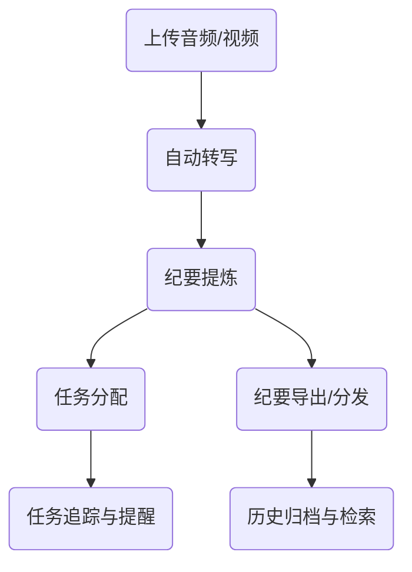
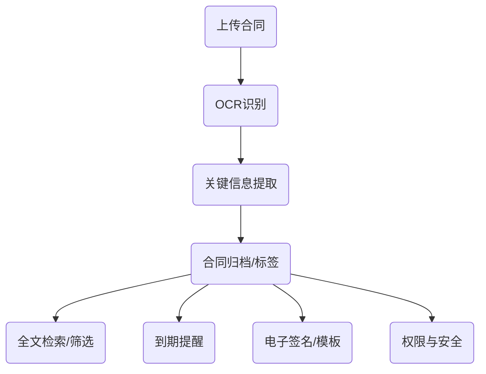
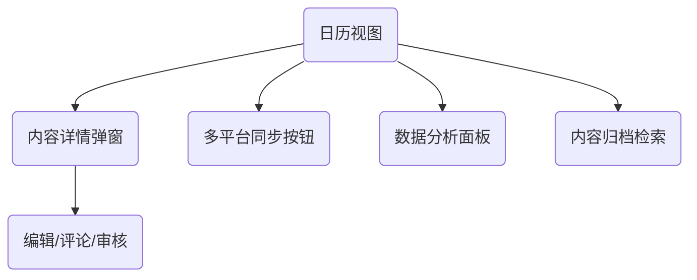
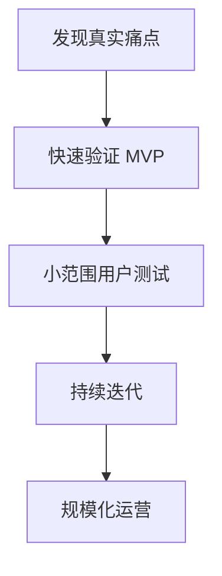

# 9 个没有竞争（但需求巨大）的微型 SaaS 理念

## 引言：小而美，才是 SaaS 创业的未来？

还记得你第一次萌生“做个 SaaS 产品”的念头吗？是不是被市面上动辄“千亿市场”的大项目吓退了？其实，**微型 SaaS** 才是普通开发者的黄金赛道——需求真实、竞争小、开发周期短，甚至一个人就能搞定 MVP！

今天，我就结合自己的观察和实战经验，分享 9 个“几乎没有竞争、但需求巨大”的微型 SaaS 创业理念。希望能给你带来灵感，甚至点燃你下一个 side project 的激情！

---

## 1. 会议纪要自动整理助手

### 1. 目标用户与场景

- **远程/混合办公团队**：频繁线上会议，需高效整理纪要
- **中小企业管理层**：需要会议决策留痕、任务跟踪
- **自由职业者/顾问**：需为客户输出专业会议纪要
- **教育/培训机构**：线上课程、研讨会内容归档

#### 典型场景
- 每周例会、项目复盘、客户沟通等多种会议类型
- 需要快速回顾会议要点、分配任务、追踪进度
- 会议内容多为音频/视频，手动整理耗时耗力

---

### 2. 功能拆解

#### 2.1 语音/视频转文字
- 支持上传音频/视频文件，或接入会议平台录制
- 实时/离线转录，支持多语言
- 说话人分离（Speaker Diarization）

#### 2.2 纪要智能提炼
- 自动提取会议要点、决策、待办事项
- 关键词高亮、自动生成摘要
- 支持自定义模板（如“决策-行动项-责任人”结构）

#### 2.3 协作与分发
- 纪要一键导出为 Markdown/Word/PDF
- 邮件/IM（如微信、Slack）自动分发
- 支持团队成员在线补充、评论、确认

#### 2.4 任务追踪与提醒
- 自动识别并分配会议任务
- 集成日历/待办工具（如 Google Calendar、钉钉待办）
- 任务到期自动提醒

#### 2.5 历史归档与检索
- 会议纪要自动归档，支持标签、关键词、日期等多维检索
- 支持全文搜索和语义检索

---

### 3. 技术实现建议

- 语音识别：集成 OpenAI Whisper、腾讯云/阿里云语音转写API
- NLP处理：用 LLM（如 GPT-4）+ 规则引擎提取要点和任务
- 前端：React/Vue + 富文本编辑器
- 后端：Python/Go/Node.js，RESTful API
- 数据库：MongoDB（存储原始音频/转录文本）、ElasticSearch（全文检索）
- 通知集成：邮件、企业微信、Slack、钉钉等
- 安全合规：加密存储，支持企业私有化部署

---

### 4. 商业模式建议

- **免费+增值**：基础转写/纪要免费，高级功能（多语言、团队协作、API调用）付费
- **按量计费**：按音频时长/转写次数计费
- **企业版**：支持私有化部署、定制集成
- **API服务**：为第三方SaaS/会议平台提供纪要API

---

### 5. 技术挑战与解决方案

| 挑战                   | 解决方案建议                         |
|------------------------|--------------------------------------|
| 语音识别准确率         | 支持自定义词库、行业模型训练           |
| 多说话人分离           | 引入声纹识别、会议前角色标注           |
| 纪要提炼不精准         | LLM+规则双重提取，支持人工校正         |
| 数据安全与隐私         | 加密存储、定期清理、合规认证           |
| 大文件处理性能         | 分片上传、异步转写、进度通知           |

---

### 6. 关键界面草图（Markdown 伪代码）

---

### 7. 个人见解与实用建议

- **先聚焦“转写+要点提炼”MVP**，后续再扩展协作、任务等功能
- **与真实用户深度访谈**，不断优化提炼算法和模板
- **注重隐私合规**，为企业客户提供私有化选项
- **开放API**，让会议平台、IM工具等生态伙伴易于集成

---

### 8. 总结

会议纪要自动整理助手不是“语音转写”的简单升级，而是让会议真正“有产出、可追踪、能落地”的智能工具。只要你能解决“转写准确+要点提炼+协作分发”三大核心痛点，这个微型SaaS就有机会成为团队刚需！

---

## 2. 个人合同管理云

### 1. 目标用户与场景

- **自由职业者/远程工作者**：合同多、来源杂、需随时查阅
- **小微企业主/创业者**：合同管理无专人，易丢失、易错过重要节点
- **法律服务从业者**：需为客户管理、归档大量合同
- **个人用户**：房屋租赁、保险、服务协议等日常合同管理

#### 典型场景
- 合同签署后需长期保存、随时查找
- 合同到期、续签、付款等关键节点需自动提醒
- 需要快速检索合同内容、条款、金额等关键信息

---

### 2. 功能拆解

#### 2.1 合同上传与归档
- 支持图片、PDF、Word等多格式上传
- OCR 自动识别合同文本，提取关键信息（甲乙方、金额、日期等）
- 合同自动归类（如租赁、服务、采购等）

#### 2.2 智能检索与标签
- 支持全文检索、关键词高亮
- 多维度标签（类型、客户、状态等）管理
- 合同内容、条款、金额等字段可筛选

#### 2.3 到期提醒与日历集成
- 合同到期、付款、续签等节点自动提醒（微信/邮件/短信）
- 支持与 Google/Outlook 日历同步
- 提前自定义提醒时间

#### 2.4 合同模板与电子签名
- 提供常用合同模板库，支持一键生成
- 集成第三方电子签名服务（如上上签、DocuSign）
- 支持合同在线编辑、协作修订

#### 2.5 权限与安全
- 支持多账户/团队协作，分级权限管理
- 合同加密存储，支持水印、防下载等安全措施
- 操作日志、访问记录可追溯

---

### 3. 技术实现建议

- 前端：React/Vue + 文件上传/预览组件
- 后端：Node.js/Go/Python，RESTful API
- OCR：集成百度/阿里/腾讯云 OCR 服务
- 数据库：MongoDB/PostgreSQL（合同结构化信息）、对象存储（原始文件）
- 搜索：ElasticSearch（全文检索）
- 通知：邮件、微信、短信网关
- 电子签名：对接第三方 API
- 安全：AES 加密、HTTPS、定期备份

---

### 4. 商业模式建议

- **免费+增值**：基础存储/提醒免费，高级功能（OCR、电子签名、团队协作）付费
- **按存储空间/合同数量计费**
- **企业版**：支持多团队、定制权限、私有化部署
- **API服务**：为第三方平台提供合同管理API

---

### 5. 技术挑战与解决方案

| 挑战                   | 解决方案建议                         |
|------------------------|--------------------------------------|
| OCR识别准确率           | 支持手动校正、行业词库优化             |
| 合同安全与隐私         | 加密存储、权限细分、操作日志           |
| 多格式文件兼容         | 统一转为PDF/图片预览，兼容主流格式      |
| 到期提醒可靠性         | 多通道通知+重试机制，用户自定义提醒     |
| 电子签名合规性         | 对接合规第三方，支持法律效力认证        |

---

### 6. 关键界面草图（Markdown 伪代码）

---

### 7. 个人见解与实用建议

- **先聚焦“上传+OCR+提醒”MVP**，解决最核心的“找不到合同、错过节点”痛点
- **与真实用户深度访谈**，不断优化OCR和提醒体验
- **注重安全与隐私**，为高价值合同提供加密和权限管理
- **开放API**，方便与企业OA、CRM等系统集成

---

### 8. 总结

个人合同管理云不是“网盘+标签”的简单升级，而是为个人和小团队量身定制的“智能合同管家”。只要你能解决“归档难、检索难、提醒难”三大核心痛点，这个微型SaaS就有机会成为用户的刚需工具！

---

## 3. 小众行业的报价单生成器

### 痛点分析
装修、摄影、定制服务等小行业，报价单样式五花八门，手工 Excel 低效且易出错。

### 产品设想
- 行业专属模板，支持自定义字段
- 一键生成 PDF/微信小程序分享
- 历史报价单归档与统计

> **经验分享**：用低代码平台（如 Retool）快速搭建原型，先跑通 MVP。

---

## 4. 个人品牌内容日历

### 1. 目标用户与场景

- **自媒体人**：公众号、B站、知乎、小红书等多平台运营者
- **KOL/博主**：需要定期发布内容、维护粉丝活跃度
- **小型内容团队**：有协作需求、内容分发多渠道
- **企业市场部**：品牌内容营销、活动节点管理

#### 典型场景
- 需要提前规划一周/月的内容主题和发布时间
- 多人协作，避免内容撞车或遗漏
- 追踪内容在各平台的表现，优化发布时间

---

### 2. 功能拆解

#### 2.1 内容日历视图
- 拖拽式日历，支持月/周/日视图切换
- 每条内容可标记平台、主题、负责人、状态（草稿/已排期/已发布）

#### 2.2 多平台同步
- 支持主流平台（如微信公众号、B站、知乎、小红书、微博等）API 对接
- 一键同步内容到多个平台
- 平台授权管理，支持多账号

#### 2.3 智能提醒与协作
- 发布前自动提醒（微信/邮件/短信）
- 评论、审核、补充素材等协作流程
- 任务分配与进度追踪

#### 2.4 数据分析与优化
- 各平台内容表现数据抓取（阅读量、点赞、评论等）
- 最佳发布时间智能推荐
- 内容类型/主题热度分析

#### 2.5 内容资产归档
- 历史内容归档检索
- 支持标签、关键词、平台等多维度筛选
- 导出为 Excel/Markdown/PDF

---

### 3. 技术实现建议

- 前端：Vue/React + FullCalendar 日历组件
- 后端：Node.js/Go/Python，RESTful API
- 数据库：PostgreSQL（结构化内容）、ElasticSearch（全文检索）
- 多平台集成：各平台开放API（如微信公众号、B站UP主API等）
- 通知服务：集成微信企业号、邮件、短信网关
- 权限与协作：OAuth2.0 授权、RBAC 权限模型
- 部署：Serverless（如 Vercel、阿里云函数）或 Docker 容器

---

### 4. 商业模式建议

- **免费+增值**：基础日历/提醒免费，高级功能（多平台同步、数据分析、团队协作）付费
- **团队版**：按成员数/协作空间数计费
- **API/插件市场**：开放API，允许第三方开发插件
- **定制服务**：为企业客户定制集成方案

---

### 5. 技术挑战与解决方案

| 挑战                   | 解决方案建议                         |
|------------------------|--------------------------------------|
| 多平台API频繁变动      | 设计平台适配层，接口解耦，定期监控API变更 |
| 内容同步延迟/失败      | 增加重试机制，失败告警，手动补发入口   |
| 用户数据安全           | 数据加密存储，定期备份，合规优先       |
| 协作冲突               | 乐观锁/版本号机制，冲突提示与合并工具   |
| 数据分析准确性         | 结合平台官方数据+自有爬虫，定期校验    |

---

### 6. 关键界面草图（Markdown 伪代码）

---

### 7. 个人见解与实用建议

- **从“提醒+日历”MVP做起**，先解决最核心的“内容规划与提醒”痛点，后续再扩展多平台同步和数据分析。
- **与内容创作者深度访谈**，不断迭代功能，避免“自嗨”开发。
- **注重移动端体验**，很多内容创作者习惯用手机管理内容。
- **开放API/插件机制**，让生态更丰富，降低平台迁移成本。

---

### 8. 总结

个人品牌内容日历不是“新瓶装旧酒”，而是为内容创作者量身定制的“内容运营中枢”。只要你能解决他们“多平台、多协作、易错过”的核心痛点，这个微型SaaS就有极大机会跑出来！

---

## 5. 远程团队“打卡”与氛围工具

### 痛点分析
远程团队缺乏“存在感”，传统考勤系统太重。

### 产品设想
- Slack/飞书/钉钉集成，轻量打卡
- 每日一句、团队氛围小游戏
- 数据可视化，团队活跃度分析

> **最佳实践**：用 Serverless 架构，降低运维成本。

---

## 6. 个人知识库自动同步器

### 痛点分析
很多人用 Notion、Obsidian、语雀等多平台，内容分散，难以统一管理。

### 产品设想
- 支持多平台 API 自动同步
- 冲突检测与合并
- 本地备份与加密

> **技术实现建议**：用定时任务+Webhook，保证数据实时同步。

---

## 7. 小型企业发票自动化助手

### 痛点分析
小微企业发票管理混乱，手工录入易出错，财务压力大。

### 产品设想
- 发票 OCR 识别、自动分类
- 支持导出 Excel/对接主流财务软件
- 到期提醒、税务合规建议

> **经验分享**：可与本地会计师事务所合作，获取真实需求。

---

## 8. 个人简历智能优化器

### 痛点分析
简历模板千篇一律，内容优化无从下手，AI 生成简历缺乏个性化。

### 产品设想
- 上传简历，AI 自动分析并给出优化建议
- 针对不同岗位自动调整关键词
- 一键导出多种格式

> **技术实现建议**：结合 LLM（如 GPT-4）+ 规则引擎，提升建议质量。

---

## 9. 订阅服务到期提醒管家

### 痛点分析
现代人订阅服务太多（网盘、流媒体、SaaS），到期常常忘记，导致自动续费或服务中断。

### 产品设想
- 支持邮箱/短信/微信提醒
- 自动识别账单邮件，智能归类
- 支持家庭/团队共享

> **最佳实践**：用 IMAP 邮箱解析+定时任务，自动化程度高。

---

## 图表：微型 SaaS 创业流程

---

## 技术挑战与解决方案

| 挑战                   | 解决方案建议                         |
|------------------------|--------------------------------------|
| API 变更/平台限制      | 监控官方文档，设计可扩展接口         |
| 用户增长缓慢           | 先服务小圈层，口碑驱动裂变           |
| 数据安全与隐私         | 默认加密存储，合规优先               |
| 付费转化难             | 免费+增值服务，降低试用门槛           |
| 运维成本               | Serverless/云函数，自动扩缩容         |

---

## 总结：下一个“独角兽”，也许就是你的小产品

微型 SaaS 的魅力在于“小而美”，只要你能抓住一个真实痛点，哪怕市场再小，也能做出有价值的产品。**与其卷大赛道，不如深耕细分领域**。希望这 9 个理念能点燃你的创业灵感，期待看到你的产品上线！

> “世界不缺大公司，缺的是懂用户的小产品。”——PFinal南丞

---

如需获取更多 SaaS 创业实战经验，欢迎关注 PFinalClub，和我一起探索技术与商业的边界！ 