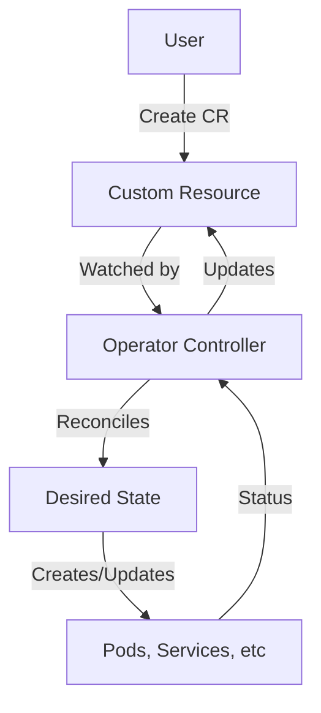

# Building Production-Ready Kubernetes Operators with Go: A Complete Guide

## Introduction

Kubernetes Operators are the most powerful way to extend Kubernetes functionality and automate complex application management. In 2025, operators have become essential for managing stateful applications, databases, monitoring stacks, and custom business logic in Kubernetes.

This comprehensive guide will teach you how to build production-ready Kubernetes operators using Go and Kubebuilder, from basic concepts to advanced patterns.

**What you'll learn:**
- ✅ Operator pattern fundamentals
- ✅ Building operators with Kubebuilder
- ✅ Custom Resource Definition (CRD) design
- ✅ Controller reconciliation loops
- ✅ Testing and debugging strategies
- ✅ Production deployment patterns
- ✅ Real-world operator examples

**Prerequisites:**
- Go 1.21+ installed
- Basic Kubernetes knowledge
- kubectl configured
- Docker installed

---

## Table of Contents

1. [Operator Pattern Overview](#operator-pattern)
2. [Setting Up Development Environment](#setup)
3. [Building Your First Operator](#first-operator)
4. [CRD Design Best Practices](#crd-design)
5. [Controller Implementation](#controller-implementation)
6. [Advanced Reconciliation Patterns](#advanced-patterns)
7. [Testing Strategies](#testing)
8. [Production Deployment](#production-deployment)
9. [Real-World Examples](#examples)
10. [Troubleshooting](#troubleshooting)

---

## Operator Pattern Overview {#operator-pattern}

### What is a Kubernetes Operator?

An **Operator** is a software extension that uses **Custom Resources** to manage applications and their components using Kubernetes native concepts.



### Operator Capability Levels

According to the Operator Capability Model:

| Level | Capability | Description |
|-------|-----------|-------------|
| 1 | Basic Install | Automated installation |
| 2 | Seamless Upgrades | Automated upgrades |
| 3 | Full Lifecycle | Backup, failure recovery |
| 4 | Deep Insights | Metrics, alerts, logs |
| 5 | Auto Pilot | Auto-scaling, tuning, anomaly detection |

### When to Build an Operator

**✅ Good use cases:**
- Stateful applications (databases, message queues)
- Complex multi-component systems
- Applications requiring domain-specific knowledge
- Custom automation workflows
- Legacy application modernization

**❌ Avoid operators for:**
- Simple stateless applications
- Standard Kubernetes resources (use Helm charts)
- One-time deployments
- Rarely changed configurations

---

## Setting Up Development Environment {#setup}

### Install Required Tools

```bash
# Install Kubebuilder
curl -L -o kubebuilder https://go.kubebuilder.io/dl/latest/$(go env GOOS)/$(go env GOARCH)
chmod +x kubebuilder && sudo mv kubebuilder /usr/local/bin/

# Install kubectl
curl -LO "https://dl.k8s.io/release/$(curl -L -s https://dl.k8s.io/release/stable.txt)/bin/linux/amd64/kubectl"
chmod +x kubectl && sudo mv kubectl /usr/local/bin/

# Install Kind (local Kubernetes cluster)
go install sigs.k8s.io/kind@v0.20.0

# Verify installations
kubebuilder version
kubectl version --client
kind version
```

### Create Local Kubernetes Cluster

```bash
# Create cluster
kind create cluster --name operator-dev

# Verify cluster
kubectl cluster-info
kubectl get nodes
```

---

## Building Your First Operator {#first-operator}

### Project Initialization

```bash
# Create project directory
mkdir webapp-operator
cd webapp-operator

# Initialize project
kubebuilder init \
  --domain friday-go.icu \
  --repo github.com/friday-go/webapp-operator \
  --owner "PFinal"

# Create API
kubebuilder create api \
  --group apps \
  --version v1alpha1 \
  --kind WebApp \
  --resource \
  --controller
```

**Project structure:**
```
webapp-operator/
├── api/
│   └── v1alpha1/
│       ├── webapp_types.go      # CRD definition
│       └── zz_generated.deepcopy.go
├── config/
│   ├── crd/                     # CRD manifests
│   ├── manager/                 # Operator deployment
│   ├── rbac/                    # RBAC rules
│   └── samples/                 # Sample CRs
├── controllers/
│   └── webapp_controller.go     # Controller logic
├── Dockerfile
├── Makefile
└── main.go
```

---

## CRD Design Best Practices {#crd-design}

### Define Custom Resource

Edit `api/v1alpha1/webapp_types.go`:

```go
package v1alpha1

import (
    metav1 "k8s.io/apimachinery/pkg/apis/meta/v1"
)

// WebAppSpec defines the desired state of WebApp
type WebAppSpec struct {
    // +kubebuilder:validation:Required
    // +kubebuilder:validation:MinLength=1
    // Image is the container image for the web application
    Image string `json:"image"`
    
    // +kubebuilder:validation:Minimum=1
    // +kubebuilder:validation:Maximum=100
    // +kubebuilder:default=1
    // Replicas is the number of desired replicas
    Replicas *int32 `json:"replicas,omitempty"`
    
    // +kubebuilder:validation:Minimum=1
    // +kubebuilder:validation:Maximum=65535
    // +kubebuilder:default=8080
    // Port is the container port
    Port *int32 `json:"port,omitempty"`
    
    // Resources defines resource requests and limits
    Resources *ResourceRequirements `json:"resources,omitempty"`
    
    // Environment variables
    Env []EnvVar `json:"env,omitempty"`
    
    // Ingress configuration
    Ingress *IngressConfig `json:"ingress,omitempty"`
}

// ResourceRequirements defines resource constraints
type ResourceRequirements struct {
    // +kubebuilder:validation:Pattern=`^(\d+)(\.\d+)?(m|Mi|Gi)?$`
    CPURequest string `json:"cpuRequest,omitempty"`
    
    // +kubebuilder:validation:Pattern=`^(\d+)(\.\d+)?(m|Mi|Gi)?$`
    CPULimit string `json:"cpuLimit,omitempty"`
    
    // +kubebuilder:validation:Pattern=`^(\d+)(\.\d+)?(m|Mi|Gi)?$`
    MemoryRequest string `json:"memoryRequest,omitempty"`
    
    // +kubebuilder:validation:Pattern=`^(\d+)(\.\d+)?(m|Mi|Gi)?$`
    MemoryLimit string `json:"memoryLimit,omitempty"`
}

// EnvVar represents an environment variable
type EnvVar struct {
    Name  string `json:"name"`
    Value string `json:"value"`
}

// IngressConfig defines ingress settings
type IngressConfig struct {
    // +kubebuilder:validation:Required
    Host string `json:"host"`
    
    // +kubebuilder:default="/"
    Path string `json:"path,omitempty"`
    
    // +kubebuilder:default=false
    TLS bool `json:"tls,omitempty"`
}

// WebAppStatus defines the observed state of WebApp
type WebAppStatus struct {
    // +optional
    AvailableReplicas int32 `json:"availableReplicas"`
    
    // +optional
    Conditions []metav1.Condition `json:"conditions,omitempty"`
    
    // +optional
    URL string `json:"url,omitempty"`
    
    // +optional
    LastUpdated metav1.Time `json:"lastUpdated,omitempty"`
}

// +kubebuilder:object:root=true
// +kubebuilder:subresource:status
// +kubebuilder:subresource:scale:specpath=.spec.replicas,statuspath=.status.availableReplicas
// +kubebuilder:printcolumn:name="Image",type=string,JSONPath=`.spec.image`
// +kubebuilder:printcolumn:name="Replicas",type=integer,JSONPath=`.spec.replicas`
// +kubebuilder:printcolumn:name="Available",type=integer,JSONPath=`.status.availableReplicas`
// +kubebuilder:printcolumn:name="Age",type=date,JSONPath=`.metadata.creationTimestamp`

// WebApp is the Schema for the webapps API
type WebApp struct {
    metav1.TypeMeta   `json:",inline"`
    metav1.ObjectMeta `json:"metadata,omitempty"`

    Spec   WebAppSpec   `json:"spec,omitempty"`
    Status WebAppStatus `json:"status,omitempty"`
}

//+kubebuilder:object:root=true

// WebAppList contains a list of WebApp
type WebAppList struct {
    metav1.TypeMeta `json:",inline"`
    metav1.ListMeta `json:"metadata,omitempty"`
    Items           []WebApp `json:"items"`
}

func init() {
    SchemeBuilder.Register(&WebApp{}, &WebAppList{})
}
```

### CRD Validation Markers

Key validation markers:

| Marker | Purpose | Example |
|--------|---------|---------|
| `+kubebuilder:validation:Required` | Field must be set | `Image string` |
| `+kubebuilder:validation:Minimum=1` | Numeric minimum | `Replicas int32` |
| `+kubebuilder:validation:Pattern` | Regex validation | `Email string` |
| `+kubebuilder:validation:Enum` | Allowed values | `Type string` |
| `+kubebuilder:default=value` | Default value | `Port int32` |
| `+kubebuilder:printcolumn` | kubectl output | Name, type, path |

### Generate CRD Manifests

```bash
# Generate CRD manifests
make manifests

# View generated CRD
cat config/crd/bases/apps.friday-go.icu_webapps.yaml
```

---

## Controller Implementation {#controller-implementation}

### Basic Controller Structure

Edit `controllers/webapp_controller.go`:

```go
package controllers

import (
    "context"
    "fmt"
    
    appsv1 "k8s.io/api/apps/v1"
    corev1 "k8s.io/api/core/v1"
    networkingv1 "k8s.io/api/networking/v1"
    "k8s.io/apimachinery/pkg/api/errors"
    "k8s.io/apimachinery/pkg/api/resource"
    metav1 "k8s.io/apimachinery/pkg/apis/meta/v1"
    "k8s.io/apimachinery/pkg/runtime"
    "k8s.io/apimachinery/pkg/types"
    ctrl "sigs.k8s.io/controller-runtime"
    "sigs.k8s.io/controller-runtime/pkg/client"
    "sigs.k8s.io/controller-runtime/pkg/controller/controllerutil"
    "sigs.k8s.io/controller-runtime/pkg/log"
    
    appsv1alpha1 "github.com/friday-go/webapp-operator/api/v1alpha1"
)

// WebAppReconciler reconciles a WebApp object
type WebAppReconciler struct {
    client.Client
    Scheme *runtime.Scheme
}

//+kubebuilder:rbac:groups=apps.friday-go.icu,resources=webapps,verbs=get;list;watch;create;update;patch;delete
//+kubebuilder:rbac:groups=apps.friday-go.icu,resources=webapps/status,verbs=get;update;patch
//+kubebuilder:rbac:groups=apps.friday-go.icu,resources=webapps/finalizers,verbs=update
//+kubebuilder:rbac:groups=apps,resources=deployments,verbs=get;list;watch;create;update;patch;delete
//+kubebuilder:rbac:groups=core,resources=services,verbs=get;list;watch;create;update;patch;delete
//+kubebuilder:rbac:groups=networking.k8s.io,resources=ingresses,verbs=get;list;watch;create;update;patch;delete

// Reconcile is part of the main kubernetes reconciliation loop
func (r *WebAppReconciler) Reconcile(ctx context.Context, req ctrl.Request) (ctrl.Result, error) {
    log := log.FromContext(ctx)
    
    // Fetch the WebApp instance
    webapp := &appsv1alpha1.WebApp{}
    err := r.Get(ctx, req.NamespacedName, webapp)
    if err != nil {
        if errors.IsNotFound(err) {
            // Request object not found, could have been deleted
            log.Info("WebApp resource not found. Ignoring since object must be deleted")
            return ctrl.Result{}, nil
        }
        // Error reading the object - requeue the request
        log.Error(err, "Failed to get WebApp")
        return ctrl.Result{}, err
    }
    
    // Add finalizer for cleanup
    if !controllerutil.ContainsFinalizer(webapp, "webapp.friday-go.icu/finalizer") {
        controllerutil.AddFinalizer(webapp, "webapp.friday-go.icu/finalizer")
        if err := r.Update(ctx, webapp); err != nil {
            return ctrl.Result{}, err
        }
    }
    
    // Check if the webapp is being deleted
    if !webapp.ObjectMeta.DeletionTimestamp.IsZero() {
        return r.handleDeletion(ctx, webapp)
    }
    
    // Reconcile Deployment
    if err := r.reconcileDeployment(ctx, webapp); err != nil {
        return ctrl.Result{}, err
    }
    
    // Reconcile Service
    if err := r.reconcileService(ctx, webapp); err != nil {
        return ctrl.Result{}, err
    }
    
    // Reconcile Ingress (if specified)
    if webapp.Spec.Ingress != nil {
        if err := r.reconcileIngress(ctx, webapp); err != nil {
            return ctrl.Result{}, err
        }
    }
    
    // Update status
    if err := r.updateStatus(ctx, webapp); err != nil {
        return ctrl.Result{}, err
    }
    
    return ctrl.Result{}, nil
}

// reconcileDeployment ensures the Deployment exists and matches the desired state
func (r *WebAppReconciler) reconcileDeployment(ctx context.Context, webapp *appsv1alpha1.WebApp) error {
    log := log.FromContext(ctx)
    
    deployment := &appsv1.Deployment{}
    err := r.Get(ctx, types.NamespacedName{
        Name:      webapp.Name,
        Namespace: webapp.Namespace,
    }, deployment)
    
    if err != nil && errors.IsNotFound(err) {
        // Create new deployment
        deployment = r.deploymentForWebApp(webapp)
        log.Info("Creating a new Deployment", "Deployment.Namespace", deployment.Namespace, "Deployment.Name", deployment.Name)
        if err := r.Create(ctx, deployment); err != nil {
            log.Error(err, "Failed to create new Deployment", "Deployment.Namespace", deployment.Namespace, "Deployment.Name", deployment.Name)
            return err
        }
        return nil
    } else if err != nil {
        log.Error(err, "Failed to get Deployment")
        return err
    }
    
    // Update existing deployment if spec has changed
    if !r.deploymentsEqual(deployment, webapp) {
        deployment = r.deploymentForWebApp(webapp)
        log.Info("Updating Deployment", "Deployment.Namespace", deployment.Namespace, "Deployment.Name", deployment.Name)
        if err := r.Update(ctx, deployment); err != nil {
            log.Error(err, "Failed to update Deployment", "Deployment.Namespace", deployment.Namespace, "Deployment.Name", deployment.Name)
            return err
        }
    }
    
    return nil
}

// deploymentForWebApp returns a Deployment object
func (r *WebAppReconciler) deploymentForWebApp(webapp *appsv1alpha1.WebApp) *appsv1.Deployment {
    replicas := int32(1)
    if webapp.Spec.Replicas != nil {
        replicas = *webapp.Spec.Replicas
    }
    
    port := int32(8080)
    if webapp.Spec.Port != nil {
        port = *webapp.Spec.Port
    }
    
    labels := map[string]string{
        "app":     webapp.Name,
        "version": "v1",
    }
    
    deployment := &appsv1.Deployment{
        ObjectMeta: metav1.ObjectMeta{
            Name:      webapp.Name,
            Namespace: webapp.Namespace,
        },
        Spec: appsv1.DeploymentSpec{
            Replicas: &replicas,
            Selector: &metav1.LabelSelector{
                MatchLabels: labels,
            },
            Template: corev1.PodTemplateSpec{
                ObjectMeta: metav1.ObjectMeta{
                    Labels: labels,
                },
                Spec: corev1.PodSpec{
                    Containers: []corev1.Container{{
                        Name:  webapp.Name,
                        Image: webapp.Spec.Image,
                        Ports: []corev1.ContainerPort{{
                            ContainerPort: port,
                            Protocol:      corev1.ProtocolTCP,
                        }},
                        Env: r.buildEnvVars(webapp.Spec.Env),
                    }},
                },
            },
        },
    }
    
    // Add resource requirements if specified
    if webapp.Spec.Resources != nil {
        deployment.Spec.Template.Spec.Containers[0].Resources = r.buildResourceRequirements(webapp.Spec.Resources)
    }
    
    // Set owner reference
    controllerutil.SetControllerReference(webapp, deployment, r.Scheme)
    
    return deployment
}

// buildResourceRequirements converts custom resource requirements
func (r *WebAppReconciler) buildResourceRequirements(res *appsv1alpha1.ResourceRequirements) corev1.ResourceRequirements {
    requirements := corev1.ResourceRequirements{
        Requests: corev1.ResourceList{},
        Limits:   corev1.ResourceList{},
    }
    
    if res.CPURequest != "" {
        requirements.Requests[corev1.ResourceCPU] = resource.MustParse(res.CPURequest)
    }
    if res.MemoryRequest != "" {
        requirements.Requests[corev1.ResourceMemory] = resource.MustParse(res.MemoryRequest)
    }
    if res.CPULimit != "" {
        requirements.Limits[corev1.ResourceCPU] = resource.MustParse(res.CPULimit)
    }
    if res.MemoryLimit != "" {
        requirements.Limits[corev1.ResourceMemory] = resource.MustParse(res.MemoryLimit)
    }
    
    return requirements
}

// buildEnvVars converts custom env vars to Kubernetes env vars
func (r *WebAppReconciler) buildEnvVars(envVars []appsv1alpha1.EnvVar) []corev1.EnvVar {
    var result []corev1.EnvVar
    for _, ev := range envVars {
        result = append(result, corev1.EnvVar{
            Name:  ev.Name,
            Value: ev.Value,
        })
    }
    return result
}

// reconcileService ensures the Service exists
func (r *WebAppReconciler) reconcileService(ctx context.Context, webapp *appsv1alpha1.WebApp) error {
    log := log.FromContext(ctx)
    
    service := &corev1.Service{}
    err := r.Get(ctx, types.NamespacedName{
        Name:      webapp.Name,
        Namespace: webapp.Namespace,
    }, service)
    
    if err != nil && errors.IsNotFound(err) {
        service = r.serviceForWebApp(webapp)
        log.Info("Creating a new Service", "Service.Namespace", service.Namespace, "Service.Name", service.Name)
        if err := r.Create(ctx, service); err != nil {
            log.Error(err, "Failed to create new Service")
            return err
        }
    } else if err != nil {
        return err
    }
    
    return nil
}

// serviceForWebApp returns a Service object
func (r *WebAppReconciler) serviceForWebApp(webapp *appsv1alpha1.WebApp) *corev1.Service {
    port := int32(8080)
    if webapp.Spec.Port != nil {
        port = *webapp.Spec.Port
    }
    
    service := &corev1.Service{
        ObjectMeta: metav1.ObjectMeta{
            Name:      webapp.Name,
            Namespace: webapp.Namespace,
        },
        Spec: corev1.ServiceSpec{
            Selector: map[string]string{
                "app": webapp.Name,
            },
            Ports: []corev1.ServicePort{{
                Port:       port,
                TargetPort: intstr.FromInt(int(port)),
                Protocol:   corev1.ProtocolTCP,
            }},
            Type: corev1.ServiceTypeClusterIP,
        },
    }
    
    controllerutil.SetControllerReference(webapp, service, r.Scheme)
    return service
}

// deploymentsEqual checks if deployment needs update
func (r *WebAppReconciler) deploymentsEqual(existing *appsv1.Deployment, webapp *appsv1alpha1.WebApp) bool {
    replicas := int32(1)
    if webapp.Spec.Replicas != nil {
        replicas = *webapp.Spec.Replicas
    }
    
    if *existing.Spec.Replicas != replicas {
        return false
    }
    
    if len(existing.Spec.Template.Spec.Containers) > 0 {
        if existing.Spec.Template.Spec.Containers[0].Image != webapp.Spec.Image {
            return false
        }
    }
    
    return true
}

// updateStatus updates the WebApp status
func (r *WebAppReconciler) updateStatus(ctx context.Context, webapp *appsv1alpha1.WebApp) error {
    deployment := &appsv1.Deployment{}
    err := r.Get(ctx, types.NamespacedName{
        Name:      webapp.Name,
        Namespace: webapp.Namespace,
    }, deployment)
    
    if err != nil {
        return err
    }
    
    webapp.Status.AvailableReplicas = deployment.Status.AvailableReplicas
    webapp.Status.LastUpdated = metav1.Now()
    
    // Update conditions
    if deployment.Status.AvailableReplicas > 0 {
        meta.SetStatusCondition(&webapp.Status.Conditions, metav1.Condition{
            Type:    "Available",
            Status:  metav1.ConditionTrue,
            Reason:  "DeploymentAvailable",
            Message: "Deployment has available replicas",
        })
    }
    
    return r.Status().Update(ctx, webapp)
}

// handleDeletion handles cleanup when WebApp is deleted
func (r *WebAppReconciler) handleDeletion(ctx context.Context, webapp *appsv1alpha1.WebApp) (ctrl.Result, error) {
    log := log.FromContext(ctx)
    
    if controllerutil.ContainsFinalizer(webapp, "webapp.friday-go.icu/finalizer") {
        // Perform cleanup tasks
        log.Info("Performing cleanup for WebApp", "Name", webapp.Name)
        
        // Remove finalizer
        controllerutil.RemoveFinalizer(webapp, "webapp.friday-go.icu/finalizer")
        if err := r.Update(ctx, webapp); err != nil {
            return ctrl.Result{}, err
        }
    }
    
    return ctrl.Result{}, nil
}

// SetupWithManager sets up the controller with the Manager
func (r *WebAppReconciler) SetupWithManager(mgr ctrl.Manager) error {
    return ctrl.NewControllerManagedBy(mgr).
        For(&appsv1alpha1.WebApp{}).
        Owns(&appsv1.Deployment{}).
        Owns(&corev1.Service{}).
        Complete(r)
}
```

---

## Advanced Reconciliation Patterns {#advanced-patterns}

### 1. Idempotent Reconciliation

Always design for **idempotency** - running reconciliation multiple times should have the same effect as running once.

```go
func (r *WebAppReconciler) Reconcile(ctx context.Context, req ctrl.Request) (ctrl.Result, error) {
    // Always fetch current state
    webapp := &appsv1alpha1.WebApp{}
    if err := r.Get(ctx, req.NamespacedName, webapp); err != nil {
        return ctrl.Result{}, client.IgnoreNotFound(err)
    }
    
    // Calculate desired state
    desiredDeployment := r.deploymentForWebApp(webapp)
    
    // Compare and reconcile
    currentDeployment := &appsv1.Deployment{}
    err := r.Get(ctx, types.NamespacedName{
        Name: webapp.Name,
        Namespace: webapp.Namespace,
    }, currentDeployment)
    
    if errors.IsNotFound(err) {
        // Create if doesn't exist
        return ctrl.Result{}, r.Create(ctx, desiredDeployment)
    }
    
    // Update if different
    if !reflect.DeepEqual(currentDeployment.Spec, desiredDeployment.Spec) {
        currentDeployment.Spec = desiredDeployment.Spec
        return ctrl.Result{}, r.Update(ctx, currentDeployment)
    }
    
    return ctrl.Result{}, nil
}
```

### 2. Rate Limiting and Retries

```go
func (r *WebAppReconciler) SetupWithManager(mgr ctrl.Manager) error {
    return ctrl.NewControllerManagedBy(mgr).
        For(&appsv1alpha1.WebApp{}).
        WithOptions(controller.Options{
            MaxConcurrentReconciles: 3,
            RateLimiter: workqueue.NewItemExponentialFailureRateLimiter(
                time.Second,    // Base delay
                time.Minute*5,  // Max delay
            ),
        }).
        Complete(r)
}
```

### 3. Event Recording

```go
import (
    "k8s.io/client-go/tools/record"
)

type WebAppReconciler struct {
    client.Client
    Scheme   *runtime.Scheme
    Recorder record.EventRecorder
}

func (r *WebAppReconciler) Reconcile(ctx context.Context, req ctrl.Request) (ctrl.Result, error) {
    // ... reconciliation logic ...
    
    // Record event
    r.Recorder.Event(webapp, corev1.EventTypeNormal, "Created", "Deployment created successfully")
    
    return ctrl.Result{}, nil
}

// In main.go
func main() {
    mgr, err := ctrl.NewManager(ctrl.GetConfigOrDie(), ctrl.Options{
        // ... options ...
    })
    
    if err = (&controllers.WebAppReconciler{
        Client:   mgr.GetClient(),
        Scheme:   mgr.GetScheme(),
        Recorder: mgr.GetEventRecorderFor("webapp-controller"),
    }).SetupWithManager(mgr); err != nil {
        setupLog.Error(err, "unable to create controller", "controller", "WebApp")
        os.Exit(1)
    }
}
```

### 4. Watch Related Resources

```go
func (r *WebAppReconciler) SetupWithManager(mgr ctrl.Manager) error {
    return ctrl.NewControllerManagedBy(mgr).
        For(&appsv1alpha1.WebApp{}).
        Owns(&appsv1.Deployment{}).
        Owns(&corev1.Service{}).
        Watches(
            &source.Kind{Type: &corev1.ConfigMap{}},
            handler.EnqueueRequestsFromMapFunc(r.findWebAppsForConfigMap),
        ).
        Complete(r)
}

func (r *WebAppReconciler) findWebAppsForConfigMap(obj client.Object) []reconcile.Request {
    // Logic to find WebApps using this ConfigMap
    // Return list of reconcile requests
    return []reconcile.Request{}
}
```

---

## Testing Strategies {#testing}

### Unit Testing

```go
// controllers/webapp_controller_test.go
package controllers

import (
    "context"
    "testing"
    
    . "github.com/onsi/ginkgo/v2"
    . "github.com/onsi/gomega"
    appsv1 "k8s.io/api/apps/v1"
    corev1 "k8s.io/api/core/v1"
    metav1 "k8s.io/apimachinery/pkg/apis/meta/v1"
    "k8s.io/apimachinery/pkg/types"
    ctrl "sigs.k8s.io/controller-runtime"
    "sigs.k8s.io/controller-runtime/pkg/client"
    
    appsv1alpha1 "github.com/friday-go/webapp-operator/api/v1alpha1"
)

var _ = Describe("WebApp Controller", func() {
    Context("When creating a WebApp", func() {
        It("Should create a Deployment", func() {
            By("Creating a new WebApp")
            webapp := &appsv1alpha1.WebApp{
                ObjectMeta: metav1.ObjectMeta{
                    Name:      "test-webapp",
                    Namespace: "default",
                },
                Spec: appsv1alpha1.WebAppSpec{
                    Image:    "nginx:latest",
                    Replicas: pointer.Int32(3),
                },
            }
            
            Expect(k8sClient.Create(ctx, webapp)).Should(Succeed())
            
            By("Checking if Deployment was created")
            deployment := &appsv1.Deployment{}
            Eventually(func() bool {
                err := k8sClient.Get(ctx, types.NamespacedName{
                    Name:      "test-webapp",
                    Namespace: "default",
                }, deployment)
                return err == nil
            }, timeout, interval).Should(BeTrue())
            
            Expect(*deployment.Spec.Replicas).Should(Equal(int32(3)))
            Expect(deployment.Spec.Template.Spec.Containers[0].Image).Should(Equal("nginx:latest"))
        })
    })
})
```

### Integration Testing with envtest

```go
// suite_test.go
package controllers

import (
    "context"
    "path/filepath"
    "testing"
    "time"
    
    . "github.com/onsi/ginkgo/v2"
    . "github.com/onsi/gomega"
    "k8s.io/client-go/kubernetes/scheme"
    "k8s.io/client-go/rest"
    "sigs.k8s.io/controller-runtime/pkg/client"
    "sigs.k8s.io/controller-runtime/pkg/envtest"
    logf "sigs.k8s.io/controller-runtime/pkg/log"
    "sigs.k8s.io/controller-runtime/pkg/log/zap"
    
    appsv1alpha1 "github.com/friday-go/webapp-operator/api/v1alpha1"
)

var cfg *rest.Config
var k8sClient client.Client
var testEnv *envtest.Environment
var ctx context.Context
var cancel context.CancelFunc

func TestControllers(t *testing.T) {
    RegisterFailHandler(Fail)
    RunSpecs(t, "Controller Suite")
}

var _ = BeforeSuite(func() {
    logf.SetLogger(zap.New(zap.WriteTo(GinkgoWriter), zap.UseDevMode(true)))
    
    ctx, cancel = context.WithCancel(context.TODO())
    
    By("bootstrapping test environment")
    testEnv = &envtest.Environment{
        CRDDirectoryPaths:     []string{filepath.Join("..", "config", "crd", "bases")},
        ErrorIfCRDPathMissing: true,
    }
    
    var err error
    cfg, err = testEnv.Start()
    Expect(err).NotTo(HaveOccurred())
    Expect(cfg).NotTo(BeNil())
    
    err = appsv1alpha1.AddToScheme(scheme.Scheme)
    Expect(err).NotTo(HaveOccurred())
    
    k8sClient, err = client.New(cfg, client.Options{Scheme: scheme.Scheme})
    Expect(err).NotTo(HaveOccurred())
    Expect(k8sClient).NotTo(BeNil())
    
    // Start controller
    k8sManager, err := ctrl.NewManager(cfg, ctrl.Options{
        Scheme: scheme.Scheme,
    })
    Expect(err).ToNot(HaveOccurred())
    
    err = (&WebAppReconciler{
        Client: k8sManager.GetClient(),
        Scheme: k8sManager.GetScheme(),
    }).SetupWithManager(k8sManager)
    Expect(err).ToNot(HaveOccurred())
    
    go func() {
        defer GinkgoRecover()
        err = k8sManager.Start(ctx)
        Expect(err).ToNot(HaveOccurred(), "failed to run manager")
    }()
})

var _ = AfterSuite(func() {
    cancel()
    By("tearing down the test environment")
    err := testEnv.Stop()
    Expect(err).NotTo(HaveOccurred())
})
```

### E2E Testing

```bash
# test/e2e/e2e_test.sh
#!/bin/bash
set -e

echo "Creating test cluster..."
kind create cluster --name operator-test

echo "Installing CRDs..."
make install

echo "Deploying operator..."
make deploy

echo "Creating test WebApp..."
kubectl apply -f config/samples/apps_v1alpha1_webapp.yaml

echo "Waiting for deployment..."
kubectl wait --for=condition=available --timeout=300s deployment/webapp-sample

echo "Testing service..."
kubectl get svc webapp-sample

echo "Cleaning up..."
kubectl delete -f config/samples/apps_v1alpha1_webapp.yaml
make undeploy
kind delete cluster --name operator-test

echo "E2E tests passed!"
```

---

## Production Deployment {#production-deployment}

### Build and Push Operator Image

```bash
# Build image
make docker-build IMG=ghcr.io/friday-go/webapp-operator:v1.0.0

# Push image
make docker-push IMG=ghcr.io/friday-go/webapp-operator:v1.0.0
```

### Deploy to Kubernetes

```bash
# Install CRDs
make install

# Deploy operator
make deploy IMG=ghcr.io/friday-go/webapp-operator:v1.0.0

# Verify deployment
kubectl get deployment -n webapp-operator-system
kubectl get pods -n webapp-operator-system
```

### Production Deployment Manifest

```yaml
# config/manager/manager.yaml
apiVersion: apps/v1
kind: Deployment
metadata:
  name: controller-manager
  namespace: system
spec:
  replicas: 2  # High availability
  selector:
    matchLabels:
      control-plane: controller-manager
  template:
    metadata:
      labels:
        control-plane: controller-manager
    spec:
      serviceAccountName: controller-manager
      containers:
      - name: manager
        image: ghcr.io/friday-go/webapp-operator:v1.0.0
        imagePullPolicy: Always
        command:
        - /manager
        args:
        - --leader-elect
        - --health-probe-bind-address=:8081
        - --metrics-bind-address=:8080
        env:
        - name: POD_NAMESPACE
          valueFrom:
            fieldRef:
              fieldPath: metadata.namespace
        resources:
          requests:
            cpu: 100m
            memory: 64Mi
          limits:
            cpu: 500m
            memory: 256Mi
        livenessProbe:
          httpGet:
            path: /healthz
            port: 8081
          initialDelaySeconds: 15
          periodSeconds: 20
        readinessProbe:
          httpGet:
            path: /readyz
            port: 8081
          initialDelaySeconds: 5
          periodSeconds: 10
        securityContext:
          runAsNonRoot: true
          allowPrivilegeEscalation: false
          capabilities:
            drop:
            - ALL
```

---

## Real-World Examples {#examples}

### Example 1: Deploy Sample WebApp

```yaml
# config/samples/webapp-example.yaml
apiVersion: apps.friday-go.icu/v1alpha1
kind: WebApp
metadata:
  name: myapp
  namespace: default
spec:
  image: nginx:1.25-alpine
  replicas: 3
  port: 80
  resources:
    cpuRequest: "100m"
    cpuLimit: "500m"
    memoryRequest: "128Mi"
    memoryLimit: "512Mi"
  env:
    - name: ENV
      value: "production"
    - name: LOG_LEVEL
      value: "info"
  ingress:
    host: myapp.example.com
    path: /
    tls: true
```

**Deploy:**
```bash
kubectl apply -f config/samples/webapp-example.yaml

# Check status
kubectl get webapp myapp
kubectl describe webapp myapp

# Verify created resources
kubectl get deployment myapp
kubectl get service myapp
kubectl get ingress myapp
```

### Example 2: Scale WebApp

```bash
# Scale to 5 replicas
kubectl patch webapp myapp -p '{"spec":{"replicas":5}}' --type=merge

# Verify scaling
kubectl get deployment myapp
```

### Example 3: Update Image

```bash
# Update to new image
kubectl patch webapp myapp -p '{"spec":{"image":"nginx:1.26-alpine"}}' --type=merge

# Watch rollout
kubectl rollout status deployment/myapp
```

---

## Troubleshooting {#troubleshooting}

### Debug Controller Logs

```bash
# View operator logs
kubectl logs -n webapp-operator-system deployment/webapp-operator-controller-manager -f

# Enable verbose logging
kubectl set env deployment/webapp-operator-controller-manager \
  -n webapp-operator-system \
  LOG_LEVEL=debug
```

### Common Issues

#### 1. CRD Not Found

**Error:** `no matches for kind "WebApp" in version "apps.friday-go.icu/v1alpha1"`

**Solution:**
```bash
# Reinstall CRDs
make install

# Verify CRDs
kubectl get crd webapps.apps.friday-go.icu
```

#### 2. RBAC Permission Denied

**Error:** `cannot create resource "deployments" in API group "apps"`

**Solution:**
```bash
# Regenerate RBAC
make manifests

# Redeploy
make deploy
```

#### 3. Reconciliation Loop

**Symptoms:** Controller continuously reconciling

**Debug:**
```go
func (r *WebAppReconciler) Reconcile(ctx context.Context, req ctrl.Request) (ctrl.Result, error) {
    log := log.FromContext(ctx)
    log.Info("Reconciling", "Request", req.NamespacedName)
    
    // Add debug logging
    defer log.Info("Reconciliation complete")
    
    // ... reconciliation logic ...
}
```

---

## Best Practices Checklist

### Development
- [ ] Use structured logging
- [ ] Implement proper error handling
- [ ] Add validation webhooks
- [ ] Design idempotent controllers
- [ ] Use finalizers for cleanup
- [ ] Record events for visibility

### Testing
- [ ] Write unit tests for controller logic
- [ ] Integration tests with envtest
- [ ] E2E tests in real clusters
- [ ] Test edge cases (deletion, updates)
- [ ] Load testing for scalability

### Security
- [ ] Follow least privilege RBAC
- [ ] Validate user input
- [ ] Use admission webhooks
- [ ] Scan images for vulnerabilities
- [ ] Run as non-root

### Production
- [ ] Enable leader election
- [ ] Configure resource limits
- [ ] Set up monitoring/alerts
- [ ] Implement health checks
- [ ] Document runbooks
- [ ] Plan upgrade strategy

---

## Conclusion

Building Kubernetes operators with Go unlocks powerful automation capabilities. By following the patterns and practices in this guide, you can create production-ready operators that:

✅ **Automate complex workflows**  
✅ **Reduce operational overhead**  
✅ **Ensure consistency**  
✅ **Scale reliably**  
✅ **Integrate seamlessly with Kubernetes**

### Key Takeaways

1. **Start with Kubebuilder** - Scaffolding saves time
2. **Design thoughtful CRDs** - Clear APIs are crucial
3. **Implement idempotent reconciliation** - Avoid side effects
4. **Test thoroughly** - Unit, integration, and E2E
5. **Monitor in production** - Observability is essential

---

## Related Articles

- [Go Containerization Best Practices](/golang/Go-Containerization-Best-Practices-Docker-Optimization.html)
- [Building Scalable Microservices with gRPC](/golang/scalable-web-services-go-grpc.html)
- [Advanced Go Testing Techniques](/golang/mastering-go-testing-advanced-techniques.html)
- [Go CLI Development Best Practices](/golang/Go-CLI-Utility-Development-Practice.html)

---

## References

- [Kubebuilder Book](https://book.kubebuilder.io/)
- [Operator Pattern](https://kubernetes.io/docs/concepts/extend-kubernetes/operator/)
- [controller-runtime](https://github.com/kubernetes-sigs/controller-runtime)
- [Operator Capability Levels](https://sdk.operatorframework.io/docs/advanced-topics/operator-capabilities/operator-capabilities/)

---

**Published**: November 13, 2025  
**Last Updated**: November 13, 2025  
**Author**: PFinal南丞  
**Tags**: #Golang #Kubernetes #Operator #CloudNative #DevOps

---

*Questions? Open an issue on [GitHub](https://github.com/friday-go) or visit our [contact page](/contact.html).*

