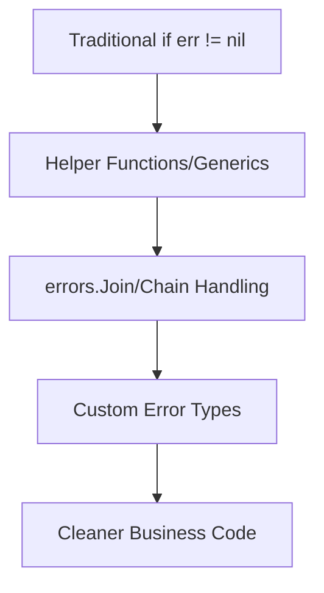

# Cleaner Go Code in 2025: Compact Error Handling

## Preface: Say Goodbye to "if err != nil" Hell

Go's explicit error handling is a cornerstone of its design, making bugs harder to ignore. However, this can lead to verbose code with frequent `if err != nil` checks.

By 2025, the Go community has embraced more sophisticated error management patterns. This article explores how to leverage modern Go features and best practices to achieve **compact, expressive, and robust error handling**.

---

## The "Past and Present" of Error Handling

### Traditional Approach: Safe but Tedious

```go
result, err := doSomething()
if err != nil {
    return fmt.Errorf("doSomething failed: %w", err)
}
// ... continue with result
```

While safe, this pattern can clutter business logic, especially in complex flows with multiple sequential operations.

### 2025 Trend: Conciseness and Expressiveness Coexist

Modern Go error handling utilizes:

- **Helper Functions & Generics**: To reduce boilerplate.
- **Error Aggregation**: Using `errors.Join` for batch processing.
- **Semantic Error Types**: Custom errors for better context and handling.
- **Context Integration**: Leveraging `context.Context` for request-scoped errors.

---

## Practical Example: More Elegant Error Management

### 1. Error Grouping and Chain Handling with `errors.Join`

For scenarios where multiple independent operations can fail, `errors.Join` (Go 1.20+) is invaluable.

**Traditional Approach:**
```go
if err := step1(); err != nil {
    return err
}
if err := step2(); err != nil {
    return err
}
if err := step3(); err != nil {
    return err
}
```

**Modern Approach:**
```go
errs := errors.Join(
    step1(),
    step2(),
    step3(),
)
if errs != nil {
    return fmt.Errorf("one or more steps failed: %w", errs)
}
```

> **Technical Depth**: `errors.Join` creates an `*errors.joinError` that implements the `error` interface. It holds a slice of the underlying errors. When printed, it concatenates the errors with newlines. `errors.Is` and `errors.As` can traverse the joined errors.

#### Advanced Usage: Validation Aggregation

```go
func ValidateUser(u User) error {
    var errs []error
    if u.Name == "" {
        errs = append(errs, errors.New("username cannot be empty"))
    }
    if u.Age < 0 {
        errs = append(errs, errors.New("age cannot be negative"))
    }
    if !strings.Contains(u.Email, "@") {
        errs = append(errs, errors.New("invalid email format"))
    }
    // Returns nil if errs is empty, otherwise a joined error
    return errors.Join(errs...)
}
```

---

### 2. Generic Helper Functions to Eliminate Repetition

Generics can encapsulate common error handling patterns.

```go
// A generic Must function for strict initialization
func Must[T any](v T, err error) T {
    if err != nil {
        panic(err)
    }
    return v
}

// Usage in initialization
var config = Must(loadConfig("config.yaml"))
```

> **Best Practice**: Use `Must`-like functions judiciously, primarily in package `init` functions, command-line tools, or scenarios where an error is unrecoverable and should crash the program immediately. For business logic, prefer explicit error handling.

#### Safe Boundaries for `Must`

- **Appropriate Use**: Tool initialization, test setup, loading essential, non-user-modifiable configuration.
- **Inappropriate Use**: Handling user input or recoverable errors in core business logic. Prefer returning errors.

---

### 3. Error Context and Layering with Custom Types

Custom error types provide semantic meaning and enable type-specific handling.

```go
// Define a semantic error type
type NotFoundError struct {
    Resource string
    ID       string
}

func (e NotFoundError) Error() string {
    return fmt.Sprintf("%s with ID %s not found", e.Resource, e.ID)
}

// Implement Is for comparison (Go 1.13+)
func (e NotFoundError) Is(target error) bool {
    _, ok := target.(NotFoundError)
    return ok
}

func getUser(ctx context.Context, id string) (User, error) {
    // ... logic ...
    if notFound {
        return User{}, NotFoundError{Resource: "User", ID: id}
    }
    // ...
}
```

> **Best Practice**: Define dedicated error types for distinct failure modes. This allows callers to use `errors.Is` and `errors.As` for precise error handling.

#### Best Practices for Custom Error Types

- **Implement `Error() string`**: The primary interface method.
- **Implement `Is(target error) bool`**: Enables `errors.Is` comparisons.
- **Implement `Unwrap() error`**: If wrapping another error, enables `errors.Unwrap` and chain traversal.
- **Consider `As(interface{}) bool`**: For more complex error hierarchies (less common).

**Example with Wrapping:**
```go
type DBError struct {
    Op  string
    Err error // Wrapped error
}

func (e DBError) Error() string {
    return fmt.Sprintf("database operation [%s] failed: %v", e.Op, e.Err)
}

func (e DBError) Unwrap() error { return e.Err } // Enable unwrapping

// Usage
if err := saveToDB(user); err != nil {
   return fmt.Errorf("failed to register user: %w", DBError{Op: "insert", Err: err})
}
```

---

### 4. Comprehensive Business Flow Example

This example demonstrates a user registration flow integrating validation, database operations, and notifications with robust error handling.

```go
package main

import (
    "context"
    "errors"
    "fmt"
    "log"
    "net/mail"
    "os"
    "time"
)

// --- Custom Error Types ---
type ValidationError struct {
    Field string
    Msg   string
}
func (e ValidationError) Error() string {
    return fmt.Sprintf("field [%s] validation failed: %s", e.Field, e.Msg)
}

type DBError struct {
    Op  string
    Err error
}
func (e DBError) Error() string {
    return fmt.Sprintf("database operation [%s] failed: %v", e.Op, e.Err)
}
func (e DBError) Unwrap() error { return e.Err }

type NotificationError struct {
    Service string
    Err     error
}
func (e NotificationError) Error() string {
    return fmt.Sprintf("notification via %s failed: %v", e.Service, e.Err)
}
func (e NotificationError) Unwrap() error { return e.Err }

// --- Business Logic Functions ---
func validateUser(email string, age int) error {
    var errs []error
    if _, err := mail.ParseAddress(email); err != nil {
        errs = append(errs, ValidationError{"email", "invalid email format"})
    }
    if age < 0 {
        errs = append(errs, ValidationError{"age", "age cannot be negative"})
    }
    return errors.Join(errs...)
}

func saveUserToDB(ctx context.Context, email string, age int) error {
    // Simulate DB call with context
    select {
    case <-ctx.Done():
        return ctx.Err() // Propagate context cancellation/timeout
    case <-time.After(100 * time.Millisecond): // Simulate work
        // Simulate a DB error
        return DBError{"insert", errors.New("connection lost")}
    }
}

func sendWelcomeEmail(email string) error {
    // Simulate notification failure
    return NotificationError{"email", errors.New("SMTP server unreachable")}
}

// --- Main Flow ---
func registerUser(ctx context.Context, email string, age int) (err error) {
    // 1. Validation
    if err := validateUser(email, age); err != nil {
        return fmt.Errorf("parameter validation failed: %w", err)
    }

    // 2. Database Operation
    if err := saveUserToDB(ctx, email, age); err != nil {
        return fmt.Errorf("failed to save user: %w", err)
    }

    // 3. Notification (Non-critical)
    // Note: Error is logged but not returned, allowing registration to succeed.
    if err := sendWelcomeEmail(email); err != nil {
        log.Printf("Warning: Welcome notification failed: %v", err)
        // Consider using a background job queue for resilience here
    }

    return nil // Success
}

func main() {
    ctx, cancel := context.WithTimeout(context.Background(), 200*time.Millisecond)
    defer cancel()

    email := "bad-email"
    age := -1

    err := registerUser(ctx, email, age)
    if err != nil {
        // Inspect and handle specific error types
        var vErr ValidationError
        var dbErr DBError
        var nErr NotificationError

        switch {
        case errors.As(err, &vErr):
            fmt.Printf("Validation Error: %s
", vErr.Msg)
            // Return 400 Bad Request to client
        case errors.As(err, &dbErr):
            fmt.Printf("Database Error: %v
", dbErr.Err)
            // Log for ops, return 500 Internal Server Error
            log.Printf("Critical DB Error during registration: %v", err)
        case errors.Is(err, context.DeadlineExceeded):
            fmt.Println("Request timed out, please try again later.")
            // Return 408 Request Timeout or 503 Service Unavailable
        default:
            fmt.Printf("Registration failed unexpectedly: %v
", err)
            log.Printf("Unexpected error during registration: %v", err)
            // Return 500 Internal Server Error
        }
        os.Exit(1)
    }
    fmt.Println("Registration successful")
}
```

---

### 5. Error Chain Logging and Tracing

Effective logging of error chains is crucial for debugging.

```go
import (
    "github.com/sirupsen/logrus" // Or "go.uber.org/zap"
    "errors"
    "fmt"
)

func doSomething() error {
    return fmt.Errorf("business processing failed: %w", errors.New("underlying IO error"))
}

func main() {
    err := doSomething()
    if err != nil {
        // Log the full error chain
        logrus.WithError(err).Error("Operation failed")

        // Manual unwrapping for inspection (optional, logger usually handles this)
        fmt.Println("--- Error Chain ---")
        for err != nil {
            fmt.Printf("  %T: %v
", err, err)
            err = errors.Unwrap(err)
        }
    }
}
```

> **Best Practice**: Use structured logging libraries (`logrus`, `zap`) that can automatically handle error chains and output them in a parseable format for log aggregation systems (e.g., ELK, Splunk).

---

### 6. Distinguishing `context.Context` Errors

It's vital to differentiate context-related errors (like timeouts) from business logic errors.

```go
func fetchData(ctx context.Context) error {
    select {
    case <-ctx.Done():
        return ctx.Err() // context.Canceled or context.DeadlineExceeded
    case <-time.After(2 * time.Second):
        return errors.New("remote service no response")
    }
}

func handler(ctx context.Context) {
    err := fetchData(ctx)
    if err != nil {
        switch {
        case errors.Is(err, context.DeadlineExceeded):
            // Handle timeout (e.g., return 408, retry logic)
            fmt.Println("Request to external service timed out.")
        case errors.Is(err, context.Canceled):
            // Handle cancellation (e.g., client disconnect)
            fmt.Println("Request was canceled.")
        default:
            // Handle other business errors
            fmt.Printf("Data fetch failed: %v
", err)
        }
    }
}
```

---

### 7. Domain-Driven Error Layering and User-Friendly Prompts

Separate internal errors from user-facing messages.

```go
// Internal Error Type
type InsufficientBalanceError struct {
    UserID  int
    Balance int
    Cost    int
}

func (e InsufficientBalanceError) Error() string {
    return fmt.Sprintf("user %d has insufficient balance (%d) for cost (%d)", e.UserID, e.Balance, e.Cost)
}

// User-Facing Error Type
type UserVisibleError struct {
    Code    string // Machine-readable code
    Message string // Human-readable message
    Details map[string]interface{} // Optional extra context
}

func (e UserVisibleError) Error() string { return e.Message }

func processPayment(userID int, amount int) error {
    // ... logic ...
    if user.Balance < amount {
        internalErr := InsufficientBalanceError{UserID: userID, Balance: user.Balance, Cost: amount}
        // Wrap internal error with user-friendly message
        return fmt.Errorf("payment processing failed: %w", UserVisibleError{
            Code:    "INSUFFICIENT_FUNDS",
            Message: "Your account balance is too low to complete this transaction.",
            Details: map[string]interface{}{"balance": user.Balance, "required": amount},
        })
    }
    // ...
    return nil
}

func apiHandler() {
    err := processPayment(123, 100)
    if err != nil {
        var userErr UserVisibleError
        if errors.As(err, &userErr) {
            // Send userErr.Code and userErr.Message to frontend
            fmt.Printf("User Error [%s]: %s
", userErr.Code, userErr.Message)
        } else {
            // Log internal error, send generic message to user
            log.Printf("Internal Error: %v", err)
            fmt.Println("An unexpected error occurred. Please try again later.")
        }
    }
}
```

---

## Diagram: Error Handling Evolution Path



---

## Technical Challenges and Solutions

### 1. Lost Error Information

**Challenge**: Deeply wrapped errors can obscure the root cause.

**Solution**:
- Consistently use `fmt.Errorf("...: %w", err)` for wrapping.
- Leverage `errors.Unwrap`, `errors.Is`, and `errors.As` for inspection.
- Use structured logging to capture and display full error chains.

### 2. Over-Abstraction Hinders Debugging

**Challenge**: Excessive helper functions can make the error's origin unclear.

**Solution**:
- Maintain explicit error handling for critical paths.
- Ensure logging includes sufficient context (e.g., function names, IDs).
- Profile and test error paths to ensure helpers don't hide real issues.

### 3. Inconsistent Team Style

**Challenge**: Mixed error handling styles reduce code maintainability.

**Solution**:
- Establish and enforce team-wide error handling guidelines (e.g., in a style guide).
- Automate checks using `golangci-lint` rules.
- Conduct code reviews focusing on error management consistency.

### 4. Excessively Long Error Chains

**Challenge**: Very long chains can be difficult to parse and understand.

**Solution**:
- Avoid unnecessary wrapping. Only wrap when adding valuable context.
- Use custom error types that aggregate related errors instead of chaining many single errors.
- Structure logs to clearly display the hierarchy of errors.

### 5. Misuse of `panic`

**Challenge**: Using `panic` for expected errors leads to service instability.

**Solution**:
- Reserve `panic` for truly exceptional, unrecoverable conditions (e.g., programming bugs, corrupted state).
- Use `recover()` in `defer` statements at service boundaries (e.g., HTTP handlers) to prevent panics from crashing the entire service.
- Convert panics to errors for upstream handling where appropriate.

### 6. Error Code and Message Confusion

**Challenge**: Inconsistent or unclear error codes/messages hamper debugging and user experience.

**Solution**:
- Define a standard set of error codes and messages.
- Document error codes and their meanings.
- Separate internal technical error messages from user-facing messages.

### 7. Incorrect Handling of `context.Context` Errors

**Challenge**: Failing to properly check for `context.Canceled` or `context.DeadlineExceeded`.

**Solution**:
- Always check context errors first when an operation returns an error.
- Design functions to accept and respect `context.Context`.
- Handle context errors by returning early, not treating them as business failures.

---

## Common Mistakes and Anti-Patterns

### Mistake 1: Panic on All Errors

```go
// Anti-pattern
if err != nil {
    panic(err) // Crashes the program/service
}
```

### Mistake 2: Returning Errors Without Context

```go
// Anti-pattern
result, err := doSomething()
if err != nil {
    return err // Loses context of where the error occurred
}

// Improvement:
result, err := doSomething()
if err != nil {
    return fmt.Errorf("failed to doSomething: %w", err) // Adds context
}
```

### Mistake 3: Ignoring Context Errors

```go
// Anti-pattern
err := fetchData(ctx)
if err != nil && err != context.Canceled { // Incorrect check
    // Treats context.Canceled as a business error
    log.Printf("Data fetch failed: %v", err)
    // Return 500 error to user
}

// Improvement:
err := fetchData(ctx)
if err != nil {
    if errors.Is(err, context.Canceled) || errors.Is(err, context.DeadlineExceeded) {
        // Handle context errors appropriately (e.g., return 499, 408)
        return // or handle specifically
    }
    // Handle business errors
    log.Printf("Data fetch failed: %v", err)
    // Return 500 error
}
```

---

## Conclusion: Make Error Management a Go Code Strength

In 2025, Go's error handling has evolved beyond simple checks. By embracing `errors.Join`, custom error types, and context integration, developers can write Go code that is not only safer but also cleaner and more maintainable.

**Key Takeaways**:

- **Leverage Modern Features**: Use `errors.Join`, `errors.Is/As`, and error wrapping (`%w`) effectively.
- **Design Semantic Errors**: Create custom error types that convey meaning and enable specific handling.
- **Handle Context Gracefully**: Distinguish context errors from business logic errors.
- **Log Effectively**: Use structured logging to capture full error contexts.
- **Establish Conventions**: Standardize error handling practices within your team.

By mastering these techniques, your Go codebase will become more robust and a pleasure to work with.

> "Elegant error handling is the hallmark of a senior Go engineer." — PFinal南丞

---

For more practical cases and tool recommendations, follow PFinalClub and explore the new paradigm of Go error management with me!