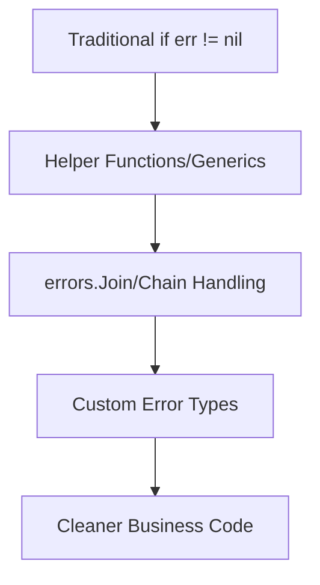

# Cleaner Go Code in 2025: Compact Error Handling

## Preface: Say Goodbye to the "if err != nil" Hell

Do you remember when you first learned Go, and your screen was full of `if err != nil`? Every time you finished a logic block, you immediately checked for errors. While Go's explicit error handling makes bugs hard to hide, it also makes code verbose and repetitive.

In 2025, the Go community has made new breakthroughs in error management. **Compact and elegant error handling** makes code both safe and refreshing. Today, I will combine real project experience and personal lessons to talk about how to manage Go errors in a more modern way.

---

## The "Past and Present" of Error Handling

### Traditional Approach: Safe but Tedious

```go
result, err := doSomething()
if err != nil {
    return fmt.Errorf("doSomething failed: %w", err)
}
```

This approach is straightforward, but in complex business flows, error checks can "cut" the code into fragments.

### 2025 Trend: Compactness and Expressiveness Coexist

With Go 1.22+ and the evolution of community libraries, error handling is becoming more "declarative." For example:

- Use helper functions/generics to simplify repetitive logic
- Error grouping and chain handling
- Combine context and custom types for better readability

---

## Practical Case: More Elegant Error Management

### 1. Error Grouping and Chain Handling

Suppose you have a series of operations, each of which may fail. Traditional approach:

```go
if err := step1(); err != nil {
    return err
}
if err := step2(); err != nil {
    return err
}
if err := step3(); err != nil {
    return err
}
```

The 2025 approach:

```go
errs := errors.Join(
    step1(),
    step2(),
    step3(),
)
if errs != nil {
    return errs
}
```

> **Experience Sharing**: `errors.Join` (Go 1.20+) merges multiple errors, making batch processing and logging easier.

#### Details: Advanced Usage of errors.Join

- `errors.Join(nil, nil)` returns `nil`, no extra checks needed.
- Supports recursive expansion of nested error lists for batch validation and centralized handling.
- Can be combined with `errors.Is`/`errors.As` for precise error type location.

**Example:**

```go
func ValidateUser(u User) error {
    var errs []error
    if u.Name == "" {
        errs = append(errs, errors.New("Username cannot be empty"))
    }
    if u.Age < 0 {
        errs = append(errs, errors.New("Age cannot be negative"))
    }
    if !strings.Contains(u.Email, "@") {
        errs = append(errs, errors.New("Invalid email format"))
    }
    return errors.Join(errs...)
}
```

---

### 2. Generic Helper Functions to Eliminate Repetition

Use generics and higher-order functions to encapsulate common error handling patterns:

```go
func Must[T any](v T, err error) T {
    if err != nil {
        panic(err)
    }
    return v
}

// Usage
data := Must(os.ReadFile("config.yaml"))
```

> **Tip**: Use `Must` boldly in scripts and initialization flows, but keep explicit error handling in main business logic.

#### Details: Safe Boundaries for Must

- Use only in initialization, scripts, and test code.
- In production, replace with logging + os.Exit(1) or return custom errors.
- Keep explicit error handling in main business flows for traceability and recovery.

---

### 3. Error Context and Layering

Combine `context.Context` and custom error types to improve error localization:

```go
type NotFoundError struct {
    Resource string
}

func (e NotFoundError) Error() string {
    return fmt.Sprintf("%s not found", e.Resource)
}

func getUser(ctx context.Context, id int) (User, error) {
    // ...
    return User{}, NotFoundError{"User"}
}
```

> **Best Practice**: Define dedicated types for key business errors for easier upper-layer capture and handling.

#### Details: Best Practices for Custom Error Types

- Recommend implementing `Is(target error) bool` to support `errors.Is` checks.
- Define dedicated types for each business error for maintainability.
- Use domain-driven design to distinguish "user-visible errors" and "internal system errors."

**Example:**

```go
type PermissionDeniedError struct {
    UserID int
    Action string
}

func (e PermissionDeniedError) Error() string {
    return fmt.Sprintf("User %d has no permission for action: %s", e.UserID, e.Action)
}

if errors.As(err, &PermissionDeniedError{}) {
    // Return 403
}
```

---

### 4. More Complete Business Flow Example

Suppose you have a user registration flow involving parameter validation, database write, email notification, etc., each step may fail:

```go
package main

import (
    "context"
    "database/sql"
    "errors"
    "fmt"
    "log"
    "net/mail"
    "os"
    "time"
)

// Custom error types ... (ValidationError, DBError, etc.)

type ValidationError struct {
    Field string
    Msg   string
}

func (e ValidationError) Error() string {
    return fmt.Sprintf("Field [%s] validation failed: %s", e.Field, e.Msg)
}

type DBError struct {
    Op  string
    Err error
}

func (e DBError) Error() string {
    return fmt.Sprintf("Database operation [%s] failed: %v", e.Op, e.Err)
}

func (e DBError) Unwrap() error { return e.Err }

// Parameter validation
func validateUser(email string, age int) error {
    var errs []error
    if _, err := mail.ParseAddress(email); err != nil {
        errs = append(errs, ValidationError{"email", "Invalid email format"})
    }
    if age < 0 {
        errs = append(errs, ValidationError{"age", "Age cannot be negative"})
    }
    return errors.Join(errs...)
}

// Database write
func saveUserToDB(ctx context.Context, email string, age int) error {
    var db *sql.DB
    select {
    case <-ctx.Done():
        return ctx.Err()
    case <-time.After(100 * time.Millisecond):
        return DBError{"insert", sql.ErrConnDone}
    }
}

// Email notification
func sendWelcomeEmail(email string) error {
    return errors.New("Email service unavailable")
}

// Registration main flow
func registerUser(ctx context.Context, email string, age int) error {
    if err := validateUser(email, age); err != nil {
        return fmt.Errorf("Parameter validation failed: %w", err)
    }
    if err := saveUserToDB(ctx, email, age); err != nil {
        return fmt.Errorf("Failed to save user: %w", err)
    }
    if err := sendWelcomeEmail(email); err != nil {
        log.Printf("Failed to send welcome email: %v", err)
    }
    return nil
}

func main() {
    ctx, cancel := context.WithTimeout(context.Background(), 200*time.Millisecond)
    defer cancel()

    err := registerUser(ctx, "bad-email", -1)
    if err != nil {
        var vErr ValidationError
        if errors.As(err, &vErr) {
            fmt.Println("User input error:", vErr)
        } else if errors.Is(err, context.DeadlineExceeded) {
            fmt.Println("Operation timed out, please try again")
        } else {
            fmt.Println("Registration failed:", err)
        }
        os.Exit(1)
    }
    fmt.Println("Registration successful")
}
```

---

### 5. Error Chain Logging and Tracing

Combine logrus/zap and other logging libraries to output complete error chains and stack information:

```go
import (
    "github.com/sirupsen/logrus"
    "errors"
    "fmt"
)

func doSomething() error {
    return fmt.Errorf("Business processing failed: %w", errors.New("Underlying IO error"))
}

func main() {
    err := doSomething()
    if err != nil {
        logrus.WithField("err", err).Error("Operation failed")
        // Output complete error chain
        var targetErr error = err
        for targetErr != nil {
            fmt.Println("Chain:", targetErr)
            targetErr = errors.Unwrap(targetErr)
        }
    }
}
```

---

### 6. context Errors vs. Business Errors

```go
func fetchData(ctx context.Context) error {
    select {
    case <-ctx.Done():
        return ctx.Err() // context.Canceled or context.DeadlineExceeded
    case <-time.After(2 * time.Second):
        return errors.New("Remote service no response")
    }
}

func main() {
    ctx, cancel := context.WithTimeout(context.Background(), 1*time.Second)
    defer cancel()
    err := fetchData(ctx)
    if errors.Is(err, context.DeadlineExceeded) {
        fmt.Println("Request timed out, please try again later")
    } else if err != nil {
        fmt.Println("Data fetch failed:", err)
    }
}
```

---

### 7. Domain-Driven Error Layering and User-Friendly Prompts

```go
type UserVisibleError struct {
    Code string
    Msg  string
}

func (e UserVisibleError) Error() string { return e.Msg }

func doBiz() error {
    return UserVisibleError{"E1001", "Insufficient balance"}
}

func main() {
    err := doBiz()
    var uErr UserVisibleError
    if errors.As(err, &uErr) {
        fmt.Printf("Frontend prompt: %s (Error code: %s)\n", uErr.Msg, uErr.Code)
    } else if err != nil {
        fmt.Println("System error, please contact admin")
    }
}
```

---

## Diagram: Error Handling Evolution Roadmap



---

## Technical Challenges and Solutions

### 1. Loss of Error Information

**Challenge**: After multiple layers of wrapping, original error information is hard to trace.

**Solution**:  
- Use `%w` formatting to preserve error chains.
- Use `errors.Unwrap` and `errors.Is/As` for error tracing.
- Combine with logging libraries (zap, logrus) for complete error chain logging.

**Example:**

```go
err := fmt.Errorf("Database operation failed: %w", dbErr)
log.WithError(err).Error("User registration failed")
```

### 2. Over-Abstraction Makes Debugging Difficult

**Challenge**: Too many helper functions make it hard to locate errors.

**Solution**:  
- Keep explicit error handling in key paths.
- Output complete error chains and call stacks in logs.

### 3. Inconsistent Team Practices

**Challenge**: Different team members have different error handling habits, leading to messy code.

**Solution**:  
- Establish team error handling guidelines.
- Focus on error management in code reviews.
- Standardize error codes and messages for internationalization and maintainability.

### 4. Error Chains Too Long

**Challenge**: After multiple layers of wrapping, it's hard to locate the root cause.

**Solution**:
- Combine log stack, layered unwrap.
- Standardize log format for later search and alerting.

### 5. Misuse of panic

**Challenge**: Using panic for business errors causes service crashes.

**Solution**:
- Only use panic in unrecoverable scenarios.
- Business errors should return error and be handled by upper layers.

### 6. Error Code Confusion

**Challenge**: Inconsistent error codes between frontend and backend, hard to trace.

**Solution**:
- Standardize error code definitions and documentation.
- Frontend only displays user-visible errors, others are logged.

### 7. Ignoring context Errors

**Challenge**: Mistakenly treating context errors as business errors.

**Solution**:
- Separate business and context errors, avoid misjudgment.
- Use `WithTimeout`/`WithCancel` to control lifecycle when passing context.

---

## Common Pitfalls and Counterexamples

### Pitfall 1: Panic on All Errors

```go
// Counterexample
if err != nil {
    panic(err) // Easily crashes service in production
}
```

### Pitfall 2: Error Information Lacks Context

```go
// Counterexample
return err // Can't locate which step failed
```

**Improvement**:

```go
return fmt.Errorf("Failed to read config file: %w", err)
```

### Pitfall 3: Ignoring context Errors

```go
// Counterexample
if err := fetchData(ctx); err != nil && err != context.Canceled {
    // Mistakenly treats context error as business error
}
```

---

## Conclusion: Make Error Management a Bonus Item for Go Code

In 2025, Go's error management is moving from "mechanical" to "expressive." **Compact error handling not only makes code more beautiful, but also makes systems more robust.** My advice:

- Make good use of new features and community tools, don't be bound by "if err != nil"
- Combine with real scenarios, choose error handling flexibly
- Standardize team style, keep optimizing
- Details determine robustness, conventions determine maintainability

Finally, may your Go code become more reliable and elegant with cleaner error management!

> "Elegant error handling is the hallmark of a senior Go engineer." — PFinal南尧

---

For more practical cases and tool recommendations, follow PFinalClub and explore new paradigms in the Go world with me! 