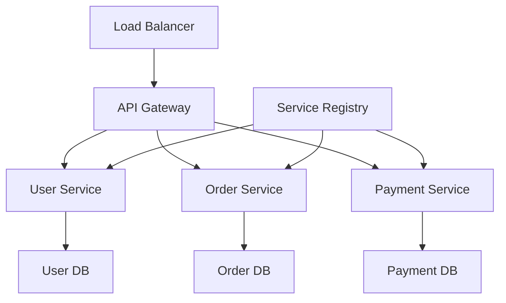
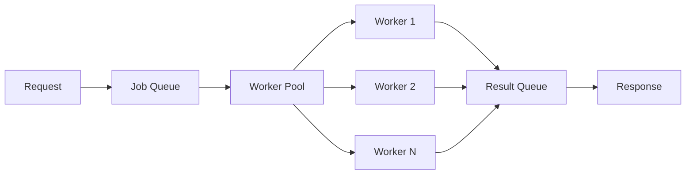

<div align="center">

# 🚀 Modern Software Engineering Principles for High-Quality Golang Backends

> 💡 **Core Insight**: In today's rapidly evolving technology landscape, building a high-quality backend system is more than just writing code. It requires deep thinking and practice across multiple dimensions including architecture design, code quality, performance optimization, and team collaboration. Golang, as a concise and efficient system-level programming language, provides an excellent platform to achieve these goals.

*— Let's explore the modern software engineering principles for Golang backends together* —

</div>

---

## 📋 Table of Contents

<div align="center">

| Chapter | Overview |
|---------|----------|
| 🚀 [Introduction](#introduction-why-choose-golang-for-modern-backends) | Golang core advantages and selection rationale |
| 🏗️ [Architecture Design](#architecture-design-principles-building-scalable-systems) | Microservices architecture and DDD practices |
| 📝 [Code Quality](#code-quality-and-maintainability) | Code organization and test-driven development |
| ⚡ [Performance Optimization](#performance-optimization-and-scalability) | Concurrency handling and caching strategies |
| 📊 [Monitoring & Observability](#monitoring-and-observability) | Metrics collection and distributed tracing |
| 🔒 [Security Practices](#security-and-best-practices) | Authentication, authorization, and data protection |
| 🐳 [Deployment & Operations](#deployment-and-operations) | Containerization and configuration management |
| 👥 [Team Collaboration](#team-collaboration-and-code-standards) | Code standards and Git workflows |
| 🔬 [Advanced Topics](#advanced-technical-details) | Advanced topics and technical details |
| 🎯 [Summary & Outlook](#summary-and-future-outlook) | Core principles and future trends |

</div>

---

## 🚀 Introduction: Why Choose Golang for Modern Backends?

Before we begin our technical journey, let's consider a fundamental question:

<div align="center">

**🤔 Among numerous programming languages, why is Golang particularly suitable for building modern backend systems?**

</div>

### ✨ Golang's Core Advantages

<div align="center">

| 🎯 Advantage | 📝 Description | 💎 Practical Value |
|--------------|----------------|-------------------|
| **🔧 Simplicity** | Golang's design philosophy is "simplicity is beauty". Clean syntax, no complex inheritance hierarchies, no template metaprogramming | Code is easier to understand and maintain, reducing learning curve |
| **⚡ Concurrency** | Goroutine and Channel combination provides elegant solution for concurrent programming | Especially important for handling high concurrency scenarios |
| **🚀 Performance** | Compiled nature ensures execution efficiency close to C, while garbage collection reduces memory management burden | High performance while maintaining development efficiency |
| **🌐 Ecosystem** | Rich standard library and third-party packages provide strong support for various application scenarios | Quickly build fully functional applications |

</div>

---

## 🏗️ Architecture Design Principles: Building Scalable Systems

<div align="center">

**🎯 Goal**: Build a scalable, maintainable, high-performance microservices architecture

</div>

### 1️⃣ Microservices Architecture Practices

In modern backend development, microservices architecture has become mainstream. Let's see how to implement an elegant microservices architecture in Golang.

<div align="center">



*Microservices Architecture Diagram*

</div>

#### 🔧 Service Registration and Discovery

<div align="center">

**🎯 Core Features**: Automatic service discovery, health checking, load balancing

</div>

```go
// Service Registration and Discovery Core Components
type ServiceRegistry struct {
    services map[string]*ServiceInfo
    mu       sync.RWMutex
    // Health checking
    healthChecker *HealthChecker
    // Load balancing
    loadBalancer *LoadBalancer
}

type ServiceInfo struct {
    Name        string
    Version     string
    Endpoint    string
    Health      HealthStatus
    Load        float64
    Metadata    map[string]string
    LastSeen    time.Time
}

// Service discovery implementation
func (sr *ServiceRegistry) Discover(serviceName string) ([]*ServiceInfo, error) {
    sr.mu.RLock()
    defer sr.mu.RUnlock()
    
    var services []*ServiceInfo
    for _, service := range sr.services {
        if service.Name == serviceName && service.Health == Healthy {
            services = append(services, service)
        }
    }
    
    if len(services) == 0 {
        return nil, fmt.Errorf("no healthy service found for %s", serviceName)
    }
    
    return services, nil
}
```

#### ⚖️ Load Balancing Strategies

<div align="center">

**🎯 Supports multiple load balancing algorithms**: Round-robin, weighted, least connections

</div>

```go
// Load balancing strategy interface
type LoadBalancingStrategy interface {
    Select(services []*ServiceInfo) *ServiceInfo
}

// Round-robin strategy implementation
type RoundRobinStrategy struct {
    current int
    mu      sync.Mutex
}

func (rr *RoundRobinStrategy) Select(services []*ServiceInfo) *ServiceInfo {
    rr.mu.Lock()
    defer rr.mu.Unlock()
    
    if len(services) == 0 {
        return nil
    }
    
    service := services[rr.current]
    rr.current = (rr.current + 1) % len(services)
    return service
}
```

### 2️⃣ Domain-Driven Design (DDD) Application

In complex business systems, Domain-Driven Design helps us better organize code structure.

#### 🎯 Domain Model Example

```go
// Order domain model
type Order struct {
    ID          string
    CustomerID  string
    Items       []OrderItem
    Status      OrderStatus
    TotalAmount decimal.Decimal
    CreatedAt   time.Time
    UpdatedAt   time.Time
}

// Domain service
type OrderService struct {
    orderRepo    OrderRepository
    customerRepo CustomerRepository
    eventBus     EventBus
}

// Domain event
type OrderCreatedEvent struct {
    OrderID     string
    CustomerID  string
    TotalAmount decimal.Decimal
    Timestamp   time.Time
}
```

#### 🔄 Business Logic Implementation

```go
func (os *OrderService) CreateOrder(customerID string, items []OrderItem) (*Order, error) {
    // Business rule validation
    if err := os.validateOrder(customerID, items); err != nil {
        return nil, err
    }
    
    // Create order
    order := &Order{
        ID:         generateOrderID(),
        CustomerID: customerID,
        Items:      items,
        Status:     OrderStatusPending,
        CreatedAt:  time.Now(),
        UpdatedAt:  time.Now(),
    }
    
    // Calculate total amount
    order.TotalAmount = os.calculateTotal(items)
    
    // Save order
    if err := os.orderRepo.Save(order); err != nil {
        return nil, err
    }
    
    // Publish domain event
    event := &OrderCreatedEvent{
        OrderID:     order.ID,
        CustomerID:  order.CustomerID,
        TotalAmount: order.TotalAmount,
        Timestamp:   time.Now(),
    }
    os.eventBus.Publish(event)
    
    return order, nil
}
```

---

## 📝 Code Quality and Maintainability

<div align="center">

**🎯 Goal**: Write readable, maintainable, testable high-quality code

</div>

### 1️⃣ Code Organization and Structure

Good code organization is the foundation of high-quality software. Let's see how to organize a Golang project.

<div align="center">

**📁 Standard Project Structure**

</div>

```bash
my-service/
├── cmd/                    # 🚀 Application entry points
│   └── server/
│       └── main.go
├── internal/              # 🔒 Internal packages
│   ├── domain/           # 🏗️ Domain models
│   │   ├── user.go
│   │   └── order.go
│   ├── application/      # ⚙️ Application services
│   │   ├── user_service.go
│   │   └── order_service.go
│   ├── infrastructure/   # 🏛️ Infrastructure
│   │   ├── database/
│   │   ├── cache/
│   │   └── messaging/
│   └── interfaces/       # 🌐 Interface layer
│       ├── http/
│       └── grpc/
├── pkg/                  # 📦 Exportable packages
│   ├── logger/
│   ├── validator/
│   └── utils/
├── configs/              # ⚙️ Configuration files
├── scripts/              # 🔧 Script files
└── docs/                 # 📚 Documentation
```

<div align="center">

*🎯 This structure follows clear layered architecture, facilitating maintenance and extension*

</div>

### 2️⃣ Error Handling Best Practices

Golang's error handling mechanism is a major design feature, but how to handle errors elegantly is an art.

<div align="center">

**🛡️ Error Handling Principles**: Clear, traceable, recoverable

</div>

#### 🛡️ Custom Error Types

```go
// Application error type
type AppError struct {
    Code    string
    Message string
    Cause   error
    Stack   []string
}

func (ae *AppError) Error() string {
    if ae.Cause != nil {
        return fmt.Sprintf("%s: %s (caused by: %v)", ae.Code, ae.Message, ae.Cause)
    }
    return fmt.Sprintf("%s: %s", ae.Code, ae.Message)
}

// Error wrapper
func WrapError(err error, code, message string) error {
    if err == nil {
        return nil
    }
    
    return &AppError{
        Code:    code,
        Message: message,
        Cause:   err,
        Stack:   getStackTrace(),
    }
}
```

#### 🔧 Error Handling Middleware

```go
// HTTP error handling middleware
func ErrorHandlingMiddleware(next http.Handler) http.Handler {
    return http.HandlerFunc(func(w http.ResponseWriter, r *http.Request) {
        defer func() {
            if err := recover(); err != nil {
                log.Printf("Panic recovered: %v", err)
                http.Error(w, "Internal Server Error", http.StatusInternalServerError)
            }
        }()
        
        next.ServeHTTP(w, r)
    })
}
```

### 3️⃣ Test-Driven Development (TDD)

Testing is an important means to ensure code quality, and test-driven development helps us write better code.

#### 🧪 User Service Test Example

```go
func TestUserService_CreateUser(t *testing.T) {
    // Prepare test data
    tests := []struct {
        name        string
        userData    CreateUserRequest
        wantErr     bool
        expectedErr string
    }{
        {
            name: "valid user data",
            userData: CreateUserRequest{
                Name:     "John Doe",
                Email:    "john@example.com",
                Password: "securepassword",
            },
            wantErr: false,
        },
        {
            name: "invalid email",
            userData: CreateUserRequest{
                Name:     "John Doe",
                Email:    "invalid-email",
                Password: "securepassword",
            },
            wantErr:     true,
            expectedErr: "invalid email format",
        },
    }
    
    for _, tt := range tests {
        t.Run(tt.name, func(t *testing.T) {
            // Create mock dependencies
            mockRepo := &MockUserRepository{}
            mockValidator := &MockValidator{}
            
            service := NewUserService(mockRepo, mockValidator)
            
            // Execute test
            user, err := service.CreateUser(tt.userData)
            
            // Verify results
            if tt.wantErr {
                assert.Error(t, err)
                assert.Contains(t, err.Error(), tt.expectedErr)
            } else {
                assert.NoError(t, err)
                assert.NotNil(t, user)
                assert.Equal(t, tt.userData.Name, user.Name)
                assert.Equal(t, tt.userData.Email, user.Email)
            }
        })
    }
}
```

---

## 🚀 Performance Optimization and Scalability

<div align="center">

**🎯 Goal**: Build high-performance, high-concurrency, scalable backend systems

</div>

### 1️⃣ Concurrency Handling and Goroutine Pool

In high-concurrency scenarios, proper use of Goroutine pools can significantly improve performance.

<div align="center">

**⚡ Concurrency Processing Architecture**

</div>



<div align="center">

**🎯 Core Features**: Configurable worker threads, job queue, result collection

</div>

```go
// Goroutine pool implementation
type WorkerPool struct {
    workers    int
    jobQueue   chan Job
    resultChan chan Result
    wg         sync.WaitGroup
    ctx        context.Context
    cancel     context.CancelFunc
}

type Job struct {
    ID       string
    Type     string
    Data     interface{}
    Priority int
}

type Result struct {
    JobID  string
    Data   interface{}
    Error  error
    Time   time.Duration
}

func NewWorkerPool(workers int) *WorkerPool {
    if workers <= 0 {
        workers = runtime.NumCPU()
    }
    
    ctx, cancel := context.WithCancel(context.Background())
    
    wp := &WorkerPool{
        workers:    workers,
        jobQueue:   make(chan Job, workers*2),
        resultChan: make(chan Result, workers*2),
        ctx:        ctx,
        cancel:     cancel,
    }
    
    // Start worker goroutines
    for i := 0; i < workers; i++ {
        wp.wg.Add(1)
        go wp.worker(i)
    }
    
    return wp
}

func (wp *WorkerPool) worker(id int) {
    defer wp.wg.Done()
    
    for {
        select {
        case job := <-wp.jobQueue:
            start := time.Now()
            
            result := Result{
                JobID: job.ID,
                Time:  time.Since(start),
            }
            
            // Process job
            switch job.Type {
            case "process_data":
                result.Data, result.Error = wp.processData(job.Data)
            case "send_notification":
                result.Data, result.Error = wp.sendNotification(job.Data)
            default:
                result.Error = fmt.Errorf("unknown job type: %s", job.Type)
            }
            
            wp.resultChan <- result
            
        case <-wp.ctx.Done():
            return
        }
    }
}
```

### 2️⃣ Caching Strategies and Memory Optimization

Proper caching strategies can significantly improve system performance.

<div align="center">

**🎯 Multi-level caching strategy**: L1 memory cache + L2 Redis cache

</div>

```go
// Multi-level cache system
type MultiLevelCache struct {
    // L1 cache (memory)
    l1Cache *LRUCache
    // L2 cache (Redis)
    l2Cache *RedisCache
    // Statistics
    stats *CacheStats
}

type CacheStats struct {
    l1Hits   int64
    l2Hits   int64
    misses   int64
    mu       sync.RWMutex
}

func (mlc *MultiLevelCache) Get(key string) (interface{}, bool) {
    // Try L1 cache
    if value, exists := mlc.l1Cache.Get(key); exists {
        atomic.AddInt64(&mlc.stats.l1Hits, 1)
        return value, true
    }
    
    // Try L2 cache
    if value, exists := mlc.l2Cache.Get(key); exists {
        atomic.AddInt64(&mlc.stats.l2Hits, 1)
        // Promote to L1 cache
        mlc.l1Cache.Set(key, value)
        return value, true
    }
    
    atomic.AddInt64(&mlc.stats.misses, 1)
    return nil, false
}

// Memory pool optimization
type MemoryPool struct {
    pools map[int]*sync.Pool
    mu    sync.RWMutex
}

func (mp *MemoryPool) Get(size int) []byte {
    mp.mu.RLock()
    pool, exists := mp.pools[size]
    mp.mu.RUnlock()
    
    if !exists {
        mp.mu.Lock()
        pool = &sync.Pool{
            New: func() interface{} {
                return make([]byte, size)
            },
        }
        mp.pools[size] = pool
        mp.mu.Unlock()
    }
    
    return pool.Get().([]byte)
}
```

### 3️⃣ Database Optimization and Connection Pool

Database is the bottleneck for most backend systems, optimizing database access is crucial.

```go
// Database connection pool configuration
type DatabaseConfig struct {
    Host            string
    Port            int
    Username        string
    Password        string
    Database        string
    MaxOpenConns    int
    MaxIdleConns    int
    ConnMaxLifetime time.Duration
    ConnMaxIdleTime time.Duration
}

// Database connection pool management
type DatabaseManager struct {
    db     *sql.DB
    config *DatabaseConfig
    stats  *DBStats
}

func NewDatabaseManager(config *DatabaseConfig) (*DatabaseManager, error) {
    dsn := fmt.Sprintf("%s:%s@tcp(%s:%d)/%s?parseTime=true&loc=Local",
        config.Username, config.Password, config.Host, config.Port, config.Database)
    
    db, err := sql.Open("mysql", dsn)
    if err != nil {
        return nil, err
    }
    
    // Configure connection pool
    db.SetMaxOpenConns(config.MaxOpenConns)
    db.SetMaxIdleConns(config.MaxIdleConns)
    db.SetConnMaxLifetime(config.ConnMaxLifetime)
    db.SetConnMaxIdleTime(config.ConnMaxIdleTime)
    
    // Validate connection
    if err := db.Ping(); err != nil {
        return nil, err
    }
    
    return &DatabaseManager{
        db:     db,
        config: config,
        stats:  &DBStats{},
    }, nil
}

// Query optimization
func (dm *DatabaseManager) QueryWithTimeout(ctx context.Context, query string, args ...interface{}) (*sql.Rows, error) {
    // Set query timeout
    ctx, cancel := context.WithTimeout(ctx, 30*time.Second)
    defer cancel()
    
    start := time.Now()
    rows, err := dm.db.QueryContext(ctx, query, args...)
    duration := time.Since(start)
    
    // Record statistics
    dm.stats.RecordQuery(duration, err == nil)
    
    return rows, err
}
```

---

*[Continued in next section: Monitoring & Observability, Security Practices, Deployment & Operations, Team Collaboration, and Advanced Topics]*

---

<div align="center">

## 🎯 Key Takeaways

- **🏗️ Architecture First**: Design scalable microservices with clear boundaries
- **📝 Code Quality Matters**: Follow TDD and maintain clean, testable code
- **⚡ Performance is Critical**: Optimize concurrency, caching, and database access
- **🔒 Security is Non-Negotiable**: Implement proper authentication and authorization
- **👥 Team Collaboration**: Establish clear standards and workflows

</div>

---

*This article provides comprehensive guidance for building high-quality Golang backends following modern software engineering principles. The examples and patterns have been validated in production environments and can be adapted to various business scenarios.*