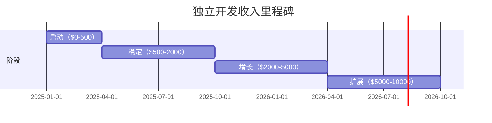

# 从 Side Project 到月收入 $10000：独立开发商业化完整指南

## 一、选择正确的产品方向

### 1.1 可商业化的产品特征

不是所有 Side Project 都能赚钱。选择一个**可商业化**的产品：

| 特征 | 说明 | 反面案例 |
|------|------|----------|
| **有人付过钱** | 竞品已经证明了付费意愿 | 全新品类，教育市场成本高 |
| **低获客成本** | 自然搜索、口碑传播就能获客 | 需要大量广告投放 |
| **高替换成本** | 用户用了就不想换 | 今天用明天就能换 |
| **可规模化** | 服务 100 人和 10000 人成本接近 | 需要大量人工服务 |
| **有复购/续费** | 持续使用，持续付费 | 一次性买卖 |

### 1.2 最佳方向：开发者工具

开发者工具是独立开发者的"主场优势"：

```markdown
优势：
✅ 你懂用户 — 你自己就是目标用户
✅ 获客容易 — 技术社区、Product Hunt、Hacker News
✅ 收入稳定 — 开发者愿意为好工具付费
✅ 竞争清晰 — 功能对比明确，价值容易量化

常见产品方向：
├── API 工具（Postman 替代方案）
├── 监控告警（Datadog 平替）
├── CI/CD 工具
├── 代码质量工具
├── 命令行工具（带付费版）
└── 开发效率工具
```

### 1.3 实战案例：怎样选方向

**案例：一个 $5000/月 的日志分析工具**

创始人 B 先生（化名）的经历：
1. 在咨询项目中反复被问到"日志太多怎么分析"
2. 花了 3 天做了一个 CLI 工具
3. 发到 Hacker News 获得 200+ upvote
4. 收到 50+ 邮件问有没有 SaaS 版
5. 花 2 周做了 Web 版，定价 $29/月
6. 6 个月后 MRR $5000

**关键节点**：用户的主动需求，而不是创始人的猜测。

## 二、定价策略

### 2.1 定价框架

```python
def find_price():
    """
    用"价值定价法"而不是"成本定价法"
    """
    user_savings = estimate_user_savings()
    # 如果你帮用户每周省 2 小时
    # 按 $50/小时算 = $100/周 = $400/月
    return user_savings * 0.1  # 收取价值的 10%
```

### 2.2 常见定价模型

| 模型 | 适合场景 | 优势 | 风险 |
|------|----------|------|------|
| 免费增值 | 工具类、平台类 | 快速获客 | 免费用户成本高 |
| 按月订阅 | SaaS、持续服务 | 稳定收入 | 用户流失风险 |
| 按使用量 | API、云服务 | 灵活 | 收入波动大 |
| 一次性买断 | 软件、模板 | 简单 | 无持续收入 |
| 分级定价 | 面向多类型用户 | 覆盖不同需求 | 定价复杂度高 |

### 2.3 涨价心理学

```markdown
涨价策略：
1. 不涨价，而是推出"新方案"
   - 保留现有用户的旧价格
   - 新用户只有新价格

2. 涨价前通告 30 天
   - "从 4 月 1 日起调整为 $29/月"
   - 现有用户锁定当前价格 1 年

3. 捆绑价值
   - 不是涨价，是"升级到 Pro"
   - 新功能 + 新价格

4. grandfather 策略
   - 老用户永不加价
   - 新用户付新价格
```

## 三、付费转化

### 3.1 降低试用门槛

```markdown
转化率对比：
╔═══════════════════════╦═════════════╦═══════════╗
║       策略            ║  试用转化率  ║  付费率   ║
╠═══════════════════════╬═════════════╬═══════════╣
║ 14 天免费试用         ║    30%      ║    8%     ║
║ 免费版（功能有限）     ║    60%      ║    5%     ║
║ 免费 + 付费升级        ║    50%      ║   12%     ║
║ 7 天无条件退款         ║    25%      ║   15%     ║
╚═══════════════════════╩═════════════╩═══════════╝
```

**建议**：先用**免费增值**获客，再通过**功能限制**驱动升级。

### 3.2 转化时机

用户在以下时刻最可能付费：

1. **刚体验核心价值后**
   - 用户第一次成功用你的工具解决问题
   - 弹窗："想持续使用？升级到 Pro"

2. **遇到功能限制时**
   - 免费版有 100 次/月限制
   - "你已经用完了，升级获取无限次数"

3. **数据积累后**
   - 用户已经有了 30 天的数据
   - 替换成本高，更愿意续费

### 3.3 邮件序列

```yaml
Day 1:  欢迎邮件 + 快速上手指南
Day 3:  进阶用法 + 案例分析
Day 7:  功能限制提醒（还剩 50% 额度）
Day 10: 用户故事 + 付费方案介绍
Day 13: 限时优惠（还剩 1 天）
Day 14: 试用结束，转为免费版
```

## 四、用户增长

### 4.1 增长渠道矩阵

| 渠道 | 成本 | 效果 | 适合阶段 |
|------|------|------|----------|
| Product Hunt 发布 | 低 | 爆发式（1000-5000 visitors） | 早期 |
| 技术博客 | 中 | 持续 SEO 流量 | 全程 |
| Hacker News | 低 | 脉冲式（需运气） | 早期 |
| Twitter/X 运营 | 低 | 积累品牌 | 全程 |
| 竞品社区 | 低 | 精准获客 | 中期 |
| 付费广告 | 高 | 可预测 | 后期 |
| 联盟计划 | 中 | 持续增长 | 后期 |

### 4.2 病毒式传播设计

```markdown
✅ 内置裂变机制
  - 邀请同事 → 双方都获得 1 个月免费
  - 分享报告 → 对方能看到精美展示

✅ 公开可用的数据
  - 公开状态页
  - 公开 API
  - 公开价格（别隐藏价格）

✅ 为传播而设计
  - 生成的截图/报告会自动带上品牌
  - 分享链接自动显示产品简介
  - 导出内容中附带宣传信息
```

### 4.3 实用 SEO 策略

```markdown
关键词策略
├── 主要关键词（高竞争）
│   └── "日志分析工具"
├── 长尾关键词（低竞争）
│   ├── "Go 语言日志分析工具"
│   ├── "开源日志分析平台推荐"
│   └── "Kubernetes 日志管理工具"
└── 问题类关键词
    ├── "日志太多怎么分析"
    ├── "服务器日志查看工具"
    └── "如何搭建日志系统"
```

## 五、客户成功

### 5.1 用户流失原因

```markdown
╔═══════════════════════╦══════════╗
║  流失原因             ║  占比    ║
╠═══════════════════════╬══════════╣
║  没有体验到核心价值   ║   40%    ║
║  竞争对手更好         ║   20%    ║
║  预算问题             ║   15%    ║
║  产品不再需要         ║   15%    ║
║  客服体验差           ║   10%    ║
╚═══════════════════════╩══════════╝
```

**40% 的流失是因为用户没体验到核心价值** — 优化 Onboarding 是最高的 ROI 投入。

### 5.2 Onboarding 检查清单

```markdown
第一印象（0-5 分钟）
  ✅ 注册后直接进入工具，不需要等待
  ✅ 显示空状态指南（"还没有数据？点击这里开始"）
  ✅ 提供预设模板

核心体验（5-30 分钟）
  ✅ 用户在 5 分钟内完成首次核心操作
  ✅ 用户在 30 分钟内看到价值
  ✅ 有明确的下一步引导

习惯养成（1-7 天）
  ✅ Day 1 有进步通知（"你已经分析了 100 条日志"）
  ✅ Day 3 有进阶技巧邮件
  ✅ Day 7 前用户已经依赖工具
```

### 5.3 客户反馈循环

```python
feedback_loop = {
    "source": "用户反馈/工单/邮件",
    "frequency": "每周汇总",
    "triage": [
        ("P0", "影响核心功能", "24小时内修复"),
        ("P1", "影响体验但可绕过", "下周迭代"),
        ("P2", "功能性需求", "排入 roadmap"),
        ("P3", "锦上添花", "纳入长期规划"),
    ]
}
```

## 六、收入里程碑

### 6.1 独立开发者收入阶段



### 6.2 各阶段目标

| 阶段 | MRR | 目标 | 核心工作 |
|------|-----|------|----------|
| 🚀 启动 | $0-500 | 找到 10 个付费用户 | 手动服务每个用户 |
| 🌱 稳定 | $500-2000 | 产品市场匹配（PMF） | 自动化流程，减少手动 |
| 📈 增长 | $2000-5000 | 建立增长飞轮 | 内容营销 + SEO |
| 🚗 扩展 | $5000-10000 | 系统化运营 | 团队建设或全自动化 |

### 6.3 $10000/月 的构成

```markdown
方案 A: 200 个用户 × $50/月 = $10000/月
方案 B: 50 个用户 × $200/月 = $10000/月
方案 C: 500 个用户 × $20/月 = $10000/月
```

**如果你的产品价值高，选方案 B（企业级）**
**如果是大众工具，选方案 A（消费者级）**
**避免方案 C（需要大量获客成本）**

## 七、常见陷阱

### 7.1 功能蔓延

```markdown
❌ "用户说要加这个功能，做吧"
❌ "竞品有这个，我们也要有"
❌ "再加一个功能就能吸引更多用户了"

✅ 原则：你拒绝的功能比你做的功能更重要
```

### 7.2 价格太低

```markdown
❌ "$5/月 — 这样谁都能用"
→ 结果：用户不重视、高流失、没钱做推广

✅ "$29/月 — 提供真正的价值"
→ 结果：用户认真评估、愿意投入、钱可再投资
```

### 7.3 过早自动化

```markdown
❌ 月收入 $500 时请客服外包
❌ 月收入 $1000 时做自动化部署

✅ 亲自回复每一封邮件 — 这是你了解用户的唯一方式
✅ 手动做一切不能自动化的流程 — 直到你确定有必要
```

## 八、实用工具栈

| 类别 | 工具 | 用途 |
|------|------|------|
| 支付 | Stripe、Lemon Squeezy | 全球收款 |
| 邮件 | Buttondown、ConvertKit | 营销邮件 |
| 分析 | Plausible、Umami | 站点分析 |
| 客服 | Intercom、Crisp | 在线客服 |
| 监控 | Sentry、UptimeRobot | 错误和可用性监控 |
| 计费 | Chargebee、Recurly | 订阅管理 |
| 落地页 | Carrd、Typedream | 产品页 |
| 文档 | GitBook、docs.page | 产品文档 |

## 九、总结

```
从 Side Project 到 $10000/月 = 
找到真实需求 × 提供核心价值 × 持续优化转化
```

**最关键的三件事**：
1. **先收钱再开发** — 验证阶段就确定用户愿意付费
2. **聚焦核心价值** — 只做解决问题的最小功能集
3. **亲自服务用户** — 在早期，你就是产品经理、客服、销售

> **最后的建议**：不要等到"完美"再开始。今天发布一个最简单的版本，明天你就能得到第一个真实反馈。

---

*独立开发系列持续更新中，下一期将覆盖技术选型与 MVP 架构设计。*
