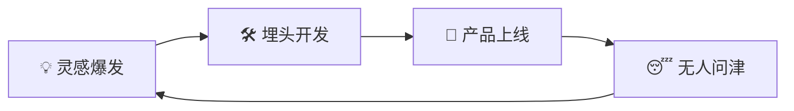

# 独立开发者产品定位与市场验证：从想法到 MVP 的系统方法

## 一、为什么需要验证？

### 1.1 独立开发者的致命陷阱



独立开发者最常见的时间浪费：

| 浪费方式 | 典型表现 | 后果 |
|----------|----------|------|
| **自嗨型** | 做自己觉得酷的产品 | 没有真实用户需求 |
| **完美主义型** | 等"所有功能"做完再发布 | 永远发布不了 |
| **假设驱动型** | 以为用户会为 X 付费 | 市场根本不买单 |
| **闭门造车型** | 不跟潜在用户交流 | 方向完全跑偏 |

**找 100 个人聊天比敲 1000 行代码更有价值。**

### 1.2 验证的核心原则

1. **先确认问题，再设计解决方案**
2. **先测试需求，再开始编码**
3. **先获取用户，再构建产品**
4. **先收钱，再花时间**

## 二、需求发现方法

### 2.1 问题清单

拿一张纸（或一个文档），回答以下问题：

```
我们正在解决什么问题？
谁会遇到这个问题？
他们现在是怎么解决的？
我们的方案好在哪里？
他们愿意为此付多少钱？
市场有多大？
```

**如果回答不了前三个，先不要编码。**

### 2.2 需求挖掘渠道

| 渠道 | 说明 | 适合领域 |
|------|------|----------|
| **技术社区** | Reddit、Hacker News、V2EX | 开发者工具 |
| **行业论坛** | 专业论坛、微信群、Discord | 垂直行业 |
| **竞品评论区** | Product Hunt、App Store 评论 | 消费类产品 |
| **客服数据** | 竞品的 FAQ、工单系统 | B2B 工具 |
| **个人痛点** | 自己工作中遇到的麻烦 | 开发者工具 |
| **咨询需求** | 别人经常问你什么问题 | 知识型产品 |

### 2.3 真实案例：如何找到需求

**案例：一个 SSO 登录工具**

有位独立开发者发现：每次做项目都要配置 OAuth、SAML，Google 一搜全是企业级方案（Auth0 起步 $200/月），小型团队和 Side Project 根本用不起。

- **问题**：小型项目需要简单的 SSO 集成方案
- **受众**：独立开发者、小型团队
- **现状方案**：自己写（耗时 2-3 天）或用昂贵的企业方案
- **机会**：提供一个 $19/月的轻量级 SSO 服务

## 三、竞品分析

### 3.1 竞争矩阵

```markdown
| 维度 | 竞品 A | 竞品 B | 竞品 C | 我们的产品 |
|------|--------|--------|--------|-----------|
| 价格 | $99/月 | $199/月 | 免费 | $19/月 |
| 集成难度 | 高 | 中 | 低 | 极低 |
| 功能数量 | 多 | 多 | 少 | 核心功能 |
| 中文支持 | ❌ | ❌ | ❌ | ✅ |
| 客户支持 | 工单 | 邮件 | 社区 | 微信直连 |
```

**关键不是做得更多，而是做得更「特定」**。

### 3.2 分析什么

1. **他们做得好的是什么** — 学习，不要重新发明
2. **他们做得不好的是什么** — 这就是你的机会
3. **他们忽略了什么** — 细分需求、小众市场
4. **用户抱怨什么** — 评论区、推特、Reddit 搜索

### 3.3 差异化策略

```
市场领导者  →  细分市场  →  超细分市场
  Shopify      独立站工具      程序员卖电子书
  Notion       个人知识库      AI 写作助手
  Stripe       开发者支付      中国开发者出海收款
```

## 四、用户访谈

### 4.1 找谁聊

| 用户类型 | 比例 | 目的 |
|----------|------|------|
| 目标用户 | 70% | 验证核心需求 |
| 边缘用户 | 20% | 发现意外场景 |
| 竞品用户 | 10% | 了解为什么选竞品 |

### 4.2 访谈技巧

**不要问：**
- ❌ "你会为这个产品付费吗？"（都会说会）
- ❌ "你觉得这个功能怎么样？"（引导性问题）
- ❌ "如果有 X 产品，你会用吗？"（假设性问题）

**要问：**
- ✅ "你现在怎么处理这个问题？"
- ✅ "你在这个流程中最头疼的是什么？"
- ✅ "你试过哪些工具解决这个问题？"
- ✅ "如果这个工具明天不能用了，你会怎么办？"

**🔑 关键：不要问"会不会买"，要问"过去怎么做的"。**

### 4.3 访谈后分析

```markdown
用户访谈记录表
──────────────────────────────────────────
用户：张工（Go 后端开发者）
痛点：每次写 API 文档都手动维护
当前方案：Swagger 注释，但经常忘记更新
花费时间：每周约 2 小时
付费意愿：团队会报销
关键洞察：需要自动化方案，而非更好的编辑器
──────────────────────────────────────────
```

## 五、MVP 设计

### 5.1 MVP 不是"功能残缺版"

好的 MVP 是：
- ✅ **核心价值完整**：解决一个核心问题
- ✅ **用户体验流畅**：虽然功能少，但体验好
- ✅ **能收费**：用户愿意为这个核心价值付费

坏的 MVP 是：
- ❌ Bug 太多
- ❌ 体验极差
- ❌ 核心功能用不了

### 5.2 功能优先级矩阵

```
                    高价值
                     │
         优先做       │       第二阶段
        （核心功能）   │      （差异化功能）
                     │
    ──────────────── ┼─────────────── 易实现 ←→ 难实现
                     │
         顺手做       │       慎重
        （基础功能）   │      （复杂需求）
                     │
                   低价值
```

### 5.3 无代码 MVP

在写第一行代码之前，可以先：

1. **落地页验证**：用 Carrd 或 Typedream 做一个产品页，看多少人点击"注册"
2. **人工服务**：手动帮用户做一遍流程，验证价值
3. **原型+演示**：Figma 原型 + 录屏，观察用户反应
4. **预售**：先收钱，再开发（最严格验证）

**案例**：一个自动化报表工具
- 先做手动版：每周用手工生成报表发给用户
- 确认用户愿意付费后
- 再自动化流程

## 六、预注册策略

### 6.1 先收集用户

在上线前就建立用户列表：

```python
# 示例：简单的预注册页面逻辑
pre_launch_data = {
    "unique_visitors": 1523,
    "signups": 342,          # 注册率 22.5%
    "twitter_followers": 89,
    "newsletter_subscribers": 156,
}
```

**指标参考**：
- 落地页转化率 > 15% → 需求较强
- 预注册后活跃互动 > 30% → 好信号
- 有人主动分享到社区 → 强烈信号

### 6.2 制造紧迫感

```markdown
📢 [产品名] 限量内测

首批仅开放 100 个名额
- 永久 7 折优惠
- 优先功能投票权
- 直接跟创始人沟通

已有 342 人排队
还剩 58 个名额
```

## 七、从验证到 MVP 的决策框架

### 7.1 验证评分卡

| 验证环节 | 通过标准 | 得分(1-5) |
|----------|----------|-----------|
| 问题真实存在 | 10+ 个用户确认此痛点 | □ |
| 用户愿意付费 | 5+ 人愿意预付费 | □ |
| 技术可行 | 现有技术能实现 | □ |
| 市场规模 | 至少 1000 潜在用户 | □ |
| 差异化 | 有明显竞争优势 | □ |

**总分 ≥ 20 → 可以开始开发**
**总分 15-19 → 需要更多验证**
**总分 < 15 → 换方向**

### 7.2 从想法到 MVP 的时间线

```
Week 1: 需求验证
  ├── 读 5 篇行业文章
  ├── 跟 10 个潜在用户聊天
  └── 做竞品分析

Week 2: 方案验证
  ├── 设计 MVP 功能清单
  ├── 做落地页 + 预注册
  └── 看转化率

Week 3-4: MVP 开发
  ├── 只做核心功能
  ├── 邀请种子用户
  └── 收集反馈

Week 5+: 迭代
  ├── 修复核心问题
  ├── 添加最需要的功能
  └── 准备公开发布
```

## 八、实用工具

| 阶段 | 工具 | 用途 |
|------|------|------|
| 需求发现 | Reddit、Hacker News、Product Hunt | 观察讨论热点 |
| 用户访谈 | Calendly、腾讯会议 | 预约和访谈 |
| 落地页 | Carrd、Typedream、VuePress | 快速建站 |
| 邮件列表 | Buttondown、Mailchimp | 预注册通知 |
| 原型设计 | Excalidraw、Figma | 低保真原型 |
| 分析 | Plausible、Umami | 落地页分析 |

## 九、总结

```
独立开发 = 90% 的发现 + 10% 的编码
           │               │
       找对问题          高效解决
       验证需求          快速迭代
       了解用户          构建价值
```

**行动清单（本周内完成）**：
1. [ ] 列出 3 个你遇到的实际问题
2. [ ] 找 5 个人聊聊这些问题
3. [ ] 写一页纸的解决方案描述
4. [ ] 做一个简单的落地页
5. [ ] 看有多少人愿意留邮箱

> **核心原则**：在构建产品之前先构建用户。1000 个等待你产品上线的人，比你想象中的"完美产品"更有价值。

---

*独立开发系列将持续更新，覆盖技术选型、增长策略、定价模型等话题。*
