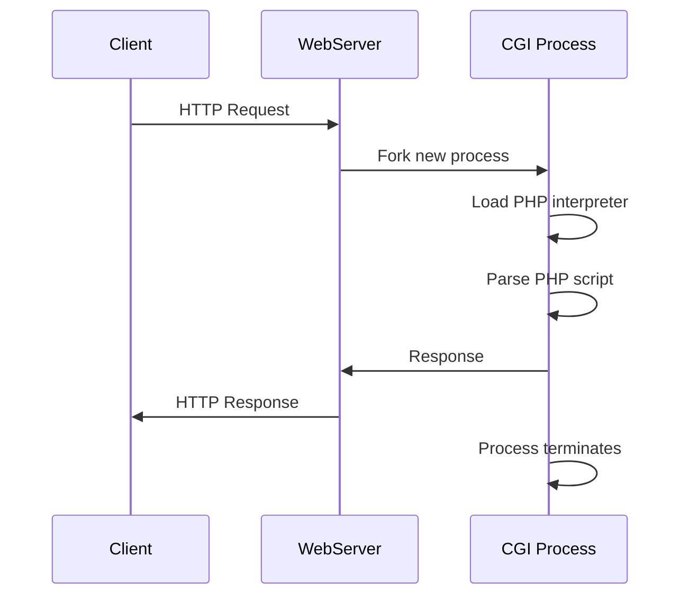

# PHP Process and Thread Analysis: Deep Dive into Concurrency Models

> **Series Navigation**: This article is part of the PHP Performance Optimization series
> - [Laravel Carbon Class Usage](/PHP/Laravel-Carbon-Class-Usage.html)
> - [Laravel Admin Special Routing Operations](/PHP/Laravel-admin-Special-Routing-Operations.html)
> - [Laravel Manual Build](/PHP/Laravel-Manual-Build.html)

## Table of Contents

[[toc]]

---

## 1. Introduction

PHP's process and thread model is fundamentally different from languages like [Golang](/golang/advanced-go-concurrency-patterns) or Node.js. Understanding these differences is crucial for building high-performance PHP applications in 2025.

**Why This Matters**:
- PHP-FPM powers millions of production websites
- Process management directly impacts application performance
- Thread safety affects extension choices and deployment strategies
- Concurrency patterns differ significantly from modern languages

**What You'll Learn**:
- ✅ PHP process architecture (CGI, FastCGI, PHP-FPM)
- ✅ Multi-process programming with pcntl extension
- ✅ Thread safety concepts (ZTS vs NTS)
- ✅ Production-grade PHP-FPM optimization
- ✅ Comparison with Go, Node.js, and Python concurrency models

---

## 2. PHP Process Model

### 2.1 Evolution: CGI → FastCGI → PHP-FPM

#### **Traditional CGI (Common Gateway Interface)**



**Problems with CGI**:
- ❌ **High overhead**: New process for every request
- ❌ **Slow startup**: PHP interpreter reload each time
- ❌ **Resource waste**: Process creation/destruction cost
- ❌ **No connection pooling**: Database connections can't be reused

#### **FastCGI Improvements**

```php
// FastCGI keeps processes alive
while (FCGI_Accept() >= 0) {
    // Persistent process handles multiple requests
    $request = parse_request();
    $response = handle_request($request);
    send_response($response);
    // Process continues running
}
```

**FastCGI Benefits**:
- ✅ **Process reuse**: Eliminate startup overhead
- ✅ **Persistent connections**: Database connection pooling
- ✅ **Better performance**: 10-100x faster than CGI
- ✅ **Separation of concerns**: Web server and PHP runtime decoupled

---

### 2.2 PHP-FPM (FastCGI Process Manager)

PHP-FPM is the de facto standard for running PHP in production. It provides advanced process management features.

#### **Architecture Overview**

```
┌─────────────────────────────────────────────────┐
│              Nginx/Apache                       │
│  (Reverse Proxy + Static File Server)          │
└────────────────┬────────────────────────────────┘
                 │ Unix Socket / TCP:9000
                 ↓
┌─────────────────────────────────────────────────┐
│         PHP-FPM Master Process                  │
│  • Process Pool Management                      │
│  • Signal Handling (SIGINT, SIGTERM, SIGUSR1)  │
│  • Configuration Reload                         │
│  • Worker Process Monitoring                    │
└────────────────┬────────────────────────────────┘
                 │
        ┌────────┴────────┬────────┬────────┐
        ↓                 ↓        ↓        ↓
    Worker 1          Worker 2  Worker 3  Worker N
    (Idle)            (Busy)    (Busy)    (Idle)
    │                   │         │         │
    └───────────────────┴─────────┴─────────┘
            Handle PHP Requests
```

#### **Master-Worker Pattern**

```php
// Simplified PHP-FPM Master Process Logic (Conceptual)
class PHPFPMMaster {
    private array $workers = [];
    private array $config;
    
    public function start(): void {
        // 1. Load configuration
        $this->loadConfig();
        
        // 2. Daemonize process
        $this->daemonize();
        
        // 3. Create initial worker pool
        $this->spawnWorkers($this->config['start_servers']);
        
        // 4. Signal handling
        pcntl_signal(SIGINT, [$this, 'handleShutdown']);
        pcntl_signal(SIGUSR1, [$this, 'reloadConfig']);
        
        // 5. Monitor loop
        while (true) {
            $this->checkWorkerHealth();
            $this->adjustWorkerPool();
            pcntl_signal_dispatch();
            sleep(1);
        }
    }
    
    private function spawnWorkers(int $count): void {
        for ($i = 0; $i < $count; $i++) {
            $pid = pcntl_fork();
            
            if ($pid === 0) {
                // Child process - become worker
                $this->becomeWorker();
                exit;
            } else {
                // Master process - track worker
                $this->workers[$pid] = [
                    'status' => 'idle',
                    'requests' => 0,
                    'start_time' => time()
                ];
            }
        }
    }
    
    private function adjustWorkerPool(): void {
        $idleWorkers = $this->countIdleWorkers();
        $busyWorkers = count($this->workers) - $idleWorkers;
        
        // Dynamic scaling based on load
        if ($idleWorkers < $this->config['min_spare_servers']) {
            $this->spawnWorkers(1);
        } elseif ($idleWorkers > $this->config['max_spare_servers']) {
            $this->terminateIdleWorker();
        }
    }
}
```

---

### 2.3 PHP-FPM Configuration Deep Dive

#### **Essential Configuration Options**

```ini
; /etc/php/8.3/fpm/pool.d/www.conf

[www]
; User/Group
user = www-data
group = www-data

; Listen Configuration
; Option 1: Unix Socket (Faster, local only)
listen = /run/php/php8.3-fpm.sock
; Option 2: TCP Socket (Network accessible)
; listen = 127.0.0.1:9000

; Process Management Strategy
pm = dynamic                    ; dynamic | static | ondemand

; Static Mode: Fixed number of workers
; pm = static
; pm.max_children = 50

; Dynamic Mode: Auto-scaling workers
pm.max_children = 50            ; Maximum worker processes
pm.start_servers = 10           ; Initial workers on startup
pm.min_spare_servers = 5        ; Minimum idle workers
pm.max_spare_servers = 15       ; Maximum idle workers
pm.max_requests = 1000          ; Recycle worker after N requests (prevents memory leaks)

; OnDemand Mode: Spawn workers only when needed
; pm = ondemand
; pm.max_children = 50
; pm.process_idle_timeout = 10s

; Slow Request Logging
request_slowlog_timeout = 5s
slowlog = /var/log/php-fpm/slow.log

; Resource Limits
rlimit_files = 1024             ; Max open file descriptors per worker
rlimit_core = 0                 ; Core dump size limit

; Security
chroot = /var/www               ; Chroot jail (optional)
chdir = /                       ; Change directory after chroot

; Status Page (for monitoring)
pm.status_path = /status
ping.path = /ping
ping.response = pong
```

#### **How to Calculate Optimal Worker Count**

```bash
# Formula: max_children = (Total RAM - OS RAM - Other Services) / PHP Process Memory

# 1. Check available RAM
free -m
# Example: 8GB server, 2GB for OS/other services = 6GB available

# 2. Measure average PHP worker memory
ps aux | grep php-fpm | awk '{sum+=$6} END {print sum/NR/1024 "MB"}'
# Example output: 50MB per worker

# 3. Calculate max_children
# 6GB (6144MB) / 50MB = 122 workers (theoretical max)
# Use 70-80% of theoretical max for safety
# Optimal: 122 * 0.75 = 91 workers

# 4. Set configuration
pm.max_children = 90
pm.start_servers = 20
pm.min_spare_servers = 10
pm.max_spare_servers = 30
```

**Performance Tuning Tips**:
1. **Unix Socket vs TCP**: Unix socket is 10-15% faster for local connections
2. **Process Recycling**: `pm.max_requests` prevents memory leaks
3. **Slow Log**: Identify bottleneck requests
4. **Status Monitoring**: Use `/status` endpoint with tools like Prometheus

---

## 3. Multi-Process Programming with pcntl

### 3.1 The pcntl Extension

The `pcntl` (Process Control) extension allows PHP to create and manage child processes.

**Installation**:
```bash
# pcntl is usually compiled by default
php -m | grep pcntl

# If missing, recompile PHP with --enable-pcntl
./configure --enable-pcntl
make && make install
```

#### **Basic Process Forking**

```php
<?php

/**
 * Basic Fork Example
 */
$pid = pcntl_fork();

if ($pid === -1) {
    // Fork failed
    die('Could not fork process');
    
} elseif ($pid === 0) {
    // Child process
    echo "[Child] My PID: " . getmypid() . "\n";
    echo "[Child] Parent PID: " . posix_getppid() . "\n";
    sleep(2);
    echo "[Child] Finished work\n";
    exit(0);
    
} else {
    // Parent process
    echo "[Parent] My PID: " . getmypid() . "\n";
    echo "[Parent] Child PID: $pid\n";
    
    // Wait for child to finish (important!)
    pcntl_wait($status);
    echo "[Parent] Child exited with status: $status\n";
}
```

**Output**:
```
[Parent] My PID: 12345
[Parent] Child PID: 12346
[Child] My PID: 12346
[Child] Parent PID: 12345
[Child] Finished work
[Parent] Child exited with status: 0
```

---

### 3.2 Practical Example: Parallel Task Processing

```php
<?php

/**
 * Process Pool for Parallel Task Execution
 */
class ProcessPool {
    private int $maxWorkers;
    private array $workers = [];
    private array $tasks;
    
    public function __construct(int $maxWorkers = 4) {
        $this->maxWorkers = $maxWorkers;
    }
    
    public function addTask(callable $task): void {
        $this->tasks[] = $task;
    }
    
    public function run(): void {
        foreach ($this->tasks as $index => $task) {
            // Wait if we've reached max workers
            while (count($this->workers) >= $this->maxWorkers) {
                $this->reapChild();
            }
            
            $pid = pcntl_fork();
            
            if ($pid === -1) {
                throw new RuntimeException("Failed to fork process");
            } elseif ($pid === 0) {
                // Child process - execute task
                try {
                    $task($index);
                    exit(0);
                } catch (Exception $e) {
                    error_log("Task $index failed: " . $e->getMessage());
                    exit(1);
                }
            } else {
                // Parent process - track worker
                $this->workers[$pid] = $index;
            }
        }
        
        // Wait for all remaining workers
        while (count($this->workers) > 0) {
            $this->reapChild();
        }
    }
    
    private function reapChild(): void {
        $pid = pcntl_wait($status, WUNTRACED);
        
        if ($pid > 0) {
            $taskIndex = $this->workers[$pid];
            unset($this->workers[$pid]);
            
            $exitCode = pcntl_wexitstatus($status);
            echo "[ProcessPool] Task $taskIndex completed by PID $pid (exit: $exitCode)\n";
        }
    }
}

// Usage Example
$pool = new ProcessPool(maxWorkers: 4);

// Add CPU-intensive tasks
for ($i = 1; $i <= 10; $i++) {
    $pool->addTask(function($index) {
        echo "[Worker " . getmypid() . "] Processing task $index\n";
        
        // Simulate heavy computation
        $result = 0;
        for ($j = 0; $j < 1000000; $j++) {
            $result += sqrt($j);
        }
        
        sleep(rand(1, 3));
        echo "[Worker " . getmypid() . "] Task $index completed\n";
    });
}

$startTime = microtime(true);
$pool->run();
$endTime = microtime(true);

printf("Total execution time: %.2f seconds\n", $endTime - $startTime);
```

**Performance Comparison**:
- **Sequential execution** (10 tasks): ~20 seconds
- **Parallel execution** (4 workers): ~6 seconds
- **Speedup**: 3.3x faster

---

### 3.3 Inter-Process Communication (IPC)

#### **Method 1: Shared Memory**

```php
<?php

/**
 * Shared Memory for IPC
 */
function useSharedMemory(): void {
    $shmKey = ftok(__FILE__, 't');
    $shmId = shmop_open($shmKey, "c", 0644, 1024);
    
    $pid = pcntl_fork();
    
    if ($pid === 0) {
        // Child process - write to shared memory
        sleep(1);
        $data = "Hello from child!";
        shmop_write($shmId, $data, 0);
        exit;
    } else {
        // Parent process - read from shared memory
        pcntl_wait($status);
        $data = shmop_read($shmId, 0, 1024);
        echo "Parent received: " . trim($data) . "\n";
        shmop_delete($shmId);
    }
}
```

#### **Method 2: Message Queues**

```php
<?php

/**
 * System V Message Queues
 */
class MessageQueue {
    private $queue;
    private int $key;
    
    public function __construct() {
        $this->key = ftok(__FILE__, 'm');
        $this->queue = msg_get_queue($this->key);
    }
    
    public function send(string $message, int $type = 1): bool {
        return msg_send($this->queue, $type, $message, false, false);
    }
    
    public function receive(int $type = 1): ?string {
        $msgType = null;
        $message = null;
        
        if (msg_receive($this->queue, $type, $msgType, 1024, $message, false, MSG_IPC_NOWAIT)) {
            return $message;
        }
        
        return null;
    }
    
    public function __destruct() {
        msg_remove_queue($this->queue);
    }
}

// Usage
$mq = new MessageQueue();

$pid = pcntl_fork();

if ($pid === 0) {
    // Child - producer
    for ($i = 1; $i <= 5; $i++) {
        $mq->send("Message $i from child");
        sleep(1);
    }
    exit;
} else {
    // Parent - consumer
    while (true) {
        $message = $mq->receive();
        if ($message !== null) {
            echo "Received: $message\n";
        } else {
            usleep(100000); // 100ms
        }
        
        // Check if child finished
        $res = pcntl_waitpid($pid, $status, WNOHANG);
        if ($res == $pid) {
            break;
        }
    }
}
```

#### **Method 3: Unix Pipes**

```php
<?php

/**
 * Pipe Communication
 */
function usePipes(): void {
    $descriptors = [
        0 => ["pipe", "r"],  // stdin
        1 => ["pipe", "w"],  // stdout
        2 => ["pipe", "w"]   // stderr
    ];
    
    $process = proc_open("cat", $descriptors, $pipes);
    
    if (is_resource($process)) {
        // Write to process stdin
        fwrite($pipes[0], "Hello from PHP!\n");
        fclose($pipes[0]);
        
        // Read from process stdout
        echo "Process output: " . stream_get_contents($pipes[1]);
        fclose($pipes[1]);
        
        // Clean up
        proc_close($process);
    }
}
```

---

## 4. PHP Thread Safety

### 4.1 ZTS (Zend Thread Safety)

PHP comes in two flavors:
- **NTS (Non-Thread-Safe)**: For single-threaded environments (PHP-FPM, CLI)
- **ZTS (Zend Thread-Safe)**: For multi-threaded environments (Apache with mod_php)

```bash
# Check your PHP build
php -v
# Output example:
# PHP 8.3.0 (cli) (built: Nov  1 2024 10:15:23) (NTS)
#                                                   ^^^
#                                            NTS = Non-Thread-Safe

# Or use php -i
php -i | grep "Thread Safety"
# Thread Safety => disabled  (NTS)
# Thread Safety => enabled   (ZTS)
```

#### **Why Thread Safety Matters**

```php
// This is why NTS exists - global state in PHP
$globalVar = "shared data";

function unsafeFunction() {
    global $globalVar;
    $globalVar .= " modified";
    // In multi-threaded environment, this causes race conditions!
}
```

**ZTS Protection Mechanism** (Simplified):
```c
// TSRM (Thread Safe Resource Manager)
// Each thread gets its own copy of global variables

#ifdef ZTS
# define TSRMLS_D    void ***tsrm_ls
# define TSRMLS_C    tsrm_ls
# define GLOBAL(v)   (*((v##_type *) (*((void ***) tsrm_ls))[v##_id]))
#else
# define TSRMLS_D
# define TSRMLS_C
# define GLOBAL(v)   v
#endif
```

---

### 4.2 pthreads Extension

**⚠️ Warning**: pthreads is only available for PHP 7.2 and requires ZTS build. For modern PHP (8.x), use [parallel extension](https://www.php.net/manual/en/book.parallel.php) or multi-process approaches.

```php
<?php

/**
 * pthreads Example (PHP 7.2 with ZTS)
 */
class WorkerThread extends Thread {
    private string $data;
    
    public function __construct(string $data) {
        $this->data = $data;
    }
    
    public function run(): void {
        echo "[Thread " . $this->getThreadId() . "] Processing: {$this->data}\n";
        sleep(2);
        echo "[Thread " . $this->getThreadId() . "] Completed\n";
    }
}

// Create threads
$threads = [];
for ($i = 0; $i < 4; $i++) {
    $thread = new WorkerThread("Task $i");
    $thread->start();
    $threads[] = $thread;
}

// Wait for all threads
foreach ($threads as $thread) {
    $thread->join();
}

echo "All threads completed!\n";
```

---

### 4.3 Modern Alternative: parallel Extension

For PHP 8.x, use the [parallel extension](https://github.com/krakjoe/parallel) (requires ZTS):

```php
<?php

use parallel\Runtime;
use parallel\Channel;

/**
 * Modern parallel execution with PHP 8
 */
$runtime = new Runtime();
$channel = new Channel();

// Submit task
$future = $runtime->run(function() use ($channel) {
    $result = expensive_calculation();
    $channel->send($result);
});

// Do other work while task runs
perform_other_tasks();

// Get result
$result = $channel->recv();
```

---

## 5. Concurrency Optimization Strategies

### 5.1 Process Pool Management

```php
<?php

/**
 * Production-Grade Process Pool
 */
class ProductionProcessPool {
    private int $minWorkers;
    private int $maxWorkers;
    private int $maxIdleTime = 300; // 5 minutes
    private array $workers = [];
    private array $queue = [];
    
    public function __construct(int $minWorkers = 5, int $maxWorkers = 20) {
        $this->minWorkers = $minWorkers;
        $this->maxWorkers = $maxWorkers;
        
        // Initialize minimum workers
        for ($i = 0; $i < $minWorkers; $i++) {
            $this->spawnWorker();
        }
    }
    
    private function spawnWorker(): void {
        $pid = pcntl_fork();
        
        if ($pid === 0) {
            // Child process
            $this->workerLoop();
            exit(0);
        } else {
            $this->workers[$pid] = [
                'spawned' => time(),
                'last_active' => time(),
                'tasks_completed' => 0
            ];
        }
    }
    
    private function workerLoop(): void {
        while (true) {
            // Check for tasks in shared memory/queue
            $task = $this->fetchTask();
            
            if ($task !== null) {
                $this->executeTask($task);
            } else {
                // Idle - check if should terminate
                if ($this->shouldTerminate()) {
                    break;
                }
                usleep(100000); // 100ms
            }
        }
    }
    
    private function shouldTerminate(): bool {
        // Only terminate if:
        // 1. We have more than minimum workers
        // 2. Worker has been idle for too long
        return count($this->workers) > $this->minWorkers
            && (time() - $this->lastActive) > $this->maxIdleTime;
    }
    
    public function submitTask(callable $task): void {
        // Add to queue
        $this->queue[] = $task;
        
        // Scale up if needed
        if ($this->shouldScaleUp()) {
            $this->spawnWorker();
        }
    }
    
    private function shouldScaleUp(): bool {
        $queueSize = count($this->queue);
        $workerCount = count($this->workers);
        
        return $queueSize > $workerCount 
            && $workerCount < $this->maxWorkers;
    }
}
```

---

### 5.2 Resource Isolation

```php
<?php

/**
 * Prevent resource leaks between requests
 */
class ResourceManager {
    private array $connections = [];
    
    public function getConnection(string $dsn): PDO {
        $key = md5($dsn);
        
        if (!isset($this->connections[$key])) {
            $this->connections[$key] = new PDO($dsn);
        }
        
        return $this->connections[$key];
    }
    
    public function cleanup(): void {
        foreach ($this->connections as $conn) {
            $conn = null; // Close connection
        }
        $this->connections = [];
        
        // Force garbage collection
        gc_collect_cycles();
    }
}

// In PHP-FPM, cleanup after each request
register_shutdown_function(function() {
    global $resourceManager;
    $resourceManager->cleanup();
});
```

---

### 5.3 Performance Tuning Best Practices

#### **1. OPcache Configuration**

```ini
; /etc/php/8.3/cli/conf.d/10-opcache.ini

[opcache]
opcache.enable=1
opcache.enable_cli=1              ; Enable for CLI scripts too
opcache.memory_consumption=256    ; 256MB OPcache memory
opcache.interned_strings_buffer=16 ; String interning
opcache.max_accelerated_files=10000
opcache.revalidate_freq=2         ; Check file changes every 2 seconds (production: 60)
opcache.fast_shutdown=1
opcache.validate_timestamps=1     ; Production: 0 (disable for performance)
```

#### **2. Preloading (PHP 7.4+)**

```php
// /path/to/preload.php

<?php

/**
 * Preload frequently used classes into memory
 */
opcache_compile_file(__DIR__ . '/vendor/autoload.php');
opcache_compile_file(__DIR__ . '/app/Models/User.php');
opcache_compile_file(__DIR__ . '/app/Controllers/HomeController.php');
// ... more files
```

```ini
; php.ini
opcache.preload=/path/to/preload.php
opcache.preload_user=www-data
```

**Performance Gain**: 10-30% faster request handling

#### **3. JIT (Just-In-Time Compilation) - PHP 8+**

```ini
; php.ini

opcache.enable=1
opcache.jit_buffer_size=100M
opcache.jit=tracing               ; or "function" for function-level JIT

; JIT optimization levels:
; 0    = Disabled
; 1205 = tracing + profile-guided optimization (recommended)
; 1255 = maximum optimization
```

**JIT Performance**:
- **CPU-bound tasks**: 2-3x faster
- **I/O-bound tasks** (typical web apps): 5-15% improvement
- **Best for**: Mathematical computations, image processing, encoding

---

## 6. Production Best Practices

### 6.1 Monitoring PHP-FPM

#### **Status Endpoint Configuration**

```ini
; /etc/php/8.3/fpm/pool.d/www.conf

pm.status_path = /php-fpm-status
ping.path = /ping
ping.response = pong
```

#### **Nginx Configuration**

```nginx
server {
    listen 80;
    server_name example.com;
    
    # PHP-FPM Status (restrict to localhost)
    location /php-fpm-status {
        access_log off;
        allow 127.0.0.1;
        deny all;
        fastcgi_pass unix:/run/php/php8.3-fpm.sock;
        fastcgi_param SCRIPT_FILENAME $document_root$fastcgi_script_name;
        include fastcgi_params;
    }
    
    # Ping endpoint
    location /ping {
        access_log off;
        allow 127.0.0.1;
        deny all;
        fastcgi_pass unix:/run/php/php8.3-fpm.sock;
        fastcgi_param SCRIPT_FILENAME $document_root$fastcgi_script_name;
        include fastcgi_params;
    }
}
```

#### **Monitor with curl**

```bash
# Full status
curl http://localhost/php-fpm-status?full

# Output:
# pool:                 www
# process manager:      dynamic
# start time:           12/Nov/2025:10:00:00 +0000
# start since:          3600
# accepted conn:        1250
# listen queue:         0
# max listen queue:     1
# listen queue len:     128
# idle processes:       8
# active processes:     2
# total processes:      10
# max active processes: 5
# max children reached: 0
# slow requests:        3

# JSON output
curl http://localhost/php-fpm-status?json
```

#### **Prometheus Exporter**

```php
<?php
/**
 * php-fpm-exporter.php
 * Export PHP-FPM metrics to Prometheus
 */

$status = file_get_contents('http://localhost/php-fpm-status?json');
$data = json_decode($status, true);

echo "# HELP phpfpm_accepted_conn Total accepted connections\n";
echo "# TYPE phpfpm_accepted_conn counter\n";
echo "phpfpm_accepted_conn " . $data['accepted conn'] . "\n";

echo "# HELP phpfpm_active_processes Current active processes\n";
echo "# TYPE phpfpm_active_processes gauge\n";
echo "phpfpm_active_processes " . $data['active processes'] . "\n";

echo "# HELP phpfpm_idle_processes Current idle processes\n";
echo "# TYPE phpfpm_idle_processes gauge\n";
echo "phpfpm_idle_processes " . $data['idle processes'] . "\n";

echo "# HELP phpfpm_slow_requests Total slow requests\n";
echo "# TYPE phpfpm_slow_requests counter\n";
echo "phpfpm_slow_requests " . $data['slow requests'] . "\n";
```

---

### 6.2 Common Pitfalls and Solutions

#### **Problem 1: Memory Leaks**

```php
<?php

// ❌ BAD: Circular references cause memory leaks
class Parent {
    public $child;
}

class Child {
    public $parent;
}

$parent = new Parent();
$child = new Child();
$parent->child = $child;
$child->parent = $parent;
// Memory won't be freed even after $parent and $child go out of scope

// ✅ GOOD: Break circular references
class Parent {
    public $child;
    
    public function __destruct() {
        $this->child = null; // Break reference
    }
}
```

**Solution**: Use `pm.max_requests` to recycle workers:
```ini
pm.max_requests = 1000  ; Restart worker after 1000 requests
```

#### **Problem 2: Process Pool Exhaustion**

```bash
# Symptoms
tail -f /var/log/php-fpm/error.log
# [pool www] server reached max_children setting (50), consider raising it
```

**Solution**:
```ini
# Calculate optimal value
# max_children = (RAM - OS) / avg_process_memory

pm.max_children = 100
pm.start_servers = 25
pm.min_spare_servers = 10
pm.max_spare_servers = 35
```

#### **Problem 3: Slow Requests**

```bash
# Enable slow log
tail -f /var/log/php-fpm/slow.log
```

**Solution**: Analyze slow queries and optimize
```php
// Use profiling
xdebug_start_trace();
slow_function();
xdebug_stop_trace();

// Or use APM tools like New Relic, Datadog
```

---

## 7. Comparison with Other Languages

### 7.1 PHP vs Golang

| Feature | PHP | Golang |
|---------|-----|--------|
| **Concurrency Model** | Multi-process (PHP-FPM) | Goroutines (lightweight threads) |
| **Memory per Worker** | 50-100MB | 2-5KB per goroutine |
| **Context Switching** | Heavy (OS-level) | Light (user-space) |
| **Shared Memory** | Complex (SHM, message queues) | Built-in channels |
| **Performance** | Good (with OPcache/JIT) | Excellent (native compilation) |
| **Use Case** | Web applications | Microservices, concurrent tasks |

**Golang Goroutine Example** (for comparison):
```go
// Golang: 10,000 concurrent tasks trivially
for i := 0; i < 10000; i++ {
    go func(id int) {
        processTask(id)
    }(i)
}
```

**PHP Equivalent** (limited by process count):
```php
// PHP: Limited to ~100-200 concurrent processes
$pool = new ProcessPool(maxWorkers: 100);
for ($i = 0; $i < 10000; $i++) {
    $pool->addTask(fn() => processTask($i));
}
```

**See also**: [Advanced Go Concurrency Patterns](/golang/advanced-go-concurrency-patterns)

---

### 7.2 PHP vs Node.js

| Feature | PHP | Node.js |
|---------|-----|---------|
| **Concurrency Model** | Multi-process | Event loop + libuv |
| **Memory Usage** | Higher (50-100MB/worker) | Lower (10-20MB) |
| **CPU-bound Tasks** | Better (separate processes) | Blocks event loop |
| **I/O-bound Tasks** | Similar performance | Excellent (async I/O) |
| **Shared State** | None (process isolation) | Global (careful with race conditions) |
| **Learning Curve** | Easy (synchronous) | Moderate (async/await, promises) |

**Node.js Event Loop** (for comparison):
```javascript
// Node.js: Non-blocking I/O
const fs = require('fs').promises;

async function readFiles() {
    const files = await Promise.all([
        fs.readFile('file1.txt'),
        fs.readFile('file2.txt'),
        fs.readFile('file3.txt')
    ]);
    // All files read concurrently
}
```

**PHP Equivalent**:
```php
// PHP: Multi-process for concurrency
$pool = new ProcessPool(3);
$pool->addTask(fn() => file_get_contents('file1.txt'));
$pool->addTask(fn() => file_get_contents('file2.txt'));
$pool->addTask(fn() => file_get_contents('file3.txt'));
$pool->run();
```

---

### 7.3 PHP vs Python

| Feature | PHP | Python |
|---------|-----|--------|
| **Concurrency Model** | Multi-process (PHP-FPM) | Multi-process/thread (GIL limitation) |
| **True Parallelism** | Yes (separate processes) | No (GIL prevents true multithreading) |
| **Process Overhead** | Similar | Similar |
| **Async Support** | Limited (ReactPHP, Swoole) | Excellent (asyncio) |
| **Use Case** | Web applications | Data science, scripting, web |

**Python GIL Issue**:
```python
# Python: GIL prevents true parallelism in threads
import threading

def cpu_task():
    sum(range(10000000))

# These threads run sequentially due to GIL
threads = [threading.Thread(target=cpu_task) for _ in range(4)]
for t in threads:
    t.start()
```

**PHP Advantage**: No GIL, true parallelism with processes.

---

## 8. Advanced: Async PHP with Swoole

For high-concurrency scenarios, consider [Swoole](https://www.swoole.co.uk/) extension:

```php
<?php

use Swoole\HTTP\Server;
use Swoole\HTTP\Request;
use Swoole\HTTP\Response;

/**
 * Swoole: Async/coroutine support for PHP
 */
$server = new Server("0.0.0.0", 9501);

$server->set([
    'worker_num' => 4,      // Worker processes
    'max_request' => 10000,
    'enable_coroutine' => true,
]);

$server->on('request', function (Request $request, Response $response) {
    // Coroutine: non-blocking concurrent requests
    go(function () use ($response) {
        $client = new Swoole\Coroutine\Http\Client('api.example.com', 443, true);
        $client->get('/data');
        $result = $client->body;
        
        $response->end($result);
    });
});

$server->start();
```

**Swoole Performance**:
- **10,000+ concurrent connections** on single server
- **100,000+ QPS** (Queries Per Second)
- **Native coroutine** support (like Go goroutines)

---

## 9. Conclusion

### Key Takeaways

1. **PHP-FPM is production-ready**: Properly configured, it handles millions of requests efficiently
2. **Process vs Thread**: PHP's multi-process model provides excellent isolation but higher memory usage
3. **pcntl for CLI**: Use multi-process for CPU-intensive batch jobs
4. **Monitoring is crucial**: Use status endpoints, slow logs, and APM tools
5. **Modern PHP is fast**: OPcache, JIT, and preloading significantly boost performance

### When to Use What

| Scenario | Solution |
|----------|----------|
| **Web applications** | PHP-FPM + Nginx/Apache |
| **CLI batch processing** | pcntl multi-process |
| **High-concurrency API** | Swoole/RoadRunner |
| **CPU-bound tasks** | Separate processes or [switch to Go](/golang/advanced-go-concurrency-patterns) |
| **I/O-bound tasks** | Async PHP (Swoole) or Node.js |

### Related Articles

- [Go Concurrency Patterns](/golang/advanced-go-concurrency-patterns) - Compare with modern concurrency
- [Laravel Carbon Class Usage](/PHP/Laravel-Carbon-Class-Usage.html) - Laravel framework essentials
- [Laravel Manual Build](/PHP/Laravel-Manual-Build.html) - Framework deployment guide

---

## 10. References

- [PHP-FPM Official Documentation](https://www.php.net/manual/en/install.fpm.php)
- [pcntl Extension Reference](https://www.php.net/manual/en/book.pcntl.php)
- [Swoole Documentation](https://www.swoole.co.uk/)
- [PHP 8 Performance Benchmarks](https://kinsta.com/blog/php-8-performance/)
- [Zend Thread Safety](https://www.phpinternalsbook.com/php7/extensions_design/thread_safety.html)

---

**Last Updated**: November 12, 2025  
**Author**: PFinal南丞  
**License**: CC BY-SA 4.0

<!-- 
BlogPosting Schema.org structured data:
- Article: PHP Process and Thread Analysis
- Published: 2025-11-12
- Keywords: PHP Process, PHP-FPM, Thread-Safe, Performance
-->

<style>
/* Custom styling for code blocks */
div[class*="language-"] {
  border-radius: 8px;
  margin: 1.5rem 0;
}

/* Mermaid diagram styling */
.mermaid {
  text-align: center;
  margin: 2rem 0;
}

/* Table styling */
table {
  border-collapse: collapse;
  width: 100%;
  margin: 1.5rem 0;
}

table th {
  background-color: var(--vp-c-bg-soft);
  font-weight: 600;
}

table td, table th {
  padding: 12px;
  border: 1px solid var(--vp-c-divider);
}
</style>

