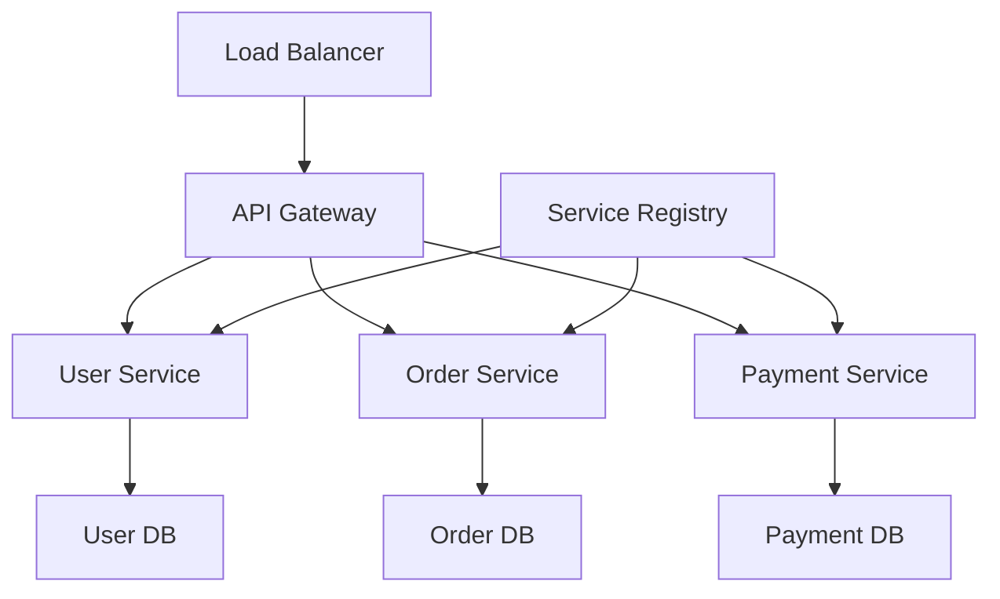
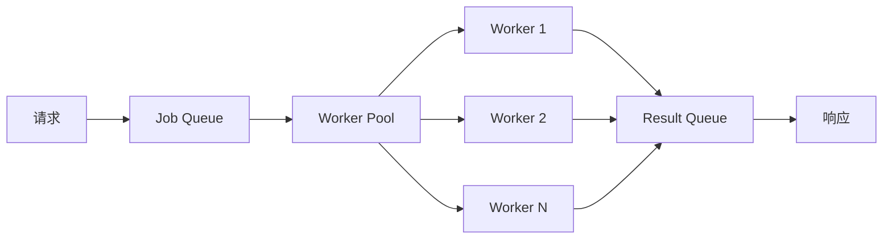

<div align="center">

# 🚀 高质量 Golang 后端的现代软件工程原则

> 💡 **核心观点**：在当今快速发展的技术世界中，构建一个高质量的后端系统不仅仅是写代码那么简单。它需要我们在架构设计、代码质量、性能优化、团队协作等多个维度上都有深入的思考和实践。而 Golang，作为一门简洁、高效的系统级编程语言，为我们提供了一个绝佳的平台来实现这些目标。

*—— 让我们一起探索 Golang 后端的现代软件工程之道*

</div>

---

## 📋 目录导航

<div align="center">

| 章节 | 内容概览 |
|------|----------|
| 🚀 [引言](#引言为什么选择-golang-构建现代后端) | Golang 核心优势与选择理由 |
| 🏗️ [架构设计](#架构设计原则构建可扩展的系统) | 微服务架构与 DDD 实践 |
| 📝 [代码质量](#代码质量与可维护性) | 代码组织与测试驱动开发 |
| ⚡ [性能优化](#性能优化与可扩展性) | 并发处理与缓存策略 |
| 📊 [监控观测](#监控与可观测性) | 指标收集与链路追踪 |
| 🔒 [安全实践](#安全性与最佳实践) | 认证授权与数据保护 |
| 🐳 [部署运维](#部署与运维) | 容器化与配置管理 |
| 👥 [团队协作](#团队协作与代码规范) | 代码规范与 Git 工作流 |
| 🔬 [深入技术](#深入技术细节) | 高级主题与技术细节 |
| 🎯 [总结展望](#总结与未来展望) | 核心原则与未来趋势 |

</div>

---

## 🚀 引言：为什么选择 Golang 构建现代后端？

在开始我们的技术之旅之前，让我们先思考一个问题：

<div align="center">

**🤔 在众多编程语言中，为什么 Golang 特别适合构建现代后端系统？**

</div>

### ✨ Golang 的核心优势

<div align="center">

| 🎯 优势 | 📝 描述 | 💎 实际价值 |
|---------|---------|-------------|
| **🔧 简洁性** | Golang 的设计哲学是"简单就是美"。语法简洁明了，没有复杂的继承层次，没有模板元编程 | 代码更容易理解和维护，降低学习成本 |
| **⚡ 并发性** | Goroutine 和 Channel 的组合为并发编程提供了优雅的解决方案 | 在处理高并发场景时显得尤为重要 |
| **🚀 性能** | 编译型特性确保了接近 C 语言的执行效率，同时垃圾回收机制减轻了内存管理的负担 | 提供高性能的同时保持开发效率 |
| **🌐 生态系统** | 丰富的标准库和第三方包为各种应用场景提供了强大的支持 | 快速构建功能完整的应用 |

</div>

---

## 🏗️ 架构设计原则：构建可扩展的系统

<div align="center">

**🎯 目标**：构建一个可扩展、可维护、高性能的微服务架构

</div>

### 1️⃣ 微服务架构的实践

在现代后端开发中，微服务架构已经成为主流。让我们看看如何在 Golang 中实现一个优雅的微服务架构。

<div align="center">



*微服务架构示意图*

</div>

#### 🔧 服务注册与发现

<div align="center">

**🎯 核心功能**：自动服务发现、健康检查、负载均衡

</div>

```go
// 服务注册与发现核心组件
type ServiceRegistry struct {
    services map[string]*ServiceInfo
    mu       sync.RWMutex
    // 健康检查
    healthChecker *HealthChecker
    // 负载均衡
    loadBalancer *LoadBalancer
}

type ServiceInfo struct {
    Name        string
    Version     string
    Endpoint    string
    Health      HealthStatus
    Load        float64
    Metadata    map[string]string
    LastSeen    time.Time
}

// 服务发现实现
func (sr *ServiceRegistry) Discover(serviceName string) ([]*ServiceInfo, error) {
    sr.mu.RLock()
    defer sr.mu.RUnlock()
    
    var services []*ServiceInfo
    for _, service := range sr.services {
        if service.Name == serviceName && service.Health == Healthy {
            services = append(services, service)
        }
    }
    
    if len(services) == 0 {
        return nil, fmt.Errorf("no healthy service found for %s", serviceName)
    }
    
    return services, nil
}
```

#### ⚖️ 负载均衡策略

<div align="center">

**🎯 支持多种负载均衡算法**：轮询、权重、最少连接数

</div>

```go
// 负载均衡策略接口
type LoadBalancingStrategy interface {
    Select(services []*ServiceInfo) *ServiceInfo
}

// 轮询策略实现
type RoundRobinStrategy struct {
    current int
    mu      sync.Mutex
}

func (rr *RoundRobinStrategy) Select(services []*ServiceInfo) *ServiceInfo {
    rr.mu.Lock()
    defer rr.mu.Unlock()
    
    if len(services) == 0 {
        return nil
    }
    
    service := services[rr.current]
    rr.current = (rr.current + 1) % len(services)
    return service
}
```

### 2️⃣ 领域驱动设计 (DDD) 的应用

在复杂的业务系统中，领域驱动设计帮助我们更好地组织代码结构。

#### 🎯 领域模型示例

```go
// 订单领域模型
type Order struct {
    ID          string
    CustomerID  string
    Items       []OrderItem
    Status      OrderStatus
    TotalAmount decimal.Decimal
    CreatedAt   time.Time
    UpdatedAt   time.Time
}

// 领域服务
type OrderService struct {
    orderRepo    OrderRepository
    customerRepo CustomerRepository
    eventBus     EventBus
}

// 领域事件
type OrderCreatedEvent struct {
    OrderID     string
    CustomerID  string
    TotalAmount decimal.Decimal
    Timestamp   time.Time
}
```

#### 🔄 业务逻辑实现

```go
func (os *OrderService) CreateOrder(customerID string, items []OrderItem) (*Order, error) {
    // 业务规则验证
    if err := os.validateOrder(customerID, items); err != nil {
        return nil, err
    }
    
    // 创建订单
    order := &Order{
        ID:         generateOrderID(),
        CustomerID: customerID,
        Items:      items,
        Status:     OrderStatusPending,
        CreatedAt:  time.Now(),
        UpdatedAt:  time.Now(),
    }
    
    // 计算总金额
    order.TotalAmount = os.calculateTotal(items)
    
    // 保存订单
    if err := os.orderRepo.Save(order); err != nil {
        return nil, err
    }
    
    // 发布领域事件
    event := &OrderCreatedEvent{
        OrderID:     order.ID,
        CustomerID:  order.CustomerID,
        TotalAmount: order.TotalAmount,
        Timestamp:   time.Now(),
    }
    os.eventBus.Publish(event)
    
    return order, nil
}
```

---

## 📝 代码质量与可维护性

<div align="center">

**🎯 目标**：编写可读、可维护、可测试的高质量代码

</div>

### 1️⃣ 代码组织与结构

良好的代码组织是高质量软件的基础。让我们看看如何组织一个 Golang 项目。

<div align="center">

**📁 标准项目结构**

</div>

```bash
my-service/
├── cmd/                    # 🚀 应用程序入口
│   └── server/
│       └── main.go
├── internal/              # 🔒 内部包
│   ├── domain/           # 🏗️ 领域模型
│   │   ├── user.go
│   │   └── order.go
│   ├── application/      # ⚙️ 应用服务
│   │   ├── user_service.go
│   │   └── order_service.go
│   ├── infrastructure/   # 🏛️ 基础设施
│   │   ├── database/
│   │   ├── cache/
│   │   └── messaging/
│   └── interfaces/       # 🌐 接口层
│       ├── http/
│       └── grpc/
├── pkg/                  # 📦 可导出的包
│   ├── logger/
│   ├── validator/
│   └── utils/
├── configs/              # ⚙️ 配置文件
├── scripts/              # 🔧 脚本文件
└── docs/                 # 📚 文档
```

<div align="center">

*🎯 这种结构遵循了清晰的分层架构，便于维护和扩展*

</div>

### 2️⃣ 错误处理的最佳实践

Golang 的错误处理机制是其设计的一大特色，但如何优雅地处理错误却是一门艺术。

<div align="center">

**🛡️ 错误处理原则**：明确、可追踪、可恢复

</div>

#### 🛡️ 自定义错误类型

```go
// 应用错误类型
type AppError struct {
    Code    string
    Message string
    Cause   error
    Stack   []string
}

func (ae *AppError) Error() string {
    if ae.Cause != nil {
        return fmt.Sprintf("%s: %s (caused by: %v)", ae.Code, ae.Message, ae.Cause)
    }
    return fmt.Sprintf("%s: %s", ae.Code, ae.Message)
}

// 错误包装器
func WrapError(err error, code, message string) error {
    if err == nil {
        return nil
    }
    
    return &AppError{
        Code:    code,
        Message: message,
        Cause:   err,
        Stack:   getStackTrace(),
    }
}
```

#### 🔧 错误处理中间件

```go
// HTTP 错误处理中间件
func ErrorHandlingMiddleware(next http.Handler) http.Handler {
    return http.HandlerFunc(func(w http.ResponseWriter, r *http.Request) {
        defer func() {
            if err := recover(); err != nil {
                log.Printf("Panic recovered: %v", err)
                http.Error(w, "Internal Server Error", http.StatusInternalServerError)
            }
        }()
        
        next.ServeHTTP(w, r)
    })
}
```

### 3️⃣ 测试驱动开发 (TDD)

测试是保证代码质量的重要手段，而测试驱动开发则能帮助我们写出更好的代码。

#### 🧪 用户服务测试示例

```go
func TestUserService_CreateUser(t *testing.T) {
    // 准备测试数据
    tests := []struct {
        name        string
        userData    CreateUserRequest
        wantErr     bool
        expectedErr string
    }{
        {
            name: "valid user data",
            userData: CreateUserRequest{
                Name:     "John Doe",
                Email:    "john@example.com",
                Password: "securepassword",
            },
            wantErr: false,
        },
        {
            name: "invalid email",
            userData: CreateUserRequest{
                Name:     "John Doe",
                Email:    "invalid-email",
                Password: "securepassword",
            },
            wantErr:     true,
            expectedErr: "invalid email format",
        },
    }
    
    for _, tt := range tests {
        t.Run(tt.name, func(t *testing.T) {
            // 创建模拟依赖
            mockRepo := &MockUserRepository{}
            mockValidator := &MockValidator{}
            
            service := NewUserService(mockRepo, mockValidator)
            
            // 执行测试
            user, err := service.CreateUser(tt.userData)
            
            // 验证结果
            if tt.wantErr {
                assert.Error(t, err)
                assert.Contains(t, err.Error(), tt.expectedErr)
            } else {
                assert.NoError(t, err)
                assert.NotNil(t, user)
                assert.Equal(t, tt.userData.Name, user.Name)
                assert.Equal(t, tt.userData.Email, user.Email)
            }
        })
    }
}
```

---

## 🚀 性能优化与可扩展性

<div align="center">

**🎯 目标**：构建高性能、高并发、可扩展的后端系统

</div>

### 1️⃣ 并发处理与 Goroutine 池

在高并发场景下，合理使用 Goroutine 池可以显著提升性能。

<div align="center">

**⚡ 并发处理架构**

</div>



<div align="center">

**🎯 核心特性**：可配置工作线程数、任务队列、结果收集

</div>

```go
// Goroutine 池实现
type WorkerPool struct {
    workers    int
    jobQueue   chan Job
    resultChan chan Result
    wg         sync.WaitGroup
    ctx        context.Context
    cancel     context.CancelFunc
}

type Job struct {
    ID       string
    Type     string
    Data     interface{}
    Priority int
}

type Result struct {
    JobID  string
    Data   interface{}
    Error  error
    Time   time.Duration
}

func NewWorkerPool(workers int) *WorkerPool {
    if workers <= 0 {
        workers = runtime.NumCPU()
    }
    
    ctx, cancel := context.WithCancel(context.Background())
    
    wp := &WorkerPool{
        workers:    workers,
        jobQueue:   make(chan Job, workers*2),
        resultChan: make(chan Result, workers*2),
        ctx:        ctx,
        cancel:     cancel,
    }
    
    // 启动工作协程
    for i := 0; i < workers; i++ {
        wp.wg.Add(1)
        go wp.worker(i)
    }
    
    return wp
}

func (wp *WorkerPool) worker(id int) {
    defer wp.wg.Done()
    
    for {
        select {
        case job := <-wp.jobQueue:
            start := time.Now()
            
            result := Result{
                JobID: job.ID,
                Time:  time.Since(start),
            }
            
            // 处理任务
            switch job.Type {
            case "process_data":
                result.Data, result.Error = wp.processData(job.Data)
            case "send_notification":
                result.Data, result.Error = wp.sendNotification(job.Data)
            default:
                result.Error = fmt.Errorf("unknown job type: %s", job.Type)
            }
            
            wp.resultChan <- result
            
        case <-wp.ctx.Done():
            return
        }
    }
}
```

### 2️⃣ 缓存策略与内存优化

合理的缓存策略可以显著提升系统性能。

<div align="center">

**🎯 多级缓存策略**：L1 内存缓存 + L2 Redis 缓存

</div>

```go
// 多级缓存系统
type MultiLevelCache struct {
    // L1 缓存 (内存)
    l1Cache *LRUCache
    // L2 缓存 (Redis)
    l2Cache *RedisCache
    // 统计信息
    stats *CacheStats
}

type CacheStats struct {
    l1Hits   int64
    l2Hits   int64
    misses   int64
    mu       sync.RWMutex
}

func (mlc *MultiLevelCache) Get(key string) (interface{}, bool) {
    // 尝试 L1 缓存
    if value, exists := mlc.l1Cache.Get(key); exists {
        atomic.AddInt64(&mlc.stats.l1Hits, 1)
        return value, true
    }
    
    // 尝试 L2 缓存
    if value, exists := mlc.l2Cache.Get(key); exists {
        atomic.AddInt64(&mlc.stats.l2Hits, 1)
        // 提升到 L1 缓存
        mlc.l1Cache.Set(key, value)
        return value, true
    }
    
    atomic.AddInt64(&mlc.stats.misses, 1)
    return nil, false
}

// 内存池优化
type MemoryPool struct {
    pools map[int]*sync.Pool
    mu    sync.RWMutex
}

func (mp *MemoryPool) Get(size int) []byte {
    mp.mu.RLock()
    pool, exists := mp.pools[size]
    mp.mu.RUnlock()
    
    if !exists {
        mp.mu.Lock()
        pool = &sync.Pool{
            New: func() interface{} {
                return make([]byte, size)
            },
        }
        mp.pools[size] = pool
        mp.mu.Unlock()
    }
    
    return pool.Get().([]byte)
}
```

### 3️⃣ 数据库优化与连接池

数据库是大多数后端系统的瓶颈，优化数据库访问至关重要。

```go
// 数据库连接池配置
type DatabaseConfig struct {
    Host            string
    Port            int
    Username        string
    Password        string
    Database        string
    MaxOpenConns    int
    MaxIdleConns    int
    ConnMaxLifetime time.Duration
    ConnMaxIdleTime time.Duration
}

// 数据库连接池管理
type DatabaseManager struct {
    db     *sql.DB
    config *DatabaseConfig
    stats  *DBStats
}

func NewDatabaseManager(config *DatabaseConfig) (*DatabaseManager, error) {
    dsn := fmt.Sprintf("%s:%s@tcp(%s:%d)/%s?parseTime=true&loc=Local",
        config.Username, config.Password, config.Host, config.Port, config.Database)
    
    db, err := sql.Open("mysql", dsn)
    if err != nil {
        return nil, err
    }
    
    // 配置连接池
    db.SetMaxOpenConns(config.MaxOpenConns)
    db.SetMaxIdleConns(config.MaxIdleConns)
    db.SetConnMaxLifetime(config.ConnMaxLifetime)
    db.SetConnMaxIdleTime(config.ConnMaxIdleTime)
    
    // 验证连接
    if err := db.Ping(); err != nil {
        return nil, err
    }
    
    return &DatabaseManager{
        db:     db,
        config: config,
        stats:  &DBStats{},
    }, nil
}

// 查询优化
func (dm *DatabaseManager) QueryWithTimeout(ctx context.Context, query string, args ...interface{}) (*sql.Rows, error) {
    // 设置查询超时
    ctx, cancel := context.WithTimeout(ctx, 30*time.Second)
    defer cancel()
    
    start := time.Now()
    rows, err := dm.db.QueryContext(ctx, query, args...)
    duration := time.Since(start)
    
    // 记录统计信息
    dm.stats.RecordQuery(duration, err == nil)
    
    return rows, err
}
```

---

## 📊 监控与可观测性

### 1️⃣ 指标收集与监控

完善的监控系统是保证系统稳定运行的重要保障。

```go
// 指标收集器
type MetricsCollector struct {
    // 计数器
    counters map[string]*Counter
    // 仪表
    gauges map[string]*Gauge
    // 直方图
    histograms map[string]*Histogram
    mu         sync.RWMutex
}

type Counter struct {
    value int64
    name  string
    help  string
}

func (c *Counter) Increment() {
    atomic.AddInt64(&c.value, 1)
}

func (c *Counter) Add(delta int64) {
    atomic.AddInt64(&c.value, delta)
}

// 性能监控中间件
func MetricsMiddleware(next http.Handler) http.Handler {
    return http.HandlerFunc(func(w http.ResponseWriter, r *http.Request) {
        start := time.Now()
        
        // 包装 ResponseWriter 以捕获状态码
        wrapped := &responseWriter{ResponseWriter: w}
        
        next.ServeHTTP(wrapped, r)
        
        // 记录请求指标
        duration := time.Since(start)
        requestCounter.Increment()
        requestDuration.Observe(duration.Seconds())
        
        // 记录状态码分布
        statusCodeCounter.WithLabelValues(fmt.Sprintf("%d", wrapped.statusCode)).Increment()
    })
}
```

### 2️⃣ 分布式追踪

在微服务架构中，分布式追踪帮助我们理解请求的完整流程。

```go
// 分布式追踪
type DistributedTracing struct {
    // 追踪上下文
    traceContext *TraceContext
    // 跨度管理
    spanManager *SpanManager
    // 采样策略
    samplingStrategy *SamplingStrategy
}

type TraceContext struct {
    TraceID    string
    SpanID     string
    ParentID   string
    Sampled    bool
    Baggage    map[string]string
}

type Span struct {
    TraceID      string
    SpanID       string
    ParentID     string
    OperationName string
    StartTime    time.Time
    EndTime      time.Time
    Duration     time.Duration
    Tags         map[string]string
    Logs         []LogEntry
}

func (dt *DistributedTracing) StartSpan(operationName string) *Span {
    span := &Span{
        TraceID:      dt.traceContext.TraceID,
        SpanID:       dt.generateSpanID(),
        ParentID:     dt.traceContext.SpanID,
        OperationName: operationName,
        StartTime:    time.Now(),
        Tags:         make(map[string]string),
        Logs:         make([]LogEntry, 0),
    }
    
    dt.spanManager.AddSpan(span)
    return span
}

// 追踪中间件
func TracingMiddleware(next http.Handler) http.Handler {
    return http.HandlerFunc(func(w http.ResponseWriter, r *http.Request) {
        // 从请求头中提取追踪信息
        traceID := r.Header.Get("X-Trace-ID")
        if traceID == "" {
            traceID = generateTraceID()
        }
        
        spanID := r.Header.Get("X-Span-ID")
        if spanID == "" {
            spanID = generateSpanID()
        }
        
        // 创建追踪上下文
        ctx := context.WithValue(r.Context(), "trace_context", &TraceContext{
            TraceID: traceID,
            SpanID:  spanID,
            Sampled: true,
        })
        
        // 创建根跨度
        span := tracing.StartSpan("http_request")
        defer span.Finish()
        
        // 添加请求信息到跨度
        span.SetTag("http.method", r.Method)
        span.SetTag("http.url", r.URL.String())
        span.SetTag("http.user_agent", r.UserAgent())
        
        // 继续处理请求
        next.ServeHTTP(w, r.WithContext(ctx))
    })
}
```

### 3️⃣ 日志聚合与分析

结构化的日志系统帮助我们更好地理解系统行为。

```go
// 结构化日志
type StructuredLogger struct {
    logger *zap.Logger
    fields map[string]interface{}
}

func NewStructuredLogger() *StructuredLogger {
    config := zap.NewProductionConfig()
    config.EncoderConfig.TimeKey = "timestamp"
    config.EncoderConfig.EncodeTime = zapcore.ISO8601TimeEncoder
    
    logger, err := config.Build()
    if err != nil {
        panic(err)
    }
    
    return &StructuredLogger{
        logger: logger,
        fields: make(map[string]interface{}),
    }
}

func (sl *StructuredLogger) WithField(key string, value interface{}) *StructuredLogger {
    newLogger := &StructuredLogger{
        logger: sl.logger,
        fields: make(map[string]interface{}),
    }
    
    for k, v := range sl.fields {
        newLogger.fields[k] = v
    }
    newLogger.fields[key] = value
    
    return newLogger
}

func (sl *StructuredLogger) Info(msg string) {
    sl.logger.Info(msg, sl.fieldsToZapFields()...)
}

func (sl *StructuredLogger) Error(msg string, err error) {
    fields := sl.fieldsToZapFields()
    fields = append(fields, zap.Error(err))
    sl.logger.Error(msg, fields...)
}

// 日志中间件
func LoggingMiddleware(logger *StructuredLogger) func(http.Handler) http.Handler {
    return func(next http.Handler) http.Handler {
        return http.HandlerFunc(func(w http.ResponseWriter, r *http.Request) {
            start := time.Now()
            
            // 包装 ResponseWriter
            wrapped := &responseWriter{ResponseWriter: w}
            
            next.ServeHTTP(wrapped, r)
            
            // 记录请求日志
            duration := time.Since(start)
            logger.WithField("method", r.Method).
                WithField("path", r.URL.Path).
                WithField("status", wrapped.statusCode).
                WithField("duration", duration).
                WithField("user_agent", r.UserAgent()).
                WithField("remote_addr", r.RemoteAddr).
                Info("HTTP request completed")
        })
    }
}
```

---

## 🔒 安全性与最佳实践

### 1️⃣ 身份认证与授权

在构建后端系统时，安全性是首要考虑的因素。

```go
// JWT 认证中间件
type JWTAuthMiddleware struct {
    secretKey []byte
    issuer    string
    audience  string
}

func NewJWTAuthMiddleware(secretKey string, issuer, audience string) *JWTAuthMiddleware {
    return &JWTAuthMiddleware{
        secretKey: []byte(secretKey),
        issuer:    issuer,
        audience:  audience,
    }
}

func (jam *JWTAuthMiddleware) Authenticate(next http.Handler) http.Handler {
    return http.HandlerFunc(func(w http.ResponseWriter, r *http.Request) {
        // 从请求头中提取 token
        authHeader := r.Header.Get("Authorization")
        if authHeader == "" {
            http.Error(w, "Authorization header required", http.StatusUnauthorized)
            return
        }
        
        // 验证 Bearer token 格式
        if !strings.HasPrefix(authHeader, "Bearer ") {
            http.Error(w, "Invalid authorization header format", http.StatusUnauthorized)
            return
        }
        
        tokenString := strings.TrimPrefix(authHeader, "Bearer ")
        
        // 验证 JWT token
        claims, err := jam.validateToken(tokenString)
        if err != nil {
            http.Error(w, "Invalid token", http.StatusUnauthorized)
            return
        }
        
        // 将用户信息添加到请求上下文
        ctx := context.WithValue(r.Context(), "user", claims)
        next.ServeHTTP(w, r.WithContext(ctx))
    })
}

// RBAC 授权
type RBACAuthorizer struct {
    rolePermissions map[string][]string
    userRoles       map[string][]string
}

func (ra *RBACAuthorizer) Authorize(userID, resource, action string) bool {
    // 获取用户角色
    roles, exists := ra.userRoles[userID]
    if !exists {
        return false
    }
    
    // 检查每个角色的权限
    for _, role := range roles {
        permissions, exists := ra.rolePermissions[role]
        if !exists {
            continue
        }
        
        // 检查是否有对应权限
        permission := fmt.Sprintf("%s:%s", resource, action)
        for _, perm := range permissions {
            if perm == permission {
                return true
            }
        }
    }
    
    return false
}
```

### 2️⃣ 数据验证与清理

输入验证是防止安全漏洞的重要措施。

```go
// 数据验证器
type Validator struct {
    rules map[string]ValidationRule
}

type ValidationRule func(interface{}) error

func NewValidator() *Validator {
    v := &Validator{
        rules: make(map[string]ValidationRule),
    }
    
    // 注册内置验证规则
    v.RegisterRule("email", v.validateEmail)
    v.RegisterRule("phone", v.validatePhone)
    v.RegisterRule("password", v.validatePassword)
    
    return v
}

func (v *Validator) RegisterRule(name string, rule ValidationRule) {
    v.rules[name] = rule
}

func (v *Validator) Validate(data map[string]interface{}, rules map[string]string) map[string]string {
    errors := make(map[string]string)
    
    for field, ruleNames := range rules {
        value, exists := data[field]
        if !exists {
            errors[field] = "field is required"
            continue
        }
        
        // 应用验证规则
        for _, ruleName := range strings.Split(ruleNames, "|") {
            rule, exists := v.rules[ruleName]
            if !exists {
                continue
            }
            
            if err := rule(value); err != nil {
                errors[field] = err.Error()
                break
            }
        }
    }
    
    return errors
}

func (v *Validator) validateEmail(value interface{}) error {
    email, ok := value.(string)
    if !ok {
        return fmt.Errorf("email must be a string")
    }
    
    if !strings.Contains(email, "@") {
        return fmt.Errorf("invalid email format")
    }
    
    return nil
}

func (v *Validator) validatePassword(value interface{}) error {
    password, ok := value.(string)
    if !ok {
        return fmt.Errorf("password must be a string")
    }
    
    if len(password) < 8 {
        return fmt.Errorf("password must be at least 8 characters long")
    }
    
    // 检查密码复杂度
    hasUpper := false
    hasLower := false
    hasDigit := false
    hasSpecial := false
    
    for _, char := range password {
        switch {
        case unicode.IsUpper(char):
            hasUpper = true
        case unicode.IsLower(char):
            hasLower = true
        case unicode.IsDigit(char):
            hasDigit = true
        case unicode.IsPunct(char) || unicode.IsSymbol(char):
            hasSpecial = true
        }
    }
    
    if !hasUpper || !hasLower || !hasDigit || !hasSpecial {
        return fmt.Errorf("password must contain uppercase, lowercase, digit, and special character")
    }
    
    return nil
}
```

### 3️⃣ 加密与数据保护

保护敏感数据是安全性的重要组成部分。

```go
// 加密服务
type EncryptionService struct {
    // AES 加密器
    aesCipher *AESCipher
    // RSA 加密器
    rsaCipher *RSACipher
    // 密钥管理
    keyManager *KeyManager
}

type AESCipher struct {
    key []byte
    iv  []byte
}

func (aes *AESCipher) Encrypt(plaintext []byte) ([]byte, error) {
    block, err := aes.NewCipher(aes.key)
    if err != nil {
        return nil, err
    }
    
    ciphertext := make([]byte, len(plaintext))
    stream := cipher.NewCFBEncrypter(block, aes.iv)
    stream.XORKeyStream(ciphertext, plaintext)
    
    return ciphertext, nil
}

func (aes *AESCipher) Decrypt(ciphertext []byte) ([]byte, error) {
    block, err := aes.NewCipher(aes.key)
    if err != nil {
        return nil, err
    }
    
    plaintext := make([]byte, len(ciphertext))
    stream := cipher.NewCFBDecrypter(block, aes.iv)
    stream.XORKeyStream(plaintext, ciphertext)
    
    return plaintext, nil
}

// 密码哈希
type PasswordHasher struct {
    cost int
}

func NewPasswordHasher(cost int) *PasswordHasher {
    if cost < 10 {
        cost = 12 // 默认成本
    }
    
    return &PasswordHasher{cost: cost}
}

func (ph *PasswordHasher) Hash(password string) (string, error) {
    hash, err := bcrypt.GenerateFromPassword([]byte(password), ph.cost)
    if err != nil {
        return "", err
    }
    
    return string(hash), nil
}

func (ph *PasswordHasher) Verify(password, hash string) bool {
    err := bcrypt.CompareHashAndPassword([]byte(hash), []byte(password))
    return err == nil
}
```

---

## 📦 部署与运维

### 1️⃣ 容器化部署

现代后端系统通常采用容器化部署。

```dockerfile
# 多阶段构建 Dockerfile
FROM golang:1.21-alpine AS builder

# 安装构建依赖
RUN apk add --no-cache git ca-certificates tzdata

# 设置工作目录
WORKDIR /app

# 复制 go mod 文件
COPY go.mod go.sum ./

# 下载依赖
RUN go mod download

# 复制源代码
COPY . .

# 构建应用
RUN CGO_ENABLED=0 GOOS=linux go build -a -installsuffix cgo -o main cmd/server/main.go

# 生产阶段
FROM alpine:latest

# 安装必要的工具
RUN apk --no-cache add ca-certificates tzdata

# 创建非 root 用户
RUN addgroup -g 1001 -S appgroup && \
    adduser -u 1001 -S appuser -G appgroup

WORKDIR /root/

# 从构建阶段复制二进制文件
COPY --from=builder /app/main .

# 创建配置文件目录
RUN mkdir -p /app/configs

# 复制配置文件
COPY --from=builder /app/configs/ /app/configs/

# 更改文件所有者
RUN chown -R appuser:appgroup /root/ /app/

# 切换到非 root 用户
USER appuser

# 暴露端口
EXPOSE 8080

# 健康检查
HEALTHCHECK --interval=30s --timeout=3s --start-period=5s --retries=3 \
    CMD curl -f http://localhost:8080/health || exit 1

# 启动应用
CMD ["./main"]
```

### 2️⃣ 配置管理

灵活的配置管理是系统可维护性的重要保障。

```go
// 配置管理
type Config struct {
    Server   ServerConfig   `yaml:"server"`
    Database DatabaseConfig `yaml:"database"`
    Redis    RedisConfig    `yaml:"redis"`
    JWT      JWTConfig      `yaml:"jwt"`
    Logging  LoggingConfig  `yaml:"logging"`
}

type ServerConfig struct {
    Port         int           `yaml:"port"`
    ReadTimeout  time.Duration `yaml:"read_timeout"`
    WriteTimeout time.Duration `yaml:"write_timeout"`
    IdleTimeout  time.Duration `yaml:"idle_timeout"`
}

func LoadConfig(configPath string) (*Config, error) {
    // 读取配置文件
    data, err := os.ReadFile(configPath)
    if err != nil {
        return nil, err
    }
    
    // 解析 YAML
    var config Config
    if err := yaml.Unmarshal(data, &config); err != nil {
        return nil, err
    }
    
    // 验证配置
    if err := config.Validate(); err != nil {
        return nil, err
    }
    
    return &config, nil
}

func (c *Config) Validate() error {
    if c.Server.Port <= 0 {
        return fmt.Errorf("invalid server port: %d", c.Server.Port)
    }
    
    if c.Database.MaxOpenConns <= 0 {
        return fmt.Errorf("invalid max open connections: %d", c.Database.MaxOpenConns)
    }
    
    return nil
}
```

### 3️⃣ 健康检查与优雅关闭

确保系统能够优雅地处理启动和关闭。

```go
// 健康检查
type HealthChecker struct {
    checks map[string]HealthCheck
    mu     sync.RWMutex
}

type HealthCheck func() error

func NewHealthChecker() *HealthChecker {
    return &HealthChecker{
        checks: make(map[string]HealthCheck),
    }
}

func (hc *HealthChecker) RegisterCheck(name string, check HealthCheck) {
    hc.mu.Lock()
    defer hc.mu.Unlock()
    hc.checks[name] = check
}

func (hc *HealthChecker) CheckHealth() map[string]error {
    hc.mu.RLock()
    defer hc.mu.RUnlock()
    
    results := make(map[string]error)
    var wg sync.WaitGroup
    
    for name, check := range hc.checks {
        wg.Add(1)
        go func(name string, check HealthCheck) {
            defer wg.Done()
            results[name] = check()
        }(name, check)
    }
    
    wg.Wait()
    return results
}

// 优雅关闭
type GracefulShutdown struct {
    server     *http.Server
    timeout    time.Duration
    onShutdown []func()
}

func NewGracefulShutdown(server *http.Server, timeout time.Duration) *GracefulShutdown {
    return &GracefulShutdown{
        server:  server,
        timeout: timeout,
    }
}

func (gs *GracefulShutdown) AddShutdownHook(hook func()) {
    gs.onShutdown = append(gs.onShutdown, hook)
}

func (gs *GracefulShutdown) Shutdown(ctx context.Context) error {
    // 创建超时上下文
    timeoutCtx, cancel := context.WithTimeout(ctx, gs.timeout)
    defer cancel()
    
    // 执行关闭钩子
    for _, hook := range gs.onShutdown {
        hook()
    }
    
    // 关闭服务器
    return gs.server.Shutdown(timeoutCtx)
}
```

---

## 🤝 团队协作与代码规范

### 1️⃣ 代码规范与 linting

统一的代码规范有助于团队协作。

```go
// .golangci.yml 配置示例
linters:
  enable:
    - gofmt
    - golint
    - govet
    - errcheck
    - staticcheck
    - gosimple
    - ineffassign
    - unused
    - misspell
    - gosec

linters-settings:
  golint:
    min-confidence: 0.8
  gosec:
    excludes:
      - G404 # Use of weak random number generator

run:
  timeout: 5m
  tests: true
  skip-dirs:
    - vendor
    - third_party

issues:
  exclude-rules:
    - path: _test\.go
      linters:
        - errcheck
```

### 2️⃣ Git 工作流

良好的 Git 工作流有助于代码管理。

```bash
# Git 提交规范
# 格式：<type>(<scope>): <subject>
#
# type 类型：
# feat: 新功能
# fix: 修复 bug
# docs: 文档更新
# style: 代码格式调整
# refactor: 代码重构
# test: 测试相关
# chore: 构建过程或辅助工具的变动
#
# scope 范围：
# 可以是文件名、模块名等
#
# subject 主题：
# 简短描述，不超过 50 个字符

# 示例：
# feat(user): add user registration endpoint
# fix(auth): resolve JWT token validation issue
# docs(api): update API documentation
# refactor(database): optimize query performance
```

### 3️⃣ 代码审查流程

代码审查是保证代码质量的重要环节。

```go
// 代码审查检查清单
type CodeReviewChecklist struct {
    // 功能正确性
    FunctionalityCorrectness bool
    // 代码可读性
    CodeReadability bool
    // 性能考虑
    PerformanceConsideration bool
    // 安全性
    Security bool
    // 测试覆盖
    TestCoverage bool
    // 文档完整性
    Documentation bool
}

// 代码审查模板
const CodeReviewTemplate = `
## 代码审查报告

### 概述
- 提交者：{{.Author}}
- 提交时间：{{.CommitTime}}
- 影响范围：{{.Scope}}

### 检查项目
- [ ] 功能正确性
- [ ] 代码可读性
- [ ] 性能考虑
- [ ] 安全性
- [ ] 测试覆盖
- [ ] 文档完整性

### 发现的问题
{{range .Issues}}
- **{{.Severity}}**: {{.Description}}
  - 位置：{{.Location}}
  - 建议：{{.Suggestion}}
{{end}}

### 总体评价
{{.OverallAssessment}}

### 建议
{{range .Recommendations}}
- {{.}}
{{end}}
`
```

---

## 🔍 深入技术细节

### 1️⃣ 内存管理与性能调优

在构建高性能的后端系统时，深入理解内存管理机制至关重要。

#### 🚰 垃圾回收调优

```go
// 内存使用监控
type MemoryMonitor struct {
    // 内存使用统计
    stats *MemoryStats
    // GC 统计
    gcStats *GCStats
    // 内存泄漏检测
    leakDetector *LeakDetector
    // 性能分析器
    profiler *Profiler
}

type MemoryStats struct {
    Alloc      uint64
    TotalAlloc uint64
    Sys        uint64
    NumGC      uint32
    PauseTotal time.Duration
    LastGC     time.Time
}

func (mm *MemoryMonitor) StartMonitoring() {
    go func() {
        ticker := time.NewTicker(30 * time.Second)
        defer ticker.Stop()
        
        for {
            select {
            case <-ticker.C:
                mm.collectMemoryStats()
                mm.analyzeMemoryUsage()
            }
        }
    }()
}

func (mm *MemoryMonitor) collectMemoryStats() {
    var m runtime.MemStats
    runtime.ReadMemStats(&m)
    
    mm.stats = &MemoryStats{
        Alloc:      m.Alloc,
        TotalAlloc: m.TotalAlloc,
        Sys:        m.Sys,
        NumGC:      m.NumGC,
        PauseTotal: time.Duration(m.PauseTotalNs),
        LastGC:     time.Unix(0, int64(m.LastGC)),
    }
    
    // 记录 GC 统计
    mm.gcStats.RecordGC(m.PauseNs[(m.NumGC+255)%256])
}

// 内存池优化
type ObjectPool struct {
    // 对象工厂
    factory func() interface{}
    // 对象池
    pool *sync.Pool
    // 统计信息
    stats *PoolStats
}

type PoolStats struct {
    Created   int64
    Reused    int64
    Discarded int64
    mu        sync.RWMutex
}

func NewObjectPool(factory func() interface{}) *ObjectPool {
    return &ObjectPool{
        factory: factory,
        pool: &sync.Pool{
            New: factory,
        },
        stats: &PoolStats{},
    }
}

func (op *ObjectPool) Get() interface{} {
    obj := op.pool.Get()
    if obj == nil {
        atomic.AddInt64(&op.stats.Created, 1)
        return op.factory()
    }
    
    atomic.AddInt64(&op.stats.Reused, 1)
    return obj
}

func (op *ObjectPool) Put(obj interface{}) {
    if obj == nil {
        return
    }
    
    // 重置对象状态
    if resettable, ok := obj.(Resettable); ok {
        resettable.Reset()
    }
    
    op.pool.Put(obj)
}

// 可重置接口
type Resettable interface {
    Reset()
}
```

#### 📊 性能分析工具

```go
// CPU 性能分析
type CPUProfiler struct {
    // 分析器配置
    config *ProfilerConfig
    // 分析结果
    results *ProfileResults
    // 分析器状态
    isRunning bool
    mu        sync.Mutex
}

type ProfilerConfig struct {
    Duration    time.Duration
    SampleRate  int
    OutputPath  string
    IncludeGC   bool
}

func (cp *CPUProfiler) StartProfiling() error {
    cp.mu.Lock()
    defer cp.mu.Unlock()
    
    if cp.isRunning {
        return errors.New("profiler is already running")
    }
    
    // 启动 CPU 分析
    if err := pprof.StartCPUProfile(os.Stdout); err != nil {
        return err
    }
    
    cp.isRunning = true
    
    // 设置定时器停止分析
    go func() {
        time.Sleep(cp.config.Duration)
        cp.StopProfiling()
    }()
    
    return nil
}

func (cp *CPUProfiler) StopProfiling() error {
    cp.mu.Lock()
    defer cp.mu.Unlock()
    
    if !cp.isRunning {
        return errors.New("profiler is not running")
    }
    
    pprof.StopCPUProfile()
    cp.isRunning = false
    
    return nil
}

// 内存性能分析
func (cp *CPUProfiler) WriteHeapProfile() error {
    f, err := os.Create(cp.config.OutputPath + "/heap.prof")
    if err != nil {
        return err
    }
    defer f.Close()
    
    return pprof.WriteHeapProfile(f)
}
```

### 2️⃣ 网络编程与协议优化

#### 📡 HTTP/2 和 gRPC 优化

```go
// HTTP/2 服务器优化
type HTTP2Server struct {
    server *http.Server
    // 连接池管理
    connPool *ConnectionPool
    // 请求限流
    rateLimiter *RateLimiter
    // 压缩器
    compressor *Compressor
}

type ConnectionPool struct {
    // 活跃连接
    activeConns map[string]*Connection
    // 连接限制
    maxConns int
    // 连接超时
    connTimeout time.Duration
    mu          sync.RWMutex
}

type Connection struct {
    ID        string
    CreatedAt time.Time
    LastUsed  time.Time
    Requests  int64
}

func (h2s *HTTP2Server) Start() error {
    // 配置 HTTP/2
    h2s.server = &http.Server{
        Addr:         ":8080",
        ReadTimeout:  30 * time.Second,
        WriteTimeout: 30 * time.Second,
        IdleTimeout:  120 * time.Second,
        Handler:      h2s.createHandler(),
    }
    
    // 启用 HTTP/2
    if err := http2.ConfigureServer(h2s.server, &http2.Server{}); err != nil {
        return err
    }
    
    return h2s.server.ListenAndServeTLS("cert.pem", "key.pem")
}

// gRPC 服务器优化
type GRPCServer struct {
    server *grpc.Server
    // 拦截器链
    interceptors []grpc.UnaryServerInterceptor
    // 流拦截器
    streamInterceptors []grpc.StreamServerInterceptor
    // 服务注册
    services map[string]interface{}
}

func NewGRPCServer() *GRPCServer {
    // 创建拦截器链
    interceptors := []grpc.UnaryServerInterceptor{
        LoggingInterceptor,
        MetricsInterceptor,
        RateLimitInterceptor,
        AuthInterceptor,
    }
    
    streamInterceptors := []grpc.StreamServerInterceptor{
        StreamLoggingInterceptor,
        StreamMetricsInterceptor,
    }
    
    server := grpc.NewServer(
        grpc.UnaryInterceptor(grpc_middleware.ChainUnaryServer(interceptors...)),
        grpc.StreamInterceptor(grpc_middleware.ChainStreamServer(streamInterceptors...)),
        grpc.MaxRecvMsgSize(1024*1024), // 1MB
        grpc.MaxSendMsgSize(1024*1024), // 1MB
    )
    
    return &GRPCServer{
        server:             server,
        interceptors:       interceptors,
        streamInterceptors: streamInterceptors,
        services:           make(map[string]interface{}),
    }
}

// 拦截器示例
func LoggingInterceptor(ctx context.Context, req interface{}, info *grpc.UnaryServerInfo, handler grpc.UnaryHandler) (interface{}, error) {
    start := time.Now()
    
    // 记录请求日志
    log.Printf("gRPC request: %s", info.FullMethod)
    
    // 调用下一个处理器
    resp, err := handler(ctx, req)
    
    // 记录响应时间
    duration := time.Since(start)
    log.Printf("gRPC response: %s, duration: %v", info.FullMethod, duration)
    
    return resp, err
}

func MetricsInterceptor(ctx context.Context, req interface{}, info *grpc.UnaryServerInfo, handler grpc.UnaryHandler) (interface{}, error) {
    start := time.Now()
    
    // 增加请求计数
    requestCounter.WithLabelValues(info.FullMethod).Inc()
    
    resp, err := handler(ctx, req)
    
    // 记录响应时间
    duration := time.Since(start)
    requestDuration.WithLabelValues(info.FullMethod).Observe(duration.Seconds())
    
    // 记录错误
    if err != nil {
        requestErrors.WithLabelValues(info.FullMethod).Inc()
    }
    
    return resp, err
}
```

#### 📞 WebSocket 和实时通信

```go
// WebSocket 连接管理
type WebSocketManager struct {
    // 连接池
    connections map[string]*WSConnection
    // 广播通道
    broadcastChan chan *WSMessage
    // 连接限制
    maxConnections int
    mu             sync.RWMutex
}

type WSConnection struct {
    ID       string
    Conn     *websocket.Conn
    UserID   string
    RoomID   string
    SendChan chan *WSMessage
    CloseChan chan bool
}

type WSMessage struct {
    Type    string      `json:"type"`
    Data    interface{} `json:"data"`
    From    string      `json:"from,omitempty"`
    To      string      `json:"to,omitempty"`
    RoomID  string      `json:"room_id,omitempty"`
}

func (wsm *WebSocketManager) HandleConnection(w http.ResponseWriter, r *http.Request) {
    // 升级 HTTP 连接为 WebSocket
    conn, err := websocket.Upgrade(w, r, nil)
    if err != nil {
        http.Error(w, "WebSocket upgrade failed", http.StatusBadRequest)
        return
    }
    
    // 创建连接对象
    wsConn := &WSConnection{
        ID:        generateConnectionID(),
        Conn:      conn,
        SendChan:  make(chan *WSMessage, 100),
        CloseChan: make(chan bool),
    }
    
    // 添加到连接池
    wsm.addConnection(wsConn)
    
    // 启动读写协程
    go wsm.handleRead(wsConn)
    go wsm.handleWrite(wsConn)
}

func (wsm *WebSocketManager) handleRead(conn *WSConnection) {
    defer func() {
        wsm.removeConnection(conn.ID)
        conn.Conn.Close()
    }()
    
    for {
        var msg WSMessage
        err := conn.Conn.ReadJSON(&msg)
        if err != nil {
            if websocket.IsUnexpectedCloseError(err, websocket.CloseGoingAway, websocket.CloseAbnormalClosure) {
                log.Printf("WebSocket read error: %v", err)
            }
            break
        }
        
        // 处理消息
        wsm.handleMessage(conn, &msg)
    }
}

func (wsm *WebSocketManager) handleWrite(conn *WSConnection) {
    defer conn.Conn.Close()
    
    for {
        select {
        case msg := <-conn.SendChan:
            err := conn.Conn.WriteJSON(msg)
            if err != nil {
                log.Printf("WebSocket write error: %v", err)
                return
            }
        case <-conn.CloseChan:
            return
        }
    }
}

func (wsm *WebSocketManager) Broadcast(msg *WSMessage) {
    wsm.mu.RLock()
    defer wsm.mu.RUnlock()
    
    for _, conn := range wsm.connections {
        select {
        case conn.SendChan <- msg:
        default:
            // 通道已满，跳过
        }
    }
}
```

### 3️⃣ 数据库高级优化

#### 📦 连接池与查询优化

```go
// 高级数据库连接池
type AdvancedDBPool struct {
    // 主连接池
    masterPool *sql.DB
    // 从连接池
    slavePools []*sql.DB
    // 连接池配置
    config *DBPoolConfig
    // 健康检查
    healthChecker *DBHealthChecker
    // 查询分析器
    queryAnalyzer *QueryAnalyzer
}

type DBPoolConfig struct {
    MaxOpenConns    int
    MaxIdleConns    int
    ConnMaxLifetime time.Duration
    ConnMaxIdleTime time.Duration
    // 读写分离配置
    ReadWriteSplit bool
    // 连接池监控
    EnableMonitoring bool
}

type QueryAnalyzer struct {
    // 慢查询日志
    slowQueryLog *SlowQueryLog
    // 查询统计
    queryStats map[string]*QueryStat
    // 性能分析
    performanceAnalyzer *PerformanceAnalyzer
    mu                  sync.RWMutex
}

type QueryStat struct {
    Count       int64
    TotalTime   time.Duration
    AvgTime     time.Duration
    MaxTime     time.Duration
    MinTime     time.Duration
    ErrorCount  int64
    LastExecuted time.Time
}

func (adp *AdvancedDBPool) QueryWithAnalysis(ctx context.Context, query string, args ...interface{}) (*sql.Rows, error) {
    start := time.Now()
    
    // 分析查询
    adp.queryAnalyzer.AnalyzeQuery(query)
    
    // 执行查询
    rows, err := adp.masterPool.QueryContext(ctx, query, args...)
    
    duration := time.Since(start)
    
    // 记录查询统计
    adp.queryAnalyzer.RecordQuery(query, duration, err)
    
    // 检查慢查询
    if duration > 100*time.Millisecond {
        adp.queryAnalyzer.slowQueryLog.LogSlowQuery(query, duration, args)
    }
    
    return rows, err
}

// 查询缓存
type QueryCache struct {
    // 缓存存储
    cache map[string]*CacheEntry
    // 缓存配置
    config *CacheConfig
    // 统计信息
    stats *CacheStats
    mu    sync.RWMutex
}

type CacheEntry struct {
    Data       interface{}
    Expiration time.Time
    HitCount   int64
    Size       int64
}

func (qc *QueryCache) Get(key string) (interface{}, bool) {
    qc.mu.RLock()
    entry, exists := qc.cache[key]
    qc.mu.RUnlock()
    
    if !exists {
        return nil, false
    }
    
    if time.Now().After(entry.Expiration) {
        qc.Delete(key)
        return nil, false
    }
    
    atomic.AddInt64(&entry.HitCount, 1)
    return entry.Data, true
}

func (qc *QueryCache) Set(key string, data interface{}, ttl time.Duration) {
    entry := &CacheEntry{
        Data:       data,
        Expiration: time.Now().Add(ttl),
        Size:       qc.calculateSize(data),
    }
    
    qc.mu.Lock()
    qc.cache[key] = entry
    qc.mu.Unlock()
    
    // 更新统计信息
    qc.stats.RecordSet(key, entry.Size)
}
```

#### 🔄 事务管理与一致性

```go
// 分布式事务管理
type DistributedTransactionManager struct {
    // 事务协调器
    coordinator *TransactionCoordinator
    // 参与者管理
    participants map[string]*TransactionParticipant
    // 事务日志
    transactionLog *TransactionLog
    // 一致性检查
    consistencyChecker *ConsistencyChecker
}

type TransactionCoordinator struct {
    // 活跃事务
    activeTransactions map[string]*Transaction
    // 事务超时
    transactionTimeout time.Duration
    // 重试策略
    retryStrategy *RetryStrategy
    mu             sync.RWMutex
}

type Transaction struct {
    ID        string
    Status    TransactionStatus
    StartTime time.Time
    Participants []string
    Operations  []*TransactionOperation
    Timeout    time.Duration
}

type TransactionOperation struct {
    ID       string
    Type     OperationType
    Data     interface{}
    Status   OperationStatus
    Rollback func() error
}

// 两阶段提交 (2PC)
func (dtm *DistributedTransactionManager) Execute2PC(tx *Transaction) error {
    // 第一阶段：准备阶段
    if err := dtm.preparePhase(tx); err != nil {
        return dtm.rollbackPhase(tx)
    }
    
    // 第二阶段：提交阶段
    return dtm.commitPhase(tx)
}

func (dtm *DistributedTransactionManager) preparePhase(tx *Transaction) error {
    var wg sync.WaitGroup
    errors := make(chan error, len(tx.Participants))
    
    // 向所有参与者发送准备请求
    for _, participantID := range tx.Participants {
        wg.Add(1)
        go func(pid string) {
            defer wg.Done()
            
            participant := dtm.participants[pid]
            if err := participant.Prepare(tx.ID); err != nil {
                errors <- err
            }
        }(participantID)
    }
    
    wg.Wait()
    close(errors)
    
    // 检查是否有错误
    for err := range errors {
        if err != nil {
            return err
        }
    }
    
    return nil
}

func (dtm *DistributedTransactionManager) commitPhase(tx *Transaction) error {
    var wg sync.WaitGroup
    errors := make(chan error, len(tx.Participants))
    
    // 向所有参与者发送提交请求
    for _, participantID := range tx.Participants {
        wg.Add(1)
        go func(pid string) {
            defer wg.Done()
            
            participant := dtm.participants[pid]
            if err := participant.Commit(tx.ID); err != nil {
                errors <- err
            }
        }(participantID)
    }
    
    wg.Wait()
    close(errors)
    
    // 检查是否有错误
    for err := range errors {
        if err != nil {
            // 记录错误但不返回，因为已经提交
            log.Printf("Commit error for transaction %s: %v", tx.ID, err)
        }
    }
    
    return nil
}
```

### 4️⃣ 消息队列与事件驱动架构

#### 📨 消息队列实现

```go
// 内存消息队列
type InMemoryMessageQueue struct {
    // 消息存储
    messages map[string]*Message
    // 消费者管理
    consumers map[string]*Consumer
    // 主题管理
    topics map[string]*Topic
    // 死信队列
    deadLetterQueue *DeadLetterQueue
    mu              sync.RWMutex
}

type Message struct {
    ID        string
    Topic     string
    Data      []byte
    Headers   map[string]string
    Timestamp time.Time
    RetryCount int
    Status    MessageStatus
}

type Consumer struct {
    ID       string
    Topic    string
    Handler  MessageHandler
    Status   ConsumerStatus
    Config   *ConsumerConfig
}

type ConsumerConfig struct {
    BatchSize     int
    PollInterval  time.Duration
    MaxRetries    int
    AutoCommit    bool
}

// 消息处理器
type MessageHandler func(*Message) error

func (imq *InMemoryMessageQueue) Publish(topic string, data []byte, headers map[string]string) error {
    message := &Message{
        ID:        generateMessageID(),
        Topic:     topic,
        Data:      data,
        Headers:   headers,
        Timestamp: time.Now(),
        Status:    MessageStatusPending,
    }
    
    imq.mu.Lock()
    defer imq.mu.Unlock()
    
    // 添加到主题
    if t, exists := imq.topics[topic]; exists {
        t.messages = append(t.messages, message)
    } else {
        imq.topics[topic] = &Topic{
            Name:    topic,
            messages: []*Message{message},
        }
    }
    
    // 通知消费者
    imq.notifyConsumers(topic, message)
    
    return nil
}

func (imq *InMemoryMessageQueue) Subscribe(topic string, handler MessageHandler, config *ConsumerConfig) (*Consumer, error) {
    consumer := &Consumer{
        ID:      generateConsumerID(),
        Topic:   topic,
        Handler: handler,
        Status:  ConsumerStatusActive,
        Config:  config,
    }
    
    imq.mu.Lock()
    imq.consumers[consumer.ID] = consumer
    imq.mu.Unlock()
    
    // 启动消费协程
    go imq.startConsumer(consumer)
    
    return consumer, nil
}

func (imq *InMemoryMessageQueue) startConsumer(consumer *Consumer) {
    ticker := time.NewTicker(consumer.Config.PollInterval)
    defer ticker.Stop()
    
    for {
        select {
        case <-ticker.C:
            if consumer.Status != ConsumerStatusActive {
                return
            }
            
            imq.processMessages(consumer)
        }
    }
}

func (imq *InMemoryMessageQueue) processMessages(consumer *Consumer) {
    imq.mu.Lock()
    topic, exists := imq.topics[consumer.Topic]
    imq.mu.Unlock()
    
    if !exists {
        return
    }
    
    // 批量处理消息
    batchSize := consumer.Config.BatchSize
    if batchSize <= 0 {
        batchSize = 1
    }
    
    for i := 0; i < batchSize && i < len(topic.messages); i++ {
        message := topic.messages[i]
        
        // 处理消息
        if err := consumer.Handler(message); err != nil {
            // 处理失败，增加重试次数
            message.RetryCount++
            
            if message.RetryCount >= consumer.Config.MaxRetries {
                // 超过最大重试次数，发送到死信队列
                imq.deadLetterQueue.Add(message)
                imq.removeMessage(topic, i)
            }
        } else {
            // 处理成功，移除消息
            imq.removeMessage(topic, i)
        }
    }
}
```

#### 📊 事件溯源与 CQRS

```go
// 事件存储
type EventStore struct {
    // 事件存储
    events map[string][]*Event
    // 快照存储
    snapshots map[string]*Snapshot
    // 事件发布器
    publisher *EventPublisher
    mu        sync.RWMutex
}

type Event struct {
    ID          string
    AggregateID string
    Type        string
    Data        interface{}
    Version     int64
    Timestamp   time.Time
    Metadata    map[string]string
}

type Snapshot struct {
    AggregateID string
    Version     int64
    Data        interface{}
    Timestamp   time.Time
}

// 聚合根
type AggregateRoot struct {
    ID      string
    Version int64
    Events  []*Event
}

func (ar *AggregateRoot) ApplyEvent(event *Event) {
    ar.Events = append(ar.Events, event)
    ar.Version = event.Version
}

// 命令处理器
type CommandHandler struct {
    eventStore *EventStore
    aggregates map[string]AggregateRoot
}

func (ch *CommandHandler) Handle(command Command) error {
    // 加载聚合根
    aggregate, err := ch.loadAggregate(command.AggregateID())
    if err != nil {
        return err
    }
    
    // 执行命令
    events, err := aggregate.HandleCommand(command)
    if err != nil {
        return err
    }
    
    // 保存事件
    for _, event := range events {
        if err := ch.eventStore.Append(event); err != nil {
            return err
        }
    }
    
    return nil
}

// 查询处理器 (CQRS)
type QueryHandler struct {
    // 读模型
    readModels map[string]ReadModel
    // 查询优化器
    queryOptimizer *QueryOptimizer
    // 缓存
    cache *QueryCache
}

type ReadModel struct {
    ID       string
    Data     interface{}
    Version  int64
    UpdatedAt time.Time
}

func (qh *QueryHandler) Handle(query Query) (interface{}, error) {
    // 检查缓存
    if cached, exists := qh.cache.Get(query.CacheKey()); exists {
        return cached, nil
    }
    
    // 执行查询
    result, err := qh.executeQuery(query)
    if err != nil {
        return nil, err
    }
    
    // 缓存结果
    qh.cache.Set(query.CacheKey(), result, query.CacheTTL())
    
    return result, nil
}
```

### 5️⃣ 服务网格与 API 网关

#### 📡 API 网关实现

```go
// API 网关
type APIGateway struct {
    // 路由管理
    router *Router
    // 中间件链
    middlewareChain *MiddlewareChain
    // 服务发现
    serviceDiscovery *ServiceDiscovery
    // 负载均衡
    loadBalancer *LoadBalancer
    // 限流器
    rateLimiter *RateLimiter
    // 熔断器
    circuitBreaker *CircuitBreaker
}

type Router struct {
    routes map[string]*Route
    // 路由匹配器
    matcher *RouteMatcher
    // 路由缓存
    cache *RouteCache
}

type Route struct {
    Path        string
    Method      string
    Service     string
    Middleware  []Middleware
    RateLimit   *RateLimitConfig
    Timeout     time.Duration
}

// 路由匹配
func (r *Router) Match(path, method string) (*Route, error) {
    // 检查缓存
    if cached, exists := r.cache.Get(path + ":" + method); exists {
        return cached.(*Route), nil
    }
    
    // 匹配路由
    for _, route := range r.routes {
        if r.matcher.Match(route.Path, path) && route.Method == method {
            r.cache.Set(path+":"+method, route, 5*time.Minute)
            return route, nil
        }
    }
    
    return nil, errors.New("route not found")
}

// 中间件链
type MiddlewareChain struct {
    middlewares []Middleware
}

type Middleware func(http.Handler) http.Handler

func (mc *MiddlewareChain) Add(middleware Middleware) {
    mc.middlewares = append(mc.middlewares, middleware)
}

func (mc *MiddlewareChain) Build(handler http.Handler) http.Handler {
    // 从后往前构建中间件链
    for i := len(mc.middlewares) - 1; i >= 0; i-- {
        handler = mc.middlewares[i](handler)
    }
    return handler
}

// 限流中间件
func RateLimitMiddleware(limiter *RateLimiter) Middleware {
    return func(next http.Handler) http.Handler {
        return http.HandlerFunc(func(w http.ResponseWriter, r *http.Request) {
            // 获取客户端标识
            clientID := getClientID(r)
            
            // 检查限流
            if !limiter.Allow(clientID) {
                http.Error(w, "Rate limit exceeded", http.StatusTooManyRequests)
                return
            }
            
            next.ServeHTTP(w, r)
        })
    }
}

// 熔断器中间件
func CircuitBreakerMiddleware(cb *CircuitBreaker) Middleware {
    return func(next http.Handler) http.Handler {
        return http.HandlerFunc(func(w http.ResponseWriter, r *http.Request) {
            // 检查熔断器状态
            if !cb.CanExecute() {
                http.Error(w, "Service temporarily unavailable", http.StatusServiceUnavailable)
                return
            }
            
            // 包装响应写入器以捕获状态码
            wrapped := &responseWriter{ResponseWriter: w}
            
            // 执行请求
            err := cb.Execute(func() error {
                next.ServeHTTP(wrapped, r)
                return nil
            })
            
            if err != nil {
                http.Error(w, "Service error", http.StatusInternalServerError)
            }
        })
    }
}
```

### 6️⃣ 机器学习与 AI 集成

#### 🤖 模型服务化

```go
// 机器学习模型服务
type MLModelService struct {
    // 模型管理器
    modelManager *ModelManager
    // 预测引擎
    predictionEngine *PredictionEngine
    // 模型版本管理
    versionManager *ModelVersionManager
    // 性能监控
    performanceMonitor *MLPerformanceMonitor
}

type ModelManager struct {
    models map[string]*Model
    // 模型加载器
    loader *ModelLoader
    // 模型验证器
    validator *ModelValidator
}

type Model struct {
    ID          string
    Name        string
    Version     string
    Type        ModelType
    Data        interface{}
    Metadata    map[string]interface{}
    LoadedAt    time.Time
    Performance *ModelPerformance
}

type ModelPerformance struct {
    Accuracy    float64
    Latency     time.Duration
    Throughput  float64
    LastUpdated time.Time
}

// 模型预测
func (mls *MLModelService) Predict(modelID string, input interface{}) (interface{}, error) {
    // 获取模型
    model, err := mls.modelManager.GetModel(modelID)
    if err != nil {
        return nil, err
    }
    
    // 验证输入
    if err := mls.validateInput(model, input); err != nil {
        return nil, err
    }
    
    // 执行预测
    start := time.Now()
    result, err := mls.predictionEngine.Predict(model, input)
    duration := time.Since(start)
    
    // 记录性能指标
    mls.performanceMonitor.RecordPrediction(modelID, duration, err == nil)
    
    return result, err
}

// 批量预测
func (mls *MLModelService) BatchPredict(modelID string, inputs []interface{}) ([]interface{}, error) {
    // 创建预测任务
    tasks := make([]*PredictionTask, len(inputs))
    for i, input := range inputs {
        tasks[i] = &PredictionTask{
            ID:     fmt.Sprintf("task_%d", i),
            Input:  input,
            Result: nil,
            Error:  nil,
        }
    }
    
    // 并行执行预测
    var wg sync.WaitGroup
    for _, task := range tasks {
        wg.Add(1)
        go func(t *PredictionTask) {
            defer wg.Done()
            t.Result, t.Error = mls.Predict(modelID, t.Input)
        }(task)
    }
    wg.Wait()
    
    // 收集结果
    results := make([]interface{}, len(tasks))
    for i, task := range tasks {
        if task.Error != nil {
            return nil, task.Error
        }
        results[i] = task.Result
    }
    
    return results, nil
}

// 模型热更新
func (mls *MLModelService) HotUpdate(modelID string, newModelData interface{}) error {
    // 验证新模型
    if err := mls.modelManager.validator.Validate(newModelData); err != nil {
        return err
    }
    
    // 创建新版本
    newVersion := mls.versionManager.CreateVersion(modelID)
    
    // 加载新模型
    newModel, err := mls.modelManager.LoadModel(modelID, newVersion, newModelData)
    if err != nil {
        return err
    }
    
    // 执行 A/B 测试
    if err := mls.performABTest(modelID, newModel); err != nil {
        return err
    }
    
    // 切换到新模型
    return mls.modelManager.SwitchModel(modelID, newVersion)
}
```

### 7️⃣ 区块链与去中心化应用

#### 💰 智能合约集成

```go
// 区块链客户端
type BlockchainClient struct {
    // 网络连接
    connection *BlockchainConnection
    // 账户管理
    accountManager *AccountManager
    // 合约管理
    contractManager *ContractManager
    // 交易管理
    transactionManager *TransactionManager
}

type BlockchainConnection struct {
    // 网络配置
    network *NetworkConfig
    // 客户端
    client interface{}
    // 连接状态
    status ConnectionStatus
}

type NetworkConfig struct {
    URL      string
    ChainID  int64
    GasLimit uint64
    GasPrice *big.Int
}

// 智能合约调用
func (bc *BlockchainClient) CallContract(contractAddress string, method string, args ...interface{}) ([]interface{}, error) {
    // 构建调用数据
    data, err := bc.contractManager.EncodeMethod(method, args...)
    if err != nil {
        return nil, err
    }
    
    // 创建调用消息
    msg := &CallMsg{
        To:   &common.Address{},
        Data: data,
    }
    
    // 执行调用
    result, err := bc.connection.client.CallContract(context.Background(), *msg, nil)
    if err != nil {
        return nil, err
    }
    
    // 解码结果
    return bc.contractManager.DecodeResult(method, result)
}

// 智能合约部署
func (bc *BlockchainClient) DeployContract(bytecode []byte, args ...interface{}) (string, error) {
    // 获取账户
    account, err := bc.accountManager.GetDefaultAccount()
    if err != nil {
        return "", err
    }
    
    // 构建部署数据
    data, err := bc.contractManager.EncodeConstructor(args...)
    if err != nil {
        return "", err
    }
    
    // 创建交易
    tx := &Transaction{
        From:  account.Address,
        Data:  append(bytecode, data...),
        Gas:   bc.connection.network.GasLimit,
        GasPrice: bc.connection.network.GasPrice,
    }
    
    // 发送交易
    hash, err := bc.transactionManager.SendTransaction(tx)
    if err != nil {
        return "", err
    }
    
    // 等待交易确认
    receipt, err := bc.transactionManager.WaitForReceipt(hash)
    if err != nil {
        return "", err
    }
    
    return receipt.ContractAddress.Hex(), nil
}

// 事件监听
func (bc *BlockchainClient) ListenToEvents(contractAddress string, eventName string, handler EventHandler) error {
    // 创建事件过滤器
    filter := &EventFilter{
        Address: contractAddress,
        Topics:  [][]common.Hash{{bc.contractManager.GetEventTopic(eventName)}},
    }
    
    // 开始监听
    logs := make(chan *Log)
    sub, err := bc.connection.client.SubscribeFilterLogs(context.Background(), *filter, logs)
    if err != nil {
        return err
    }
    
    // 处理事件
    go func() {
        for {
            select {
            case log := <-logs:
                event, err := bc.contractManager.DecodeEvent(eventName, log)
                if err != nil {
                    log.Printf("Failed to decode event: %v", err)
                    continue
                }
                handler(event)
            case err := <-sub.Err():
                log.Printf("Event subscription error: %v", err)
                return
            }
        }
    }()
    
    return nil
}
```

---

## 🎯 总结与未来展望

<div align="center">

**🌟 核心原则总结**

</div>

通过本文的深入探讨，我们可以总结出构建高质量 Golang 后端的几个核心原则：

<div align="center">

| 🎯 原则 | 📝 核心要点 | 💡 实践建议 |
|---------|-------------|-------------|
| **🏗️ 架构优先** | 清晰的分层架构、DDD 原则、微服务最佳实践 | 从业务需求出发，设计可扩展的架构 |
| **📝 质量至上** | 全面测试、代码审查、编码规范 | 建立质量门禁，持续改进代码质量 |
| **⚡ 性能优化** | 并发处理、多级缓存、数据库优化 | 性能测试驱动，持续监控和优化 |
| **📊 可观测性** | 监控体系、分布式追踪、结构化日志 | 建立完整的可观测性体系 |
| **🔒 安全性** | 认证授权、输入验证、数据保护 | 安全左移，从设计阶段考虑安全 |
| **🐳 运维友好** | 容器化、配置管理、健康检查 | 自动化部署，简化运维流程 |
| **👥 团队协作** | 代码规范、Git 工作流、代码审查 | 建立高效的协作流程 |

</div>

---

## 🚀 未来发展趋势

<div align="center">

**🔮 技术演进方向**

</div>

随着技术的不断发展，Golang 后端开发也在持续演进。以下是一些值得关注的发展趋势：

<div align="center">

| 🌟 趋势 | 🎯 技术方向 | 💎 应用场景 |
|---------|-------------|-------------|
| **☁️ 云原生技术** | Kubernetes 原生、服务网格、无服务器架构 | 弹性伸缩、自动化运维 |
| **🤖 人工智能集成** | 机器学习模型部署、NLP、推荐系统 | 智能化业务处理 |
| **🌐 边缘计算** | 边缘节点部署、本地数据处理、实时响应 | 低延迟、高可用 |
| **🔗 区块链技术** | 智能合约、去中心化应用、加密货币集成 | 可信计算、价值传递 |

</div>

---

## 🎉 结语

<div align="center">

**💡 核心理念**

</div>

构建高质量的后端系统是一个持续的过程，需要我们在技术选型、架构设计、代码质量、性能优化、安全性、可观测性等多个维度上都有深入的思考和实践。

<div align="center">

> 🚀 **Golang 作为一门现代化的编程语言，为我们提供了强大的工具和优雅的解决方案。通过遵循本文提到的原则和最佳实践，我们可以构建出高性能、可扩展、易维护的后端系统。**

</div>

<div align="center">

> 💎 **记住，技术是服务于业务的。在追求技术卓越的同时，我们也要始终关注业务价值的实现。只有将技术能力与业务需求完美结合，才能真正构建出高质量的后端系统。**

</div>

<div align="center">

> 🌟 **正如 Go 语言的设计哲学所说："简单就是美"。在复杂的技术世界中，保持简单、清晰的架构和代码，往往是最有效的解决方案。**

</div>

---

<div align="center">

## 📚 参考资料

| 📖 资源 | 🔗 链接 | 📝 描述 |
|---------|---------|---------|
| **Go 官方文档** | [golang.org/doc/](https://golang.org/doc/) | 官方权威文档 |
| **Go 最佳实践** | [github.com/golang/go/wiki/CodeReviewComments](https://github.com/golang/go/wiki/CodeReviewComments) | 代码审查指南 |
| **微服务架构设计模式** | [microservices.io/](https://microservices.io/) | 微服务设计模式 |
| **云原生应用开发指南** | [cloudnative.dev/](https://cloudnative.dev/) | 云原生开发指南 |

</div>

<div align="center">

## 🔗 相关文章

</div>
- [Go 语言并发模式实战指南](./Go语言并发模式实战指南.md)
- [基于 Wails 和 Vue.js 打造跨平台桌面应用](./基于Wails和Vue.js打造跨平台桌面应用.md)
- [Go 语言实现守护进程的技术详解](./Go语言实现守护进程的技术详解.md)
